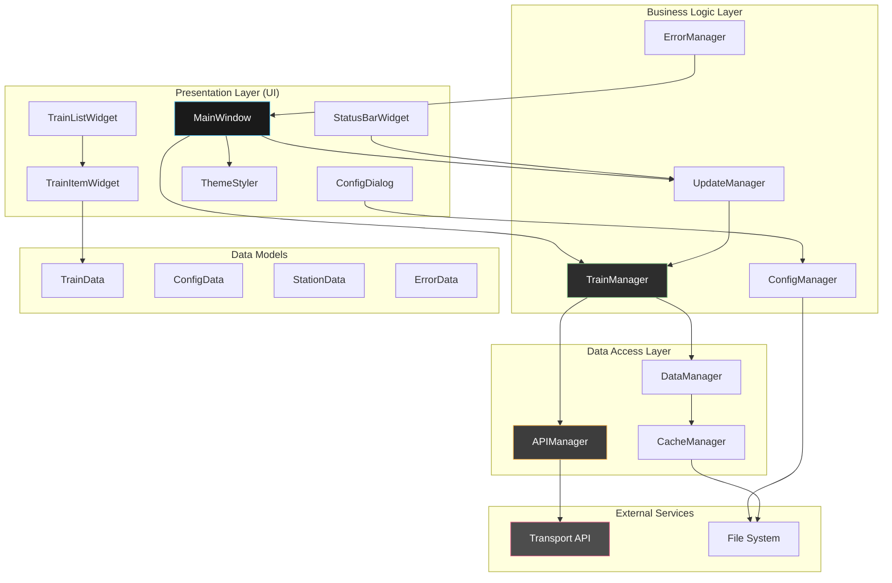

# 🏗️ Application Architecture

## Overview
The Trainer train times application follows a layered Object-Oriented architecture with clear separation of concerns, designed for maintainability, testability, and extensibility.

## Architecture Diagram



## Core Components

### 1. Data Models

#### TrainData
```python
@dataclass(frozen=True)
class TrainData:
    """Immutable data class representing a single train service."""
    departure_time: datetime
    scheduled_departure: datetime
    destination: str
    platform: Optional[str]
    operator: str
    service_type: str  # "fast", "stopping", "express"
    status: TrainStatus  # ON_TIME, DELAYED, CANCELLED
    delay_minutes: int
    estimated_arrival: Optional[datetime]
    journey_duration: Optional[timedelta]
    current_location: Optional[str]
    train_uid: str
    service_id: str
    
    @property
    def is_delayed(self) -> bool:
        return self.delay_minutes > 0
    
    @property
    def status_icon(self) -> str:
        return STATUS_ICONS[self.status]
    
    @property
    def service_icon(self) -> str:
        return SERVICE_ICONS[self.service_type]
```

#### ConfigData
```python
@dataclass
class ConfigData:
    """Application configuration data."""
    api_app_id: str
    api_app_key: str
    api_base_url: str
    from_station: str
    to_station: str
    auto_refresh_enabled: bool
    auto_refresh_interval: int
    max_trains_display: int
    time_window_hours: int
    show_cancelled: bool
    dark_theme: bool = True
    
    @classmethod
    def from_file(cls, filepath: str) -> 'ConfigData':
        """Load configuration from JSON file."""
        pass
    
    def to_file(self, filepath: str) -> None:
        """Save configuration to JSON file."""
        pass
```

#### TrainStatus Enum
```python
class TrainStatus(Enum):
    ON_TIME = "on_time"
    DELAYED = "delayed"
    CANCELLED = "cancelled"
    UNKNOWN = "unknown"
```

### 2. Business Logic Layer

#### TrainManager
```python
class TrainManager(QObject):
    """Core business logic for train data management."""
    
    trains_updated = Signal(list)  # List[TrainData]
    error_occurred = Signal(str)
    
    def __init__(self, config: ConfigData):
        super().__init__()
        self.config = config
        self.api_manager = APIManager(config)
        self.data_manager = DataManager()
        self.cache_manager = CacheManager()
    
    async def fetch_trains(self) -> List[TrainData]:
        """Fetch current train departures."""
        pass
    
    def process_api_response(self, response_data: Dict) -> List[TrainData]:
        """Convert API response to TrainData objects."""
        pass
    
    def filter_trains(self, trains: List[TrainData]) -> List[TrainData]:
        """Apply filtering based on configuration."""
        pass
    
    def sort_trains(self, trains: List[TrainData]) -> List[TrainData]:
        """Sort trains by departure time."""
        pass
```

#### UpdateManager
```python
class UpdateManager(QObject):
    """Manages automatic and manual refresh operations."""
    
    update_requested = Signal()
    update_status_changed = Signal(str)
    countdown_updated = Signal(int)  # seconds until next update
    
    def __init__(self, refresh_interval: int):
        super().__init__()
        self.refresh_interval = refresh_interval
        self.timer = QTimer()
        self.countdown_timer = QTimer()
        self.setup_timers()
    
    def start_auto_refresh(self) -> None:
        """Start automatic refresh timer."""
        pass
    
    def stop_auto_refresh(self) -> None:
        """Stop automatic refresh timer."""
        pass
    
    def manual_refresh(self) -> None:
        """Trigger manual refresh."""
        pass
    
    def reset_countdown(self) -> None:
        """Reset countdown timer."""
        pass
```

### 3. Data Access Layer

#### APIManager
```python
class APIManager:
    """Handles all Transport API communications."""
    
    def __init__(self, config: ConfigData):
        self.config = config
        self.session = requests.Session()
        self.base_url = config.api_base_url
    
    async def get_departures(self, from_station: str, to_station: str, 
                           time_window_hours: int = 3) -> Dict:
        """Fetch departure information from API."""
        pass
    
    async def get_service_details(self, service_id: str) -> Dict:
        """Fetch detailed service information."""
        pass
    
    def _build_request_url(self, endpoint: str, params: Dict) -> str:
        """Construct API request URL."""
        pass
    
    def _make_request(self, url: str) -> requests.Response:
        """Make HTTP request with error handling."""
        pass
    
    def _handle_api_response(self, response: requests.Response) -> Dict:
        """Process API response and handle errors."""
        pass
```

### 4. Presentation Layer

#### MainWindow
```python
class MainWindow(QMainWindow):
    """Main application window with dark theme."""
    
    def __init__(self):
        super().__init__()
        self.train_manager = None
        self.update_manager = None
        self.config = None
        self.theme_styler = ThemeStyler()
        self.setup_ui()
        self.apply_dark_theme()
    
    def setup_ui(self) -> None:
        """Initialize UI components."""
        pass
    
    def setup_menu_bar(self) -> None:
        """Create application menu."""
        pass
    
    def setup_central_widget(self) -> None:
        """Setup main content area."""
        pass
    
    def setup_status_bar(self) -> None:
        """Setup status bar with refresh controls."""
        pass
    
    def apply_dark_theme(self) -> None:
        """Apply dark theme styling."""
        pass
    
    def update_train_display(self, trains: List[TrainData]) -> None:
        """Update train list display."""
        pass
    
    def show_error_message(self, error: str) -> None:
        """Display error message to user."""
        pass
```

#### TrainListWidget
```python
class TrainListWidget(QScrollArea):
    """Scrollable list of train departures."""
    
    def __init__(self):
        super().__init__()
        self.train_items = []
        self.setup_ui()
    
    def setup_ui(self) -> None:
        """Initialize scroll area and container."""
        pass
    
    def update_trains(self, trains: List[TrainData]) -> None:
        """Update displayed trains."""
        pass
    
    def clear_trains(self) -> None:
        """Clear all train displays."""
        pass
    
    def add_train_item(self, train: TrainData) -> None:
        """Add single train item."""
        pass
```

#### TrainItemWidget
```python
class TrainItemWidget(QFrame):
    """Individual train information display widget."""
    
    def __init__(self, train_data: TrainData):
        super().__init__()
        self.train_data = train_data
        self.setup_ui()
        self.apply_styling()
    
    def setup_ui(self) -> None:
        """Create train information layout."""
        pass
    
    def apply_styling(self) -> None:
        """Apply status-based styling."""
        pass
    
    def update_data(self, train_data: TrainData) -> None:
        """Update train information."""
        pass
    
    def get_status_color(self) -> str:
        """Get color based on train status."""
        pass
```

## Dark Theme Implementation

### ThemeStyler Class
```python
class ThemeStyler:
    """Manages dark theme styling for the application."""
    
    DARK_PALETTE = {
        'background': '#1a1a1a',
        'surface': '#2d2d2d',
        'primary': '#4fc3f7',
        'secondary': '#81c784',
        'accent': '#ffb74d',
        'text_primary': '#ffffff',
        'text_secondary': '#b0b0b0',
        'success': '#4caf50',
        'warning': '#ff9800',
        'error': '#f44336',
        'border': '#404040'
    }
    
    def apply_dark_theme(self, app: QApplication) -> None:
        """Apply dark theme to entire application."""
        pass
    
    def get_train_status_style(self, status: TrainStatus) -> str:
        """Get CSS style for train status."""
        pass
    
    def get_main_window_style(self) -> str:
        """Get main window stylesheet."""
        pass
    
    def get_train_item_style(self) -> str:
        """Get train item stylesheet."""
        pass
```

## Threading Architecture

### Background Operations
- **API Calls**: Executed on separate thread using QThread
- **Auto Refresh**: Timer-based updates on background thread
- **File I/O**: Configuration operations on worker thread

### Thread Communication
- **Qt Signals/Slots**: For thread-safe communication
- **Immutable Data**: TrainData objects prevent race conditions
- **Thread-Safe Managers**: All manager classes designed for thread safety

## Error Handling Strategy

### Error Types
1. **Network Errors**: Connection timeouts, DNS failures
2. **API Errors**: Authentication, rate limiting, service unavailable
3. **Data Errors**: Malformed responses, missing fields
4. **Configuration Errors**: Invalid settings, missing credentials

### Error Recovery
- **Graceful Degradation**: Show cached data when API unavailable
- **Retry Logic**: Exponential backoff for transient failures
- **User Feedback**: Clear error messages with suggested actions
- **Logging**: Comprehensive error logging for debugging

## Performance Considerations

### Optimization Strategies
- **Lazy Loading**: Load train details on demand
- **Caching**: Cache API responses to reduce requests
- **Efficient Updates**: Only update changed train information
- **Memory Management**: Proper cleanup of Qt objects

### Resource Management
- **Connection Pooling**: Reuse HTTP connections
- **Timer Management**: Efficient timer usage for updates
- **Widget Recycling**: Reuse train item widgets when possible

---
*This architecture provides a solid foundation for a maintainable, scalable, and user-friendly train times application.*