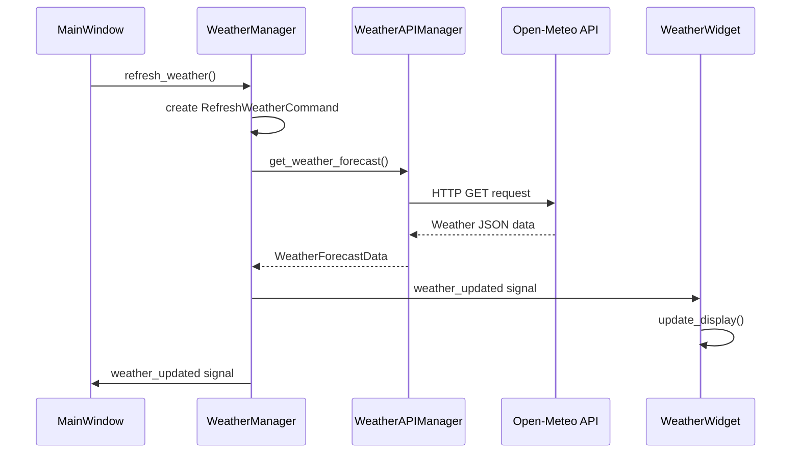
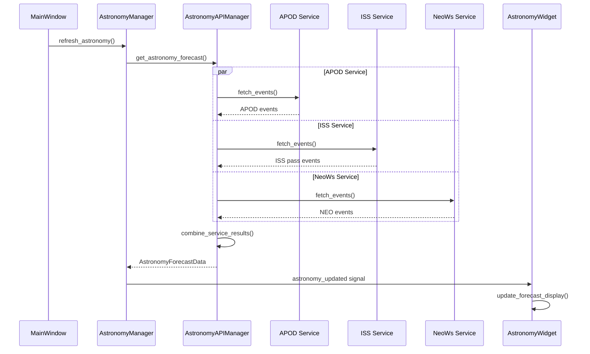

# 🏗️ Application Architecture

## Overview
The Trainer train times application follows a sophisticated layered Object-Oriented architecture with clear separation of concerns, designed for maintainability, testability, and extensibility. The application integrates train data, comprehensive weather forecasting, and advanced astronomy information from NASA APIs in a unified, responsive interface.

## Enhanced Architecture Diagram

```mermaid
graph TB
    subgraph "Presentation Layer (UI)"
        MW[MainWindow]
        WW[WeatherWidget]
        AW[AstronomyWidget]
        TLW[TrainListWidget]
        TIW[TrainItemWidget]
        SD[SettingsDialog]
        SS[SplashScreen]
        TM[ThemeManager]
    end
    
    subgraph "Business Logic Layer"
        CM[ConfigManager]
        WM[WeatherManager]
        AM[AstronomyManager]
        TRM[TrainManager]
        CFM[CombinedForecastManager]
    end
    
    subgraph "Data Access Layer"
        WAM[WeatherAPIManager]
        AAM[AstronomyAPIManager]
        NAM[NASAAPIManager]
        TAM[APIManager]
        HC[HTTPClient]
    end
    
    subgraph "Configuration System"
        CD[ConfigData]
        WC[WeatherConfig]
        AC[AstronomyConfig]
        WCF[WeatherConfigFactory]
        ACF[AstronomyConfigFactory]
    end
    
    subgraph "Data Models"
        WD[WeatherData]
        WFD[WeatherForecastData]
        AD[AstronomyData]
        AFD[AstronomyForecastData]
        AE[AstronomyEvent]
        TD[TrainData]
        L[Location]
    end
    
    subgraph "External Services"
        OM[Open-Meteo API]
        APOD[NASA APOD API]
        ISS[NASA ISS API]
        NEO[NASA NeoWs API]
        EPIC[NASA EPIC API]
        TAPI[Transport API]
    end
    
    MW --> CM
    MW --> WM
    MW --> AM
    MW --> TRM
    MW --> TM
    WW --> WM
    AW --> AM
    TLW --> TIW
    
    CM --> CD
    CM --> WC
    CM --> AC
    WM --> WAM
    AM --> AAM
    TRM --> TAM
    CFM --> WM
    CFM --> AM
    
    WAM --> OM
    AAM --> NAM
    NAM --> APOD
    NAM --> ISS
    NAM --> NEO
    NAM --> EPIC
    TAM --> TAPI
    
    WM --> WD
    WM --> WFD
    AM --> AD
    AM --> AFD
    AM --> AE
    TRM --> TD
    
    style MW fill:#1a1a1a,stroke:#4fc3f7,color:#ffffff
    style WM fill:#2d2d2d,stroke:#4fc3f7,color:#ffffff
    style AM fill:#2d2d2d,stroke:#ffb74d,color:#ffffff
    style CM fill:#2d2d2d,stroke:#81c784,color:#ffffff
    style WAM fill:#3d3d3d,stroke:#4fc3f7,color:#ffffff
    style AAM fill:#3d3d3d,stroke:#ffb74d,color:#ffffff
    style OM fill:#4d4d4d,stroke:#4fc3f7,color:#ffffff
    style APOD fill:#4d4d4d,stroke:#ffb74d,color:#ffffff
```



## Core Components

### 1. Enhanced Configuration Management

#### ConfigManager with Pydantic Integration
```python
class ConfigManager:
    """
    Manages application configuration with file persistence and validation.
    
    Features:
    - Pydantic-based validation and type safety
    - AppData directory integration for Windows
    - Configuration migration and versioning
    - Factory pattern for default configurations
    """
    
    def __init__(self, config_path: Optional[str] = None):
        if config_path is None:
            self.config_path = self.get_default_config_path()
        else:
            self.config_path = Path(config_path)
        self.config: Optional[ConfigData] = None
    
    @staticmethod
    def get_default_config_path() -> Path:
        """Get platform-specific configuration path."""
        if os.name == "nt":  # Windows
            appdata = os.environ.get("APPDATA")
            if appdata:
                config_dir = Path(appdata) / "Trainer"
                config_dir.mkdir(parents=True, exist_ok=True)
                return config_dir / "config.json"
        return Path("config.json")
    
    def load_config(self) -> ConfigData:
        """Load configuration with automatic migration."""
        if not self.config_path.exists():
            self.create_default_config()
        
        with open(self.config_path, "r", encoding="utf-8") as f:
            data = json.load(f)
        self.config = ConfigData(**data)
        return self.config
```

#### Pydantic Configuration Models
```python
class ConfigData(BaseModel):
    """Main configuration data model with integrated subsystems."""
    
    api: APIConfig
    stations: StationConfig
    refresh: RefreshConfig
    display: DisplayConfig
    weather: Optional[WeatherConfig] = None
    astronomy: Optional[AstronomyConfig] = None
    
    def __init__(self, **data):
        # Auto-create default weather and astronomy configs
        if "weather" not in data or data["weather"] is None:
            data["weather"] = WeatherConfigFactory.create_waterloo_config()
        if "astronomy" not in data or data["astronomy"] is None:
            data["astronomy"] = AstronomyConfig.create_default()
        super().__init__(**data)

class WeatherConfig(BaseModel):
    """Weather system configuration with validation."""
    
    enabled: bool = True
    location_name: str = "London Waterloo"
    location_latitude: float = 51.5045
    location_longitude: float = -0.1097
    api_provider: str = "open-meteo"
    refresh_interval_minutes: int = 30
    cache_duration_seconds: int = 1800
    timeout_seconds: int = 10
    
    def get_refresh_interval_seconds(self) -> int:
        return self.refresh_interval_minutes * 60

class AstronomyConfig(BaseModel):
    """Astronomy system configuration with NASA API integration."""
    
    enabled: bool = True
    nasa_api_key: str = ""
    location_name: str = "London"
    location_latitude: float = 51.5074
    location_longitude: float = -0.1278
    timezone: Optional[str] = None
    
    # NASA API Services Configuration
    services: AstronomyServicesConfig = Field(default_factory=AstronomyServicesConfig)
    display: AstronomyDisplayConfig = Field(default_factory=AstronomyDisplayConfig)
    
    cache_duration_hours: int = 6
    update_interval_minutes: int = 360
    timeout_seconds: int = 15
    max_concurrent_requests: int = 4
    
    def has_valid_api_key(self) -> bool:
        return bool(self.nasa_api_key and len(self.nasa_api_key.strip()) > 10)
```

### 2. Advanced Weather Integration

#### WeatherManager with Design Patterns
```python
class WeatherManager(QObject, WeatherSubject):
    """
    High-level weather manager implementing multiple design patterns.
    
    Design Patterns:
    - Observer Pattern: WeatherSubject for UI updates
    - Command Pattern: Undoable weather operations
    - Strategy Pattern: Error handling strategies
    - Factory Pattern: API manager creation
    """
    
    # Qt Signals for UI integration
    weather_updated = Signal(object)  # WeatherForecastData
    weather_error = Signal(str)
    loading_state_changed = Signal(bool)
    
    def __init__(self, config: WeatherConfig):
        QObject.__init__(self)
        WeatherSubject.__init__(self)
        
        self._config = config
        self._api_manager = WeatherAPIFactory.create_manager_from_config(config)
        self._current_forecast: Optional[WeatherForecastData] = None
        self._error_handler = WeatherErrorHandler(logger)
        
        # Command pattern for undo functionality
        self._command_history: List[WeatherCommand] = []
        self._max_history_size = 10
        
        # Auto-refresh timer
        self._refresh_timer = QTimer()
        self._refresh_timer.timeout.connect(self._on_refresh_timer)
        
        if config.enabled:
            self.start_auto_refresh()
    
    async def refresh_weather(self, location: Optional[Location] = None) -> None:
        """Refresh weather data using Command pattern."""
        command = RefreshWeatherCommand(self, location)
        await self._execute_command(command)
    
    async def _execute_command(self, command: WeatherCommand) -> None:
        """Execute command and add to history for undo functionality."""
        await command.execute()
        self._command_history.append(command)
        if len(self._command_history) > self._max_history_size:
            self._command_history.pop(0)
```

#### Weather Data Models with Protocols
```python
class WeatherDataReader(Protocol):
    """Protocol for reading weather data."""
    
    def get_temperature(self) -> float: ...
    def get_humidity(self) -> int: ...
    def get_weather_code(self) -> int: ...
    def get_timestamp(self) -> datetime: ...

@dataclass(frozen=True)
class WeatherData:
    """Immutable weather data with comprehensive validation."""
    
    timestamp: datetime
    temperature: float  # Celsius
    humidity: int  # Percentage (0-100)
    weather_code: int  # WMO weather code
    description: str = ""
    data_source: str = field(default=__weather_api_provider__)
    
    def __post_init__(self):
        """Validate weather data on creation."""
        if not (0 <= self.humidity <= 100):
            raise ValueError(f"Invalid humidity: {self.humidity}")
        if self.weather_code < 0:
            raise ValueError(f"Invalid weather code: {self.weather_code}")
    
    @property
    def temperature_display(self) -> str:
        return f"{self.temperature:.1f}°C"
    
    def is_precipitation(self) -> bool:
        """Check if weather involves precipitation."""
        precipitation_codes = {51, 53, 55, 61, 63, 65, 71, 73, 75, 80, 81, 82, 95, 96, 99}
        return self.weather_code in precipitation_codes
```

### 3. Comprehensive Astronomy Integration

#### AstronomyManager with NASA API Integration
```python
class AstronomyManager(QObject):
    """
    Business logic manager for astronomy data with comprehensive NASA integration.
    
    Features:
    - Multiple NASA API services (APOD, ISS, NeoWs, EPIC)
    - Intelligent caching and auto-refresh
    - Comprehensive error handling
    - Qt signals for UI updates
    """
    
    # Qt Signals for observer pattern
    astronomy_updated = Signal(AstronomyForecastData)
    astronomy_error = Signal(str)
    loading_state_changed = Signal(bool)
    cache_status_changed = Signal(dict)
    
    def __init__(self, config: AstronomyConfig):
        super().__init__()
        self._config = config
        self._api_manager: Optional[AstronomyAPIManager] = None
        self._validator = AstronomyDataValidator()
        self._current_forecast: Optional[AstronomyForecastData] = None
        
        # Auto-refresh timer
        self._refresh_timer = QTimer()
        self._refresh_timer.timeout.connect(self._auto_refresh)
        
        if config.enabled and config.has_valid_api_key():
            self._initialize_api_manager()
    
    async def refresh_astronomy(self, force_refresh: bool = False) -> Optional[AstronomyForecastData]:
        """Refresh astronomy data with intelligent caching."""
        if not self._config.enabled or not self._api_manager:
            return None
        
        if not force_refresh and self._should_skip_refresh():
            return self._current_forecast
        
        self._set_loading_state(True)
        
        try:
            location = Location(
                name=self._config.location_name,
                latitude=self._config.location_latitude,
                longitude=self._config.location_longitude,
                timezone=self._config.timezone,
            )
            
            forecast_data = await self._api_manager.get_astronomy_forecast(location, days=7)
            
            if not self._validator.validate_astronomy_forecast(forecast_data):
                raise ValueError("Invalid astronomy data received from API")
            
            self._current_forecast = forecast_data
            self._last_update_time = datetime.now()
            
            self.astronomy_updated.emit(forecast_data)
            self._emit_cache_status()
            
            return forecast_data
            
        except (AstronomyAuthenticationException, AstronomyRateLimitException, 
                AstronomyNetworkException, AstronomyAPIException) as e:
            self.astronomy_error.emit(str(e))
            return None
        finally:
            self._set_loading_state(False)
```

#### Astronomy Data Models with Rich Validation
```python
@dataclass(frozen=True)
class AstronomyEvent:
    """Immutable astronomy event with comprehensive validation."""
    
    event_type: AstronomyEventType
    title: str
    description: str
    start_time: datetime
    end_time: Optional[datetime] = None
    visibility_info: Optional[str] = None
    nasa_url: Optional[str] = None
    image_url: Optional[str] = None
    priority: AstronomyEventPriority = AstronomyEventPriority.MEDIUM
    metadata: Dict[str, Any] = field(default_factory=dict)
    
    def __post_init__(self):
        """Comprehensive validation on creation."""
        if not self.title.strip():
            raise ValueError("Event title cannot be empty")
        if self.end_time and self.end_time < self.start_time:
            raise ValueError("End time cannot be before start time")
        if self.nasa_url and not self._is_valid_url(self.nasa_url):
            raise ValueError(f"Invalid NASA URL: {self.nasa_url}")
    
    @property
    def event_icon(self) -> str:
        """Get emoji icon for event type."""
        icons = {
            AstronomyEventType.APOD: "📸",
            AstronomyEventType.ISS_PASS: "🛰️",
            AstronomyEventType.NEAR_EARTH_OBJECT: "☄️",
            AstronomyEventType.MOON_PHASE: "🌙",
            AstronomyEventType.PLANETARY_EVENT: "🪐",
            AstronomyEventType.METEOR_SHOWER: "⭐",
            AstronomyEventType.SOLAR_EVENT: "☀️",
            AstronomyEventType.SATELLITE_IMAGE: "🌍",
        }
        return icons.get(self.event_type, "❓")
    
    @property
    def is_ongoing(self) -> bool:
        """Check if event is currently ongoing."""
        now = datetime.now()
        if self.end_time:
            return self.start_time <= now <= self.end_time
        return self.start_time <= now <= (self.start_time + timedelta(hours=24))

@dataclass(frozen=True)
class AstronomyForecastData:
    """Complete astronomy forecast with validation."""
    
    location: Location
    daily_astronomy: List[AstronomyData] = field(default_factory=list)
    last_updated: datetime = field(default_factory=datetime.now)
    data_source: str = "NASA"
    data_version: str = field(default=__version__)
    forecast_days: int = 7
    
    @property
    def total_events(self) -> int:
        """Get total number of events across all days."""
        return sum(data.event_count for data in self.daily_astronomy)
    
    @property
    def is_stale(self) -> bool:
        """Check if forecast data is stale (older than 6 hours)."""
        return (datetime.now() - self.last_updated) > timedelta(hours=6)
```

### 4. Enhanced UI Architecture

#### MainWindow with Responsive Design
```python
class MainWindow(QMainWindow):
    """
    Main application window with responsive design and theme management.
    
    Features:
    - Responsive scaling for different screen sizes
    - Integrated weather and astronomy widgets
    - Theme switching with persistent settings
    - Signal-based communication with managers
    """
    
    # Signals for component communication
    refresh_requested = Signal()
    theme_changed = Signal(str)
    astronomy_manager_ready = Signal()
    
    def __init__(self, config_manager: Optional[ConfigManager] = None):
        super().__init__()
        
        self.config_manager = config_manager or ConfigManager()
        self.theme_manager = ThemeManager()
        
        # Responsive design calculations
        screen = QApplication.primaryScreen()
        screen_geometry = screen.availableGeometry()
        self.is_small_screen = screen_geometry.width() <= 1440 or screen_geometry.height() <= 900
        self.ui_scale_factor = 0.8 if self.is_small_screen else 1.0
        
        # Initialize managers
        self.weather_manager: Optional[WeatherManager] = None
        self.astronomy_manager: Optional[AstronomyManager] = None
        
        self.setup_ui()
        self.setup_weather_system()
        self.setup_astronomy_system()
    
    def setup_weather_system(self):
        """Initialize weather integration with error handling."""
        if not self.config or not hasattr(self.config, "weather"):
            return
        
        try:
            self.weather_manager = WeatherManager(self.config.weather)
            
            # Connect signals
            self.weather_manager.weather_updated.connect(self.on_weather_updated)
            self.weather_manager.weather_error.connect(self.on_weather_error)
            self.weather_manager.loading_state_changed.connect(self.on_weather_loading_changed)
            
            if self.weather_widget:
                self.weather_manager.weather_updated.connect(self.weather_widget.on_weather_updated)
                self.weather_widget.update_config(self.config.weather)
            
            if self.config.weather.enabled:
                self.refresh_weather()
                
        except Exception as e:
            logger.error(f"Failed to initialize weather system: {e}")
    
    def setup_astronomy_system(self):
        """Initialize astronomy integration with graceful degradation."""
        if not self.config or not hasattr(self.config, "astronomy"):
            return
        
        try:
            if self.astronomy_widget:
                self.astronomy_widget.astronomy_refresh_requested.connect(self.refresh_astronomy)
                self.astronomy_widget.nasa_link_clicked.connect(self.on_nasa_link_clicked)
                self.astronomy_widget.update_config(self.config.astronomy)
            
            if self.config.astronomy.has_valid_api_key():
                self.astronomy_manager = AstronomyManager(self.config.astronomy)
                
                # Connect signals
                self.astronomy_manager.astronomy_updated.connect(self.on_astronomy_updated)
                self.astronomy_manager.astronomy_error.connect(self.on_astronomy_error)
                
                if self.astronomy_widget:
                    self.astronomy_manager.astronomy_updated.connect(
                        self.astronomy_widget.on_astronomy_updated
                    )
                
                self.astronomy_manager_ready.emit()
            
        except Exception as e:
            logger.error(f"Failed to initialize astronomy system: {e}")
```

#### Weather and Astronomy Widgets
```python
class WeatherWidget(QWidget):
    """Weather display widget with responsive design."""
    
    weather_refresh_requested = Signal()
    weather_settings_requested = Signal()
    
    def __init__(self, scale_factor: float = 1.0, parent=None):
        super().__init__(parent)
        self._scale_factor = scale_factor
        self._forecast_data: Optional[WeatherForecastData] = None
        self._config: Optional[WeatherConfig] = None
        self.setup_ui()
    
    def on_weather_updated(self, weather_data: WeatherForecastData):
        """Handle weather data updates with validation."""
        self._forecast_data = weather_data
        self.update_display()
    
    def apply_theme(self, theme_colors: Dict[str, str]):
        """Apply theme colors to weather widget."""
        self.setStyleSheet(f"""
            WeatherWidget {{
                background-color: {theme_colors.get('background_primary', '#1a1a1a')};
                color: {theme_colors.get('text_primary', '#ffffff')};
                border: 1px solid {theme_colors.get('border_primary', '#404040')};
                border-radius: 8px;
            }}
        """)

class AstronomyWidget(QWidget):
    """Astronomy display widget with NASA integration."""
    
    astronomy_refresh_requested = Signal()
    astronomy_event_clicked = Signal(AstronomyEvent)
    nasa_link_clicked = Signal(str)
    
    def __init__(self, scale_factor: float = 1.0, parent=None):
        super().__init__(parent)
        self._scale_factor = scale_factor
        self._config: Optional[AstronomyConfig] = None
        self._setup_ui()
    
    def on_astronomy_updated(self, forecast_data: AstronomyForecastData):
        """Handle astronomy data updates."""
        self._forecast_panel.update_forecast(forecast_data)
        logger.info(f"Astronomy widget updated with {forecast_data.total_events} events")
```

## Design Patterns Implementation

### 1. Observer Pattern
- **WeatherSubject/WeatherObserver**: Decoupled weather data updates
- **Qt Signals/Slots**: UI component communication
- **Manager-Widget Communication**: Real-time data updates

### 2. Strategy Pattern
- **WeatherIconStrategy/EmojiWeatherIconStrategy**: Flexible icon display
- **AstronomyIconStrategy/EmojiAstronomyIconStrategy**: Astronomy event icons
- **WeatherErrorHandler**: Different error handling strategies

### 3. Factory Pattern
- **WeatherAPIFactory**: Creates weather managers and components
- **WeatherConfigFactory**: Creates default weather configurations
- **AstronomyConfigFactory**: Creates astronomy configurations

### 4. Command Pattern
- **WeatherCommand/RefreshWeatherCommand**: Undoable weather operations
- **Command History**: Undo functionality for weather actions

### 5. Protocol Pattern (Structural Typing)
- **WeatherDataReader**: Interface for weather data access
- **AstronomyDataReader**: Interface for astronomy data access
- **WeatherIconProvider/AstronomyIconProvider**: Icon display interfaces

## Data Flow Architecture

### Weather Data Flow


### Astronomy Data Flow


## Error Handling & Resilience

### Comprehensive Error Strategy
```python
class WeatherErrorHandler:
    """Centralized error handling with strategy pattern."""
    
    def __init__(self, logger: logging.Logger):
        self._logger = logger
        self._error_strategies = {
            WeatherAPIException: self._handle_api_error,
            WeatherNetworkException: self._handle_network_error,
            WeatherDataException: self._handle_data_error,
            Exception: self._handle_generic_error,
        }
    
    def handle_error(self, error: Exception) -> str:
        """Handle error and return user-friendly message."""
        for exception_type, handler in self._error_strategies.items():
            if isinstance(error, exception_type):
                return handler(error)
        return self._handle_generic_error(error)
```

### Graceful Degradation
- **Weather System**: Shows cached data when API unavailable
- **Astronomy System**: Shows placeholder content without API key
- **UI Components**: Responsive design adapts to missing data
- **Configuration**: Auto-migration and default value creation

## Performance & Caching

### Intelligent Caching Strategy
- **Weather Data**: 30-minute cache with staleness detection
- **Astronomy Data**: 6-hour cache with intelligent refresh
- **Configuration**: In-memory caching with file persistence
- **UI State**: Theme and layout preferences cached

### Optimization Techniques
- **Concurrent API Calls**: Parallel fetching for astronomy services
- **Lazy Loading**: Components initialized on demand
- **Memory Management**: Proper cleanup of Qt objects and timers
- **Responsive UI**: Scale factors for different screen sizes

## Testing Strategy

### Current Test Structure
```
tests/
├── unit/
│   ├── test_managers/
│   │   ├── test_config_manager.py
│   │   ├── test_weather_manager.py
│   │   └── test_astronomy_manager.py
│   ├── test_models/
│   │   ├── test_weather_data.py
│   │   └── test_astronomy_data.py
│   └── test_api/
│       ├── test_weather_api_manager.py
│       └── test_nasa_api_manager.py
├── integration/
│   └── test_api_integration.py
└── performance/
    └── test_large_datasets.py
```

### Testing Approach
- **Unit Tests**: Comprehensive coverage of managers and data models
- **Integration Tests**: API integration with mock responses
- **Performance Tests**: Large dataset handling and memory usage
- **UI Tests**: pytest-qt for widget interaction testing

## Security Considerations

### API Key Management
- **Secure Storage**: Configuration files with appropriate permissions
- **Validation**: API key format and length validation
- **Error Handling**: Secure error messages without key exposure

### Data Privacy
- **Local Storage**: All data stored locally, no external transmission
- **HTTPS Communication**: Secure API communication
- **Input Validation**: Comprehensive validation of all external data

## Future Enhancements

### Planned Architecture Improvements
1. **Microservices Architecture**: Potential separation of weather/astronomy services
2. **Plugin System**: Extensible architecture for additional data sources
3. **Real-time Updates**: WebSocket integration for live data
4. **Mobile Support**: Cross-platform mobile application architecture
5. **Advanced Caching**: Redis integration for distributed caching
6. **Monitoring**: Application performance monitoring and metrics

### Technology Evolution
- **Async/Await**: Full async architecture implementation
- **Type Hints**: Complete type annotation coverage
- **Dependency Injection**: IoC container for better testability
- **Event Sourcing**: Event-driven architecture for data changes

---

*This architecture documentation reflects the current state of the Trainer application as of 2025, showcasing a mature, well-designed system with comprehensive weather and astronomy integration, robust error handling, and excellent Object-Oriented design principles.*