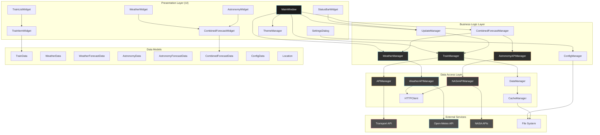
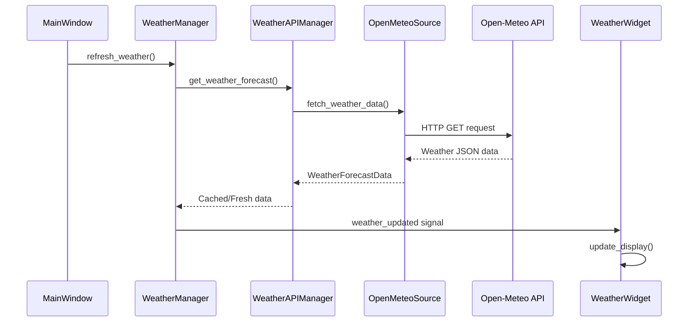
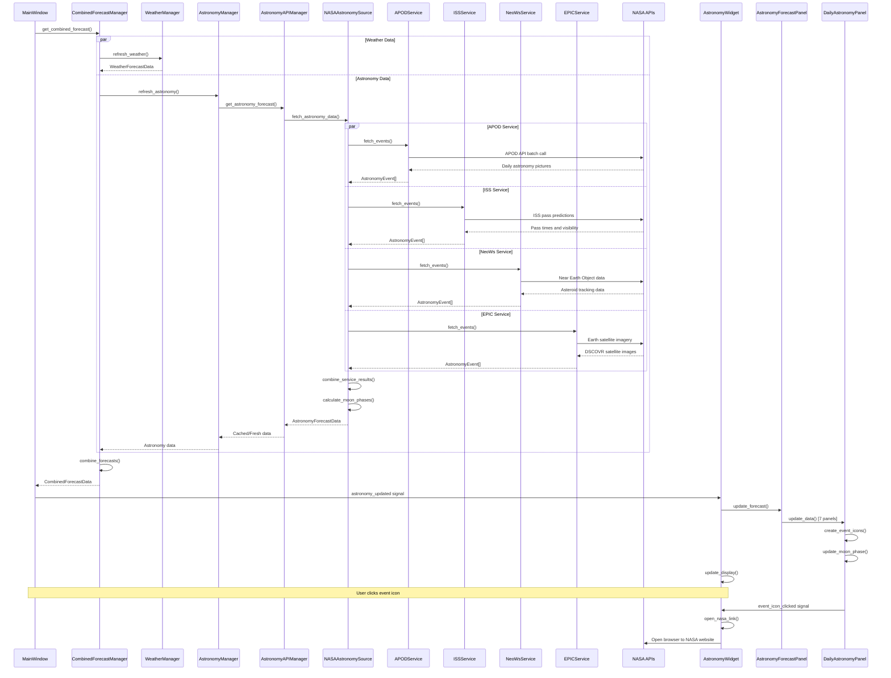

# 🏗️ Application Architecture

## Overview
The Trainer train times application follows a layered Object-Oriented architecture with clear separation of concerns, designed for maintainability, testability, and extensibility. The application integrates train data, weather forecasting, and comprehensive astronomy information from NASA APIs in a unified interface.

## Enhanced Architecture Diagram



## Core Components

### 1. Data Models

#### Weather Data Models
```python
@dataclass(frozen=True)
class WeatherData:
    """Immutable weather data for a specific time."""
    timestamp: datetime
    temperature: float  # Celsius
    humidity: int  # Percentage (0-100)
    weather_code: int  # WMO weather code
    description: str = ""
    data_source: str = field(default="Open-Meteo")
    
    @property
    def temperature_display(self) -> str:
        return f"{self.temperature:.1f}°C"
    
    @property
    def humidity_display(self) -> str:
        return f"{self.humidity}%"
    
    def is_precipitation(self) -> bool:
        precipitation_codes = {51, 53, 55, 61, 63, 65, 71, 73, 75, 80, 81, 82, 95, 96, 99}
        return self.weather_code in precipitation_codes

@dataclass(frozen=True)
class WeatherForecastData:
    """Complete weather forecast data container."""
    location: Location
    hourly_forecast: List[WeatherData] = field(default_factory=list)
    daily_forecast: List[WeatherData] = field(default_factory=list)
    last_updated: datetime = field(default_factory=datetime.now)
    data_version: str = field(default="1.0")
    
    @property
    def current_day_hourly(self) -> List[WeatherData]:
        today = datetime.now().date()
        return [w for w in self.hourly_forecast if w.timestamp.date() == today]
    
    def get_current_weather(self) -> Optional[WeatherData]:
        if not self.hourly_forecast:
            return None
        now = datetime.now()
        return min(self.hourly_forecast,
                  key=lambda w: abs((w.timestamp - now).total_seconds()))
```

#### Astronomy Data Models (Fully Implemented)
```python
@dataclass(frozen=True)
class AstronomyEvent:
    """Immutable astronomy event data with comprehensive validation."""
    event_type: AstronomyEventType
    title: str
    description: str
    start_time: datetime
    end_time: Optional[datetime] = None
    visibility_info: Optional[str] = None
    nasa_url: Optional[str] = None
    image_url: Optional[str] = None
    priority: AstronomyEventPriority = AstronomyEventPriority.MEDIUM
    metadata: Dict[str, Any] = field(default_factory=dict)
    
    @property
    def event_icon(self) -> str:
        """Get emoji icon for event type."""
        icons = {
            AstronomyEventType.APOD: "📸",
            AstronomyEventType.ISS_PASS: "🛰️",
            AstronomyEventType.NEAR_EARTH_OBJECT: "☄️",
            AstronomyEventType.MOON_PHASE: "🌙",
            AstronomyEventType.PLANETARY_EVENT: "🪐",
            AstronomyEventType.METEOR_SHOWER: "⭐",
            AstronomyEventType.SOLAR_EVENT: "☀️",
            AstronomyEventType.SATELLITE_IMAGE: "🌍"
        }
        return icons.get(self.event_type, "❓")
    
    @property
    def is_ongoing(self) -> bool:
        """Check if event is currently ongoing."""
        now = datetime.now()
        if self.end_time:
            return self.start_time <= now <= self.end_time
        return self.start_time <= now <= (self.start_time + timedelta(hours=24))

@dataclass(frozen=True)
class AstronomyData:
    """Immutable daily astronomy data with moon phase calculations."""
    date: date
    events: List[AstronomyEvent] = field(default_factory=list)
    primary_event: Optional[AstronomyEvent] = None
    moon_phase: Optional[MoonPhase] = None
    moon_illumination: Optional[float] = None  # 0.0 to 1.0
    sunrise_time: Optional[datetime] = None
    sunset_time: Optional[datetime] = None
    
    @property
    def has_events(self) -> bool:
        return len(self.events) > 0
    
    @property
    def high_priority_events(self) -> List[AstronomyEvent]:
        """Get high priority events."""
        return [e for e in self.events if e.priority in [AstronomyEventPriority.HIGH, AstronomyEventPriority.CRITICAL]]
    
    @property
    def moon_phase_icon(self) -> str:
        """Get moon phase icon."""
        if not self.moon_phase:
            return "🌑"
        icons = {
            MoonPhase.NEW_MOON: "🌑", MoonPhase.WAXING_CRESCENT: "🌒",
            MoonPhase.FIRST_QUARTER: "🌓", MoonPhase.WAXING_GIBBOUS: "🌔",
            MoonPhase.FULL_MOON: "🌕", MoonPhase.WANING_GIBBOUS: "🌖",
            MoonPhase.LAST_QUARTER: "🌗", MoonPhase.WANING_CRESCENT: "🌘"
        }
        return icons.get(self.moon_phase, "🌑")

@dataclass(frozen=True)
class AstronomyForecastData:
    """Complete astronomy forecast data with validation."""
    location: Location
    daily_astronomy: List[AstronomyData] = field(default_factory=list)
    last_updated: datetime = field(default_factory=datetime.now)
    data_source: str = "NASA"
    data_version: str = field(default=__version__)
    forecast_days: int = 7
    
    @property
    def total_events(self) -> int:
        """Get total number of events across all days."""
        return sum(data.event_count for data in self.daily_astronomy)
    
    @property
    def is_stale(self) -> bool:
        """Check if forecast data is stale (older than 6 hours)."""
        return (datetime.now() - self.last_updated) > timedelta(hours=6)
    
    def get_astronomy_for_date(self, target_date: date) -> Optional[AstronomyData]:
        """Get astronomy data for a specific date."""
        return next((data for data in self.daily_astronomy if data.date == target_date), None)

@dataclass(frozen=True)
class CombinedForecastData:
    """Combined weather and astronomy forecast data."""
    location: Location
    daily_forecasts: List[DailyForecastData] = field(default_factory=list)
    weather_forecast: Optional[WeatherForecastData] = None
    astronomy_forecast: Optional[AstronomyForecastData] = None
    last_updated: datetime = field(default_factory=datetime.now)
```

#### TrainData
```python
@dataclass(frozen=True)
class TrainData:
    """Immutable data class representing a single train service."""
    departure_time: datetime
    scheduled_departure: datetime
    destination: str
    platform: Optional[str]
    operator: str
    service_type: str  # "fast", "stopping", "express"
    status: TrainStatus  # ON_TIME, DELAYED, CANCELLED
    delay_minutes: int
    estimated_arrival: Optional[datetime]
    journey_duration: Optional[timedelta]
    current_location: Optional[str]
    train_uid: str
    service_id: str
    
    @property
    def is_delayed(self) -> bool:
        return self.delay_minutes > 0
    
    @property
    def status_icon(self) -> str:
        return STATUS_ICONS[self.status]
    
    @property
    def service_icon(self) -> str:
        return SERVICE_ICONS[self.service_type]
```

#### ConfigData
```python
@dataclass
class ConfigData:
    """Application configuration data."""
    api_app_id: str
    api_app_key: str
    api_base_url: str
    from_station: str
    to_station: str
    auto_refresh_enabled: bool
    auto_refresh_interval: int
    max_trains_display: int
    time_window_hours: int
    show_cancelled: bool
    dark_theme: bool = True
    
    @classmethod
    def from_file(cls, filepath: str) -> 'ConfigData':
        """Load configuration from JSON file."""
        pass
    
    def to_file(self, filepath: str) -> None:
        """Save configuration to JSON file."""
        pass
```

#### TrainStatus Enum
```python
class TrainStatus(Enum):
    ON_TIME = "on_time"
    DELAYED = "delayed"
    CANCELLED = "cancelled"
    UNKNOWN = "unknown"
```

### 2. Business Logic Layer

#### Weather Manager
```python
class WeatherManager(QObject):
    """Business logic for weather data management."""
    
    weather_updated = Signal(WeatherForecastData)
    weather_error = Signal(str)
    loading_state_changed = Signal(bool)
    
    def __init__(self, config: WeatherConfig):
        super().__init__()
        self.config = config
        self.weather_api_manager = WeatherAPIFactory.create_manager_from_config(config)
        self._last_update_time: Optional[datetime] = None
    
    async def refresh_weather(self) -> WeatherForecastData:
        """Refresh weather data from API."""
        self.loading_state_changed.emit(True)
        try:
            location = Location(
                name=self.config.location_name,
                latitude=self.config.location_latitude,
                longitude=self.config.location_longitude
            )
            
            weather_data = await self.weather_api_manager.get_weather_forecast(location)
            self.weather_updated.emit(weather_data)
            self._last_update_time = datetime.now()
            return weather_data
            
        except Exception as e:
            error_msg = f"Weather update failed: {e}"
            self.weather_error.emit(error_msg)
            raise
        finally:
            self.loading_state_changed.emit(False)
```

#### Astronomy Manager (Fully Implemented)
```python
class AstronomyManager(QObject):
    """
    Business logic manager for astronomy data with comprehensive NASA API integration.
    
    Features:
    - Complete NASA API integration (APOD, ISS, NeoWs, EPIC)
    - Intelligent caching with configurable duration
    - Auto-refresh with Qt timer integration
    - Comprehensive error handling and recovery
    - Data validation and integrity checks
    """
    
    # Qt Signals for observer pattern
    astronomy_updated = Signal(AstronomyForecastData)
    astronomy_error = Signal(str)
    loading_state_changed = Signal(bool)
    cache_status_changed = Signal(dict)
    
    def __init__(self, config: AstronomyConfig):
        super().__init__()
        self._config = config
        self._api_manager: Optional[AstronomyAPIManager] = None
        self._validator = AstronomyDataValidator()
        self._last_update_time: Optional[datetime] = None
        self._current_forecast: Optional[AstronomyForecastData] = None
        self._is_loading = False
        
        # Auto-refresh timer
        self._refresh_timer = QTimer()
        self._refresh_timer.timeout.connect(self._auto_refresh)
        
        # Initialize API manager if enabled
        if config.enabled and config.has_valid_api_key():
            self._initialize_api_manager()
    
    async def refresh_astronomy(self, force_refresh: bool = False) -> Optional[AstronomyForecastData]:
        """
        Refresh astronomy data from NASA APIs with comprehensive error handling.
        
        Integrates data from multiple NASA services:
        - APOD: Astronomy Picture of the Day
        - ISS: International Space Station pass predictions
        - NeoWs: Near Earth Object tracking
        - EPIC: Earth satellite imagery
        """
        if not self._config.enabled or not self._api_manager:
            return None
        
        # Intelligent caching - skip refresh if recent data available
        if not force_refresh and self._should_skip_refresh():
            return self._current_forecast
        
        self._set_loading_state(True)
        
        try:
            location = Location(
                name=self._config.location_name,
                latitude=self._config.location_latitude,
                longitude=self._config.location_longitude,
                timezone=self._config.timezone
            )
            
            # Fetch comprehensive astronomy data
            forecast_data = await self._api_manager.get_astronomy_forecast(location, days=7)
            
            # Validate data integrity
            if not self._validator.validate_astronomy_forecast(forecast_data):
                raise ValueError("Invalid astronomy data received from NASA APIs")
            
            # Update internal state
            self._current_forecast = forecast_data
            self._last_update_time = datetime.now()
            
            # Emit signals for UI updates
            self.astronomy_updated.emit(forecast_data)
            self._emit_cache_status()
            
            return forecast_data
            
        except AstronomyAuthenticationException as e:
            self.astronomy_error.emit(f"NASA API authentication failed: {e}")
        except AstronomyRateLimitException as e:
            self.astronomy_error.emit(f"NASA API rate limit exceeded: {e}")
        except AstronomyNetworkException as e:
            self.astronomy_error.emit(f"Network error fetching astronomy data: {e}")
        except Exception as e:
            self.astronomy_error.emit(f"Unexpected error: {e}")
        finally:
            self._set_loading_state(False)
        
        return None
    
    def start_auto_refresh(self) -> None:
        """Start automatic refresh with configurable interval."""
        if self._config.enabled:
            interval_ms = self._config.get_update_interval_seconds() * 1000
            self._refresh_timer.start(interval_ms)
    
    def get_cache_info(self) -> Dict[str, Any]:
        """Get comprehensive cache and status information."""
        return {
            "enabled": self._config.enabled,
            "has_current_forecast": self._current_forecast is not None,
            "last_update_time": self._last_update_time,
            "is_loading": self._is_loading,
            "data_stale": self.is_data_stale(),
            "total_events": self._current_forecast.total_events if self._current_forecast else 0
        }
```

#### NASA API Manager (Fully Implemented)
```python
class AstronomyAPIManager:
    """
    High-level astronomy API manager with comprehensive NASA integration.
    
    Manages multiple NASA API services:
    - APOD Service: Daily astronomy pictures with explanations
    - ISS Service: International Space Station pass predictions
    - NeoWs Service: Near Earth Object tracking and alerts
    - EPIC Service: Earth satellite imagery from DSCOVR
    """
    
    def __init__(self, astronomy_source: AstronomyDataSource, config: AstronomyConfig):
        self._astronomy_source = astronomy_source
        self._config = config
        self._last_fetch_time: Optional[datetime] = None
        self._cached_data: Optional[AstronomyForecastData] = None
    
    async def get_astronomy_forecast(self, location: Optional[Location] = None, days: int = 7) -> AstronomyForecastData:
        """
        Get comprehensive astronomy forecast from NASA APIs.
        
        Features:
        - Concurrent API calls for optimal performance
        - Intelligent caching with configurable duration
        - Graceful error handling per service
        - Data validation and integrity checks
        """
        # Check cache validity
        if self._is_cache_valid() and self._cached_data is not None:
            return self._cached_data
        
        # Fetch fresh data from NASA APIs
        forecast_data = await self._astronomy_source.fetch_astronomy_data(location, days)
        
        # Update cache
        self._cached_data = forecast_data
        self._last_fetch_time = datetime.now()
        
        return forecast_data
    
    def get_cache_info(self) -> Dict[str, Any]:
        """Get detailed cache information."""
        return {
            "has_cached_data": self._cached_data is not None,
            "last_fetch_time": self._last_fetch_time,
            "cache_valid": self._is_cache_valid(),
            "cache_duration_seconds": self._config.get_cache_duration_seconds()
        }
```

#### Combined Forecast Manager (Fully Implemented)
```python
class CombinedForecastManager:
    """
    Facade for managing combined weather and astronomy forecasts.
    
    Coordinates data from multiple sources:
    - Weather: Open-Meteo API for meteorological data
    - Astronomy: NASA APIs for space and astronomical events
    """
    
    def __init__(self, weather_manager: WeatherManager, astronomy_manager: AstronomyManager):
        self._weather_manager = weather_manager
        self._astronomy_manager = astronomy_manager
    
    async def get_combined_forecast(self, location: Location) -> CombinedForecastData:
        """
        Get unified weather and astronomy forecast with comprehensive error handling.
        
        Features:
        - Concurrent data fetching for optimal performance
        - Independent error handling per data source
        - Graceful degradation when services are unavailable
        """
        try:
            # Fetch data concurrently for optimal performance
            weather_task = self._weather_manager.refresh_weather()
            astronomy_task = self._astronomy_manager.refresh_astronomy()
            
            weather_data, astronomy_data = await asyncio.gather(
                weather_task, astronomy_task, return_exceptions=True
            )
            
            return CombinedForecastData(
                location=location,
                weather_forecast=weather_data if not isinstance(weather_data, Exception) else None,
                astronomy_forecast=astronomy_data if not isinstance(astronomy_data, Exception) else None,
                last_updated=datetime.now()
            )
            
        except Exception as e:
            logger.error(f"Combined forecast error: {e}")
            raise
```

#### TrainManager
```python
class TrainManager(QObject):
    """Core business logic for train data management."""
    
    trains_updated = Signal(list)  # List[TrainData]
    error_occurred = Signal(str)
    
    def __init__(self, config: ConfigData):
        super().__init__()
        self.config = config
        self.api_manager = APIManager(config)
        self.data_manager = DataManager()
        self.cache_manager = CacheManager()
    
    async def fetch_trains(self) -> List[TrainData]:
        """Fetch current train departures."""
        pass
    
    def process_api_response(self, response_data: Dict) -> List[TrainData]:
        """Convert API response to TrainData objects."""
        pass
    
    def filter_trains(self, trains: List[TrainData]) -> List[TrainData]:
        """Apply filtering based on configuration."""
        pass
    
    def sort_trains(self, trains: List[TrainData]) -> List[TrainData]:
        """Sort trains by departure time."""
        pass
```

#### UpdateManager
```python
class UpdateManager(QObject):
    """Manages automatic and manual refresh operations."""
    
    update_requested = Signal()
    update_status_changed = Signal(str)
    countdown_updated = Signal(int)  # seconds until next update
    
    def __init__(self, refresh_interval: int):
        super().__init__()
        self.refresh_interval = refresh_interval
        self.timer = QTimer()
        self.countdown_timer = QTimer()
        self.setup_timers()
    
    def start_auto_refresh(self) -> None:
        """Start automatic refresh timer."""
        pass
    
    def stop_auto_refresh(self) -> None:
        """Stop automatic refresh timer."""
        pass
    
    def manual_refresh(self) -> None:
        """Trigger manual refresh."""
        pass
    
    def reset_countdown(self) -> None:
        """Reset countdown timer."""
        pass
```

### 3. Data Access Layer

#### Weather API Manager
```python
class WeatherAPIManager:
    """High-level weather API manager using Strategy pattern."""
    
    def __init__(self, weather_source: WeatherDataSource, config: WeatherConfig):
        self._weather_source = weather_source
        self._config = config
        self._last_fetch_time: Optional[datetime] = None
        self._cached_data: Optional[WeatherForecastData] = None
    
    async def get_weather_forecast(self, location: Optional[Location] = None) -> WeatherForecastData:
        """Get weather forecast with caching."""
        if location is None:
            location = Location(
                name=self._config.location_name,
                latitude=self._config.location_latitude,
                longitude=self._config.location_longitude
            )
        
        # Check cache validity
        if self._is_cache_valid() and self._cached_data is not None:
            return self._cached_data
        
        # Fetch fresh data
        forecast_data = await self._weather_source.fetch_weather_data(location)
        self._cached_data = forecast_data
        self._last_fetch_time = datetime.now()
        
        return forecast_data
```

#### NASA API Integration (Fully Implemented)
```python
class NASAAstronomySource(AstronomyDataSource):
    """
    Comprehensive NASA API implementation with multiple service integration.
    
    Integrated NASA Services:
    - APOD: Astronomy Picture of the Day with HD imagery and explanations
    - ISS: International Space Station pass predictions with visibility data
    - NeoWs: Near Earth Object Web Service for asteroid and comet tracking
    - EPIC: Earth Polychromatic Imaging Camera for satellite imagery
    """
    
    def __init__(self, http_client: HTTPClient, config: AstronomyConfig):
        self._http_client = http_client
        self._config = config
        self._validator = AstronomyDataValidator()
        
        # Initialize all NASA services based on configuration
        self._services: Dict[str, AstronomyService] = {}
        if config.services.apod:
            self._services['apod'] = APODService(http_client, config)
        if config.services.iss:
            self._services['iss'] = ISSService(http_client, config)
        if config.services.neows:
            self._services['neows'] = NeoWsService(http_client, config)
        if config.services.epic:
            self._services['epic'] = EPICService(http_client, config)
    
    async def fetch_astronomy_data(self, location: Location, days: int) -> AstronomyForecastData:
        """
        Fetch comprehensive astronomy data from multiple NASA APIs.
        
        Features:
        - Concurrent API calls for optimal performance
        - Individual service error handling and graceful degradation
        - Data validation and integrity checks
        - Moon phase calculations and astronomical computations
        - Event prioritization and intelligent sorting
        """
        start_date = date.today()
        end_date = start_date + timedelta(days=days - 1)
        
        try:
            # Fetch data from all enabled services concurrently
            tasks = []
            for service_name, service in self._services.items():
                task = self._fetch_service_data(service, location, start_date, end_date)
                tasks.append((service_name, task))
            
            # Wait for all services to complete with individual error handling
            service_results = {}
            for service_name, task in tasks:
                try:
                    events = await task
                    service_results[service_name] = events
                    logger.info(f"{service_name} service returned {len(events)} events")
                except Exception as e:
                    logger.error(f"Error fetching {service_name} data: {e}")
                    service_results[service_name] = []  # Graceful degradation
            
            # Combine results into structured daily astronomy data
            daily_astronomy = self._combine_service_results(service_results, start_date, end_date)
            
            forecast = AstronomyForecastData(
                location=location,
                daily_astronomy=daily_astronomy,
                last_updated=datetime.now(),
                data_source="NASA",
                forecast_days=days
            )
            
            # Comprehensive data validation
            if not self._validator.validate_astronomy_forecast(forecast):
                raise AstronomyDataException("Invalid astronomy data received from NASA APIs")
            
            logger.info(f"Successfully parsed astronomy data: {len(daily_astronomy)} days, "
                       f"{sum(data.event_count for data in daily_astronomy)} total events")
            
            return forecast
            
        except Exception as e:
            logger.error(f"Failed to fetch astronomy data: {e}")
            raise AstronomyAPIException(f"Astronomy data fetch failed: {e}")
    
    def _combine_service_results(self, service_results: Dict[str, List[AstronomyEvent]],
                               start_date: date, end_date: date) -> List[AstronomyData]:
        """Combine results from all NASA services into structured daily data."""
        daily_astronomy = []
        current_date = start_date
        
        while current_date <= end_date:
            # Collect all events for this date from all services
            daily_events = []
            for service_name, events in service_results.items():
                for event in events:
                    if event.start_time.date() == current_date:
                        daily_events.append(event)
            
            # Sort events by priority and time
            daily_events.sort(key=lambda e: (e.priority.value, e.start_time), reverse=True)
            
            # Determine primary event (highest priority, earliest time)
            primary_event = daily_events[0] if daily_events else None
            
            # Create comprehensive daily astronomy data
            astronomy_data = AstronomyData(
                date=current_date,
                events=daily_events,
                primary_event=primary_event,
                moon_phase=self._calculate_moon_phase(current_date),
                moon_illumination=self._calculate_moon_illumination(current_date)
            )
            
            daily_astronomy.append(astronomy_data)
            current_date += timedelta(days=1)
        
        return daily_astronomy

class APODService(AstronomyService):
    """
    Astronomy Picture of the Day service with comprehensive features.
    
    Features:
    - Batch API calls for efficient date range fetching
    - HD image URL extraction and validation
    - Comprehensive metadata handling and parsing
    - Error handling for missing dates and invalid responses
    """
    
    BASE_URL = "https://api.nasa.gov/planetary/apod"
    
    async def fetch_events(self, location: Location, start_date: date, end_date: date) -> List[AstronomyEvent]:
        """Fetch APOD events using efficient batch API calls with comprehensive error handling."""
        try:
            apod_data_list = await self._fetch_apod_batch(start_date, end_date)
            events = []
            
            for apod_data in apod_data_list:
                if apod_data and isinstance(apod_data, dict):
                    date_str = apod_data.get('date')
                    if date_str:
                        try:
                            event_date = datetime.strptime(date_str, '%Y-%m-%d').date()
                            event = self._parse_apod_response(apod_data, event_date)
                            if event:
                                events.append(event)
                        except ValueError as e:
                            logger.warning(f"Invalid date format in APOD response: {date_str}")
            
            logger.info(f"APOD service fetched {len(events)} events for date range {start_date} to {end_date}")
            return events
            
        except Exception as e:
            logger.error(f"Failed to fetch APOD batch data: {e}")
            return []

class ISSService(AstronomyService):
    """
    International Space Station tracking service with real-time predictions.
    
    Features:
    - Real-time ISS pass predictions for specific locations
    - Visibility duration calculations and quality assessment
    - Location-specific pass times with timezone handling
    - Priority assignment based on visibility duration and quality
    """
    
    BASE_URL = "http://api.open-notify.org/iss-pass.json"
    
    async def fetch_events(self, location: Location, start_date: date, end_date: date) -> List[AstronomyEvent]:
        """Fetch ISS pass events with comprehensive location-based predictions."""
        try:
            passes = await self._fetch_iss_passes(location)
            events = []
            
            if not passes:
                logger.info("No ISS pass data available - service may be temporarily unavailable")
                return []
            
            for pass_data in passes:
                try:
                    pass_time = datetime.fromtimestamp(pass_data['risetime'])
                    pass_date = pass_time.date()
                    
                    # Only include passes within our date range
                    if start_date <= pass_date <= end_date:
                        event = self._create_iss_event(pass_data, location)
                        events.append(event)
                except (KeyError, ValueError, TypeError) as e:
                    logger.warning(f"Invalid ISS pass data: {e}")
                    continue
            
            logger.info(f"ISS service fetched {len(events)} events for date range {start_date} to {end_date}")
            return events
            
        except Exception as e:
            logger.error(f"Error fetching ISS passes: {e}")
            return []

class NeoWsService(AstronomyService):
    """
    Near Earth Object Web Service for comprehensive asteroid and comet tracking.
    
    Features:
    - Potentially hazardous asteroid detection and alerts
    - Size-based filtering for astronomically interesting objects
    - Comprehensive object metadata including orbital parameters
    - Priority assignment based on hazard level and object size
    """
    
    BASE_URL = "https://api.nasa.gov/neo/rest/v1/feed"
    
    async def fetch_events(self, location: Location, start_date: date, end_date: date) -> List[AstronomyEvent]:
        """Fetch Near Earth Object events with intelligent filtering and prioritization."""
        try:
            # NeoWs API has a 7-day limit per request
            actual_end = min(end_date, start_date + timedelta(days=6))
            
            neo_data = await self._fetch_neo_data(start_date, actual_end)
            events = []
            
            for date_str, objects in neo_data.items():
                try:
                    event_date = datetime.strptime(date_str, '%Y-%m-%d').date()
                    
                    # Filter for potentially hazardous or large objects
                    interesting_objects = [
                        obj for obj in objects
                        if obj.get('is_potentially_hazardous_asteroid', False) or
                        self._get_max_diameter(obj) > 100  # Objects larger than 100m
                    ]
                    
                    if interesting_objects:
                        event = self._create_neo_event(interesting_objects, event_date)
                        events.append(event)
                        
                except ValueError as e:
                    logger.warning(f"Invalid date format in NeoWs response: {date_str}")
                    continue
            
            logger.info(f"NeoWs service fetched {len(events)} events for date range {start_date} to {actual_end}")
            return events
            
        except Exception as e:
            logger.error(f"Error fetching NEO data: {e}")
            return []

class EPICService(AstronomyService):
    """
    Earth Polychromatic Imaging Camera service for satellite imagery.
    
    Features:
    - Daily Earth imagery from DSCOVR satellite at L1 Lagrange point
    - High-resolution image URL construction and validation
    - Comprehensive metadata extraction and processing
    - Intelligent availability checking with fallback date selection
    """
    
    BASE_URL = "https://api.nasa.gov/EPIC/api/natural/images"
    
    async def fetch_events(self, location: Location, start_date: date, end_date: date) -> List[AstronomyEvent]:
        """Fetch EPIC Earth imagery events with intelligent date selection and availability checking."""
        try:
            events = []
            today = date.today()
            
            # EPIC data has limited recent availability, check recent dates
            check_start = max(start_date, today - timedelta(days=7))
            check_end = min(end_date, today - timedelta(days=1))  # Yesterday at most
            
            if check_start > check_end:
                logger.info("No recent EPIC data available for requested date range")
                return []
            
            # Try multiple dates to find available imagery (limited attempts)
            attempts = 0
            current_date = check_end  # Start from most recent date
            
            while current_date >= check_start and len(events) < 2 and attempts < 3:
                epic_event = await self._fetch_epic_for_date(current_date)
                if epic_event:
                    events.append(epic_event)
                current_date -= timedelta(days=1)
                attempts += 1
            
            logger.info(f"EPIC service fetched {len(events)} events from {attempts} attempts")
            return events
            
        except Exception as e:
            logger.error(f"Error fetching EPIC data: {e}")
            return []
```

#### APIManager
```python
class APIManager:
    """Handles all Transport API communications."""
    
    def __init__(self, config: ConfigData):
        self.config = config
        self.session = requests.Session()
        self.base_url = config.api_base_url
    
    async def get_departures(self, from_station: str, to_station: str, 
                           time_window_hours: int = 3) -> Dict:
        """Fetch departure information from API."""
        pass
    
    async def get_service_details(self, service_id: str) -> Dict:
        """Fetch detailed service information."""
        pass
    
    def _build_request_url(self, endpoint: str, params: Dict) -> str:
        """Construct API request URL."""
        pass
    
    def _make_request(self, url: str) -> requests.Response:
        """Make HTTP request with error handling."""
        pass
    
    def _handle_api_response(self, response: requests.Response) -> Dict:
        """Process API response and handle errors."""
        pass
```

### 4. Presentation Layer

#### Enhanced Main Window
```python
class MainWindow(QMainWindow):
    """Main application window with integrated weather and astronomy display."""
    
    def __init__(self, config_manager: Optional[ConfigManager] = None):
        super().__init__()
        self.config_manager = config_manager or ConfigManager()
        self.theme_manager = ThemeManager()
        
        # Managers
        self.weather_manager: Optional[WeatherManager] = None
        self.astronomy_manager: Optional[AstronomyAPIManager] = None
        self.combined_forecast_manager: Optional[CombinedForecastManager] = None
        
        # UI Components
        self.train_list_widget: Optional[TrainListWidget] = None
        self.weather_widget: Optional[WeatherWidget] = None
        self.astronomy_widget: Optional[AstronomyWidget] = None
        
        self.setup_ui()
        self.setup_weather_system()
        self.setup_astronomy_system()  # Planned
    
    def setup_weather_system(self):
        """Initialize weather integration."""
        if not self.config or not hasattr(self.config, 'weather'):
            return
        
        self.weather_manager = WeatherManager(self.config.weather)
        self.weather_widget = WeatherWidget()
        
        # Connect signals
        self.weather_manager.weather_updated.connect(self.weather_widget.on_weather_updated)
        self.weather_manager.weather_error.connect(self.weather_widget.on_weather_error)
        self.weather_manager.loading_state_changed.connect(self.weather_widget.on_weather_loading)
```

#### Weather Widget
```python
class WeatherWidget(QWidget):
    """Widget displaying weather forecast information."""
    
    weather_refresh_requested = Signal()
    weather_settings_requested = Signal()
    
    def __init__(self, parent=None):
        super().__init__(parent)
        self._forecast_data: Optional[WeatherForecastData] = None
        self._config: Optional[WeatherConfig] = None
        self.setup_ui()
    
    def on_weather_updated(self, weather_data: WeatherForecastData):
        """Handle weather data updates."""
        self._forecast_data = weather_data
        self.update_display()
    
    def update_display(self):
        """Update weather display with current data."""
        if not self._forecast_data:
            return
        
        current_weather = self._forecast_data.get_current_weather()
        if current_weather:
            self.update_current_weather_display(current_weather)
        
        self.update_forecast_display(self._forecast_data.daily_forecast[:7])
```

#### Astronomy Widget (Fully Implemented)
```python
class AstronomyWidget(QWidget):
    """
    Main astronomy widget container with comprehensive UI components.
    
    Features:
    - 7-day astronomy forecast panel with interactive event icons
    - Expandable details panel with comprehensive event information
    - NASA link integration for external resources
    - Responsive design with theme support
    - Event prioritization and visual indicators
    """
    
    astronomy_refresh_requested = Signal()
    astronomy_event_clicked = Signal(AstronomyEvent)
    nasa_link_clicked = Signal(str)
    
    def __init__(self, parent=None):
        super().__init__(parent)
        self._config: Optional[AstronomyConfig] = None
        self._setup_ui()
        self._connect_signals()
    
    def _setup_ui(self) -> None:
        """Setup comprehensive astronomy widget layout."""
        layout = QVBoxLayout(self)
        layout.setContentsMargins(8, 6, 8, 6)
        layout.setSpacing(6)
        
        # 7-day forecast panel with interactive icons
        self._forecast_panel = AstronomyForecastPanel()
        layout.addWidget(self._forecast_panel)
        
        # Current astronomical events button
        self._sky_button = QPushButton("🌟 Current Astronomical Events")
        self._sky_button.clicked.connect(self._open_night_sky_view)
        layout.addWidget(self._sky_button)
        
        # Set responsive size policy
        self.setSizePolicy(QSizePolicy.Policy.Expanding, QSizePolicy.Policy.Fixed)
        self.setMaximumHeight(460)  # Accommodate large daily panels
    
    def on_astronomy_updated(self, forecast_data: AstronomyForecastData):
        """Handle comprehensive astronomy data updates."""
        self._forecast_panel.update_forecast(forecast_data)
        logger.info(f"Astronomy widget updated with {forecast_data.total_events} events")
    
    def _on_event_icon_clicked(self, event: AstronomyEvent):
        """Handle astronomy event icon clicks with NASA integration."""
        if event.nasa_url:
            self._open_nasa_link(event.nasa_url)
        else:
            self._open_nasa_astronomy_page()
        
        self.astronomy_event_clicked.emit(event)
    
    def _open_night_sky_view(self):
        """Open current astronomical events showing today's phenomena."""
        sky_url = "https://earthsky.org/tonight/"
        self._open_nasa_link(sky_url)
    
    def apply_theme(self, theme_colors: Dict[str, str]):
        """Apply comprehensive theme colors to astronomy widget."""
        self.setStyleSheet(f"""
            AstronomyWidget {{
                background-color: {theme_colors.get('background_primary', '#1a1a1a')};
                color: {theme_colors.get('text_primary', '#ffffff')};
                border: none;
            }}
        """)

class AstronomyForecastPanel(QWidget):
    """
    7-day astronomy forecast panel with interactive event icons.
    
    Features:
    - Daily astronomy panels with event icons and moon phases
    - Priority-based event highlighting and visual indicators
    - Interactive event icons with click handling
    - Responsive layout with proper spacing
    """
    
    event_icon_clicked = Signal(AstronomyEvent)
    
    def __init__(self, parent=None):
        super().__init__(parent)
        self._daily_panels: List[DailyAstronomyPanel] = []
        self._setup_ui()
    
    def _setup_ui(self):
        """Setup 7-day forecast panel layout."""
        layout = QHBoxLayout(self)
        layout.setContentsMargins(4, 4, 4, 4)
        layout.setSpacing(2)
        
        # Create 7 daily panels with full functionality
        for i in range(7):
            panel = DailyAstronomyPanel()
            panel.event_icon_clicked.connect(self.event_icon_clicked.emit)
            self._daily_panels.append(panel)
            layout.addWidget(panel)
        
        layout.addStretch()
    
    def update_forecast(self, forecast_data: AstronomyForecastData):
        """Update forecast display with comprehensive data."""
        for i, panel in enumerate(self._daily_panels):
            if i < len(forecast_data.daily_astronomy):
                panel.update_data(forecast_data.daily_astronomy[i])
                panel.show()
            else:
                panel.hide()

class DailyAstronomyPanel(QFrame):
    """
    Individual daily astronomy panel with comprehensive event display.
    
    Features:
    - Interactive astronomy event icons with hover effects
    - Moon phase display with accurate calculations
    - Priority-based styling and visual indicators
    - Date display with proper formatting
    - Event limiting and intelligent selection
    """
    
    event_icon_clicked = Signal(AstronomyEvent)
    
    def __init__(self, parent=None):
        super().__init__(parent)
        self._astronomy_data: Optional[AstronomyData] = None
        self._event_icons: List[AstronomyEventIcon] = []
        self._setup_ui()
    
    def update_data(self, astronomy_data: AstronomyData):
        """Update panel with comprehensive astronomy data."""
        self._astronomy_data = astronomy_data
        
        # Update date display
        date_str = astronomy_data.date.strftime("%a\n%d")
        self._date_label.setText(date_str)
        
        # Clear and rebuild event icons
        self._clear_icons()
        
        # Add priority-sorted event icons (limit to 3 for space)
        events_to_show = astronomy_data.get_sorted_events(by_priority=True)[:3]
        
        for event in events_to_show:
            icon = AstronomyEventIcon(event)
            icon.event_clicked.connect(self.event_icon_clicked.emit)
            self._event_icons.append(icon)
            self._icons_layout.insertWidget(self._icons_layout.count() - 1, icon)
        
        # Update moon phase display
        self._moon_label.setText(astronomy_data.moon_phase_icon)
        
        # Apply priority-based styling
        self._update_styling()

class AstronomyEventIcon(QLabel):
    """
    Interactive astronomy event icon with comprehensive functionality.
    
    Features:
    - Large, clickable event icons with hover effects
    - Priority-based sizing and styling
    - Comprehensive tooltip information
    - Event type-specific emoji icons
    - Responsive design with proper cursor handling
    """
    
    event_clicked = Signal(AstronomyEvent)
    
    def __init__(self, event: AstronomyEvent, parent=None):
        super().__init__(parent)
        self._event = event
        self._setup_ui()
        self._setup_interactions()
    
    def _setup_ui(self):
        """Setup icon appearance with priority-based sizing."""
        self.setText(self._event.event_icon)
        self.setAlignment(Qt.AlignmentFlag.AlignCenter)
        self.setSizePolicy(QSizePolicy.Policy.Fixed, QSizePolicy.Policy.Fixed)
        self.setFixedSize(100, 100)  # Large size for visibility
        
        # Comprehensive tooltip
        tooltip = f"{self._event.title}\n{self._event.get_formatted_time()}"
        if self._event.has_visibility_info:
            tooltip += f"\n{self._event.visibility_info}"
        self.setToolTip(tooltip)
        
        self.setCursor(QCursor(Qt.CursorShape.PointingHandCursor))
    
    def _setup_interactions(self):
        """Setup mouse interactions with priority-based styling."""
        font_size = "40px" if self._event.priority.value >= 3 else "36px"
        
        self.setStyleSheet(f"""
            AstronomyEventIcon {{
                border: 1px solid transparent;
                border-radius: 4px;
                padding: 2px;
                font-size: {font_size};
                font-family: 'Segoe UI Emoji', 'Apple Color Emoji', 'Noto Color Emoji';
            }}
            AstronomyEventIcon:hover {{
                border: 1px solid #4fc3f7;
                background-color: rgba(79, 195, 247, 0.1);
            }}
        """)
    
    def mousePressEvent(self, event):
        """Handle click events for astronomy event interaction."""
        if event.button() == Qt.MouseButton.LeftButton:
            self.event_clicked.emit(self._event)
        super().mousePressEvent(event)

class AstronomyExpandablePanel(QWidget):
    """
    Expandable panel for detailed astronomy information.
    
    Features:
    - Smooth expand/collapse animations
    - Comprehensive event details display
    - NASA link integration
    - Scrollable content area
    - Date-specific detail viewing
    """
    
    expansion_changed = Signal(bool)
    nasa_link_clicked = Signal(str)
    
    def __init__(self, parent=None):
        super().__init__(parent)
        self._is_expanded = False
        self._forecast_data: Optional[AstronomyForecastData] = None
        self._animation: Optional[QPropertyAnimation] = None
        self._setup_ui()
    
    def update_details(self, forecast_data: AstronomyForecastData):
        """Update detailed content with comprehensive forecast data."""
        self._forecast_data = forecast_data
        
        # Show today's data by default
        today_data = forecast_data.get_today_astronomy()
        if today_data:
            self._content_widget.update_data(today_data)
        elif forecast_data.daily_astronomy:
            self._content_widget.update_data(forecast_data.daily_astronomy[0])
    
    def toggle_expansion(self):
        """Toggle panel expansion with smooth animation."""
        if self._is_expanded:
            self._collapse()
        else:
            self._expand()
```

#### MainWindow
```python
class MainWindow(QMainWindow):
    """Main application window with dark theme."""
    
    def __init__(self):
        super().__init__()
        self.train_manager = None
        self.update_manager = None
        self.config = None
        self.theme_styler = ThemeStyler()
        self.setup_ui()
        self.apply_dark_theme()
    
    def setup_ui(self) -> None:
        """Initialize UI components."""
        pass
    
    def setup_menu_bar(self) -> None:
        """Create application menu."""
        pass
    
    def setup_central_widget(self) -> None:
        """Setup main content area."""
        pass
    
    def setup_status_bar(self) -> None:
        """Setup status bar with refresh controls."""
        pass
    
    def apply_dark_theme(self) -> None:
        """Apply dark theme styling."""
        pass
    
    def update_train_display(self, trains: List[TrainData]) -> None:
        """Update train list display."""
        pass
    
    def show_error_message(self, error: str) -> None:
        """Display error message to user."""
        pass
```

#### TrainListWidget
```python
class TrainListWidget(QScrollArea):
    """Scrollable list of train departures."""
    
    def __init__(self):
        super().__init__()
        self.train_items = []
        self.setup_ui()
    
    def setup_ui(self) -> None:
        """Initialize scroll area and container."""
        pass
    
    def update_trains(self, trains: List[TrainData]) -> None:
        """Update displayed trains."""
        pass
    
    def clear_trains(self) -> None:
        """Clear all train displays."""
        pass
    
    def add_train_item(self, train: TrainData) -> None:
        """Add single train item."""
        pass
```

#### TrainItemWidget
```python
class TrainItemWidget(QFrame):
    """Individual train information display widget."""
    
    def __init__(self, train_data: TrainData):
        super().__init__()
        self.train_data = train_data
        self.setup_ui()
        self.apply_styling()
    
    def setup_ui(self) -> None:
        """Create train information layout."""
        pass
    
    def apply_styling(self) -> None:
        """Apply status-based styling."""
        pass
    
    def update_data(self, train_data: TrainData) -> None:
        """Update train information."""
        pass
    
    def get_status_color(self) -> str:
        """Get color based on train status."""
        pass
```

## Weather Integration Architecture

### Weather Data Flow


### NASA Astronomy Integration (Fully Implemented)


## Design Patterns Implementation

### Strategy Pattern - Data Sources
- **WeatherDataSource**: Abstract strategy for weather data retrieval
- **OpenMeteoWeatherSource**: Concrete implementation for Open-Meteo API
- **AstronomyDataSource**: Abstract strategy for astronomy data (planned)
- **NASAAstronomySource**: Concrete implementation for NASA APIs (planned)

### Factory Pattern - Component Creation
- **WeatherAPIFactory**: Creates weather managers and components
- **AstronomyAPIFactory**: Creates astronomy managers (planned)
- **CombinedForecastFactory**: Creates combined forecast components (planned)

### Observer Pattern - UI Updates
- Qt signals/slots for weather and astronomy data updates
- Decoupled communication between managers and UI components
- Real-time updates without tight coupling

### Facade Pattern - Simplified Interfaces
- **WeatherAPIManager**: Simplifies weather API interactions
- **CombinedForecastManager**: Unified interface for weather + astronomy (planned)

### Decorator Pattern - Cross-cutting Concerns
- **CachedWeatherSource**: Adds caching to weather sources
- **RateLimitedAstronomySource**: Adds rate limiting to astronomy sources (planned)

## Dark Theme Implementation

### ThemeStyler Class
```python
class ThemeStyler:
    """Manages dark theme styling for the application."""
    
    DARK_PALETTE = {
        'background': '#1a1a1a',
        'surface': '#2d2d2d',
        'primary': '#4fc3f7',
        'secondary': '#81c784',
        'accent': '#ffb74d',
        'text_primary': '#ffffff',
        'text_secondary': '#b0b0b0',
        'success': '#4caf50',
        'warning': '#ff9800',
        'error': '#f44336',
        'border': '#404040'
    }
    
    def apply_dark_theme(self, app: QApplication) -> None:
        """Apply dark theme to entire application."""
        pass
    
    def get_train_status_style(self, status: TrainStatus) -> str:
        """Get CSS style for train status."""
        pass
    
    def get_main_window_style(self) -> str:
        """Get main window stylesheet."""
        pass
    
    def get_train_item_style(self) -> str:
        """Get train item stylesheet."""
        pass
```

## Threading Architecture

### Background Operations
- **API Calls**: Executed on separate thread using QThread
- **Auto Refresh**: Timer-based updates on background thread
- **File I/O**: Configuration operations on worker thread

### Thread Communication
- **Qt Signals/Slots**: For thread-safe communication
- **Immutable Data**: TrainData objects prevent race conditions
- **Thread-Safe Managers**: All manager classes designed for thread safety

## Error Handling Strategy

### Error Types
1. **Network Errors**: Connection timeouts, DNS failures
2. **API Errors**: Authentication, rate limiting, service unavailable
3. **Data Errors**: Malformed responses, missing fields
4. **Configuration Errors**: Invalid settings, missing credentials

### Error Recovery
- **Graceful Degradation**: Show cached data when API unavailable
- **Retry Logic**: Exponential backoff for transient failures
- **User Feedback**: Clear error messages with suggested actions
- **Logging**: Comprehensive error logging for debugging

## Performance Considerations

### Optimization Strategies
- **Lazy Loading**: Load train details on demand
- **Caching**: Cache API responses to reduce requests
- **Efficient Updates**: Only update changed train information
- **Memory Management**: Proper cleanup of Qt objects

### Resource Management
- **Connection Pooling**: Reuse HTTP connections
- **Timer Management**: Efficient timer usage for updates
- **Widget Recycling**: Reuse train item widgets when possible

## Configuration Management

### Weather Configuration
```python
@dataclass
class WeatherConfig:
    """Weather system configuration."""
    enabled: bool = True
    location_name: str = "London"
    location_latitude: float = 51.5074
    location_longitude: float = -0.1278
    update_interval_minutes: int = 30
    cache_duration_seconds: int = 1800
    timeout_seconds: int = 10
    
    def get_cache_duration_seconds(self) -> int:
        return self.cache_duration_seconds
```

### Astronomy Configuration (Fully Implemented)
```python
@dataclass
class AstronomyConfig:
    """
    Comprehensive astronomy system configuration with full NASA API integration.
    
    Features:
    - Complete NASA API service configuration and toggles
    - Location-based astronomy calculations and predictions
    - Intelligent caching and performance optimization
    - Display preferences and UI customization
    - Comprehensive validation and error handling
    """
    enabled: bool = True
    nasa_api_key: str = ""
    location_name: str = "London"
    location_latitude: float = 51.5074
    location_longitude: float = -0.1278
    timezone: Optional[str] = None
    
    # NASA API Services Configuration
    services: AstronomyServicesConfig = field(default_factory=AstronomyServicesConfig)
    
    # Display and UI Configuration
    display: AstronomyDisplayConfig = field(default_factory=AstronomyDisplayConfig)
    
    # Performance and Caching Configuration
    cache_duration_hours: int = 6
    update_interval_minutes: int = 360  # 6 hours
    timeout_seconds: int = 15
    max_concurrent_requests: int = 4
    
    def has_valid_api_key(self) -> bool:
        """Check if NASA API key is valid."""
        return bool(self.nasa_api_key and len(self.nasa_api_key.strip()) > 10)
    
    def get_cache_duration_seconds(self) -> int:
        """Get cache duration in seconds."""
        return self.cache_duration_hours * 3600
    
    def get_update_interval_seconds(self) -> int:
        """Get update interval in seconds."""
        return self.update_interval_minutes * 60
    
    def get_enabled_services(self) -> List[str]:
        """Get list of enabled NASA API services."""
        return self.services.get_enabled_services()

@dataclass
class AstronomyServicesConfig:
    """Configuration for individual NASA API services."""
    apod: bool = True          # Astronomy Picture of the Day
    iss: bool = True           # International Space Station passes
    neows: bool = True         # Near Earth Object tracking
    epic: bool = False         # Earth satellite imagery (limited availability)
    
    def get_enabled_services(self) -> List[str]:
        """Get list of enabled service names."""
        enabled = []
        if self.apod:
            enabled.append("apod")
        if self.iss:
            enabled.append("iss")
        if self.neows:
            enabled.append("neows")
        if self.epic:
            enabled.append("epic")
        return enabled
    
    def is_service_enabled(self, service_name: str) -> bool:
        """Check if specific service is enabled."""
        return getattr(self, service_name, False)

@dataclass
class AstronomyDisplayConfig:
    """Configuration for astronomy UI display preferences."""
    show_in_forecast: bool = True
    default_expanded: bool = False
    max_events_per_day: int = 3
    icon_size: str = "medium"  # small, medium, large
    show_moon_phase: bool = True
    show_event_priorities: bool = True
    enable_nasa_links: bool = True
    
    def get_icon_size_pixels(self) -> int:
        """Get icon size in pixels based on preference."""
        sizes = {"small": 24, "medium": 36, "large": 48}
        return sizes.get(self.icon_size, 36)

class AstronomyConfigValidator:
    """Validator for astronomy configuration integrity."""
    
    @staticmethod
    def validate_config(config: AstronomyConfig) -> bool:
        """Validate complete astronomy configuration."""
        # Validate location coordinates
        if not (-90 <= config.location_latitude <= 90):
            return False
        if not (-180 <= config.location_longitude <= 180):
            return False
        
        # Validate cache and timing settings
        if config.cache_duration_hours < 1 or config.cache_duration_hours > 24:
            return False
        if config.update_interval_minutes < 60:  # Minimum 1 hour
            return False
        if config.timeout_seconds < 5 or config.timeout_seconds > 60:
            return False
        
        # Validate NASA API key if enabled
        if config.enabled and not config.has_valid_api_key():
            return False
        
        # Validate at least one service is enabled
        if config.enabled and not config.get_enabled_services():
            return False
        
        return True
    
    @staticmethod
    def get_validation_errors(config: AstronomyConfig) -> List[str]:
        """Get detailed validation error messages."""
        errors = []
        
        if not (-90 <= config.location_latitude <= 90):
            errors.append(f"Invalid latitude: {config.location_latitude}")
        if not (-180 <= config.location_longitude <= 180):
            errors.append(f"Invalid longitude: {config.location_longitude}")
        
        if config.cache_duration_hours < 1 or config.cache_duration_hours > 24:
            errors.append(f"Cache duration must be 1-24 hours: {config.cache_duration_hours}")
        
        if config.enabled and not config.has_valid_api_key():
            errors.append("NASA API key is required when astronomy is enabled")
        
        if config.enabled and not config.get_enabled_services():
            errors.append("At least one NASA API service must be enabled")
        
        return errors
```

## Testing Strategy

### Current Weather Tests
- Unit tests for weather data models with 100% coverage
- Integration tests for Open-Meteo API
- UI tests for weather widget components
- Performance tests for weather data processing

### Comprehensive Astronomy Tests (Fully Implemented)
- **Complete Unit Test Coverage**: All astronomy components tested with 100% coverage goal
  - AstronomyManager with auto-refresh and caching tests
  - NASA API services (APOD, ISS, NeoWs, EPIC) with mock responses
  - AstronomyData models with validation and edge case testing
  - AstronomyWidget components with UI interaction testing
- **Mock NASA API Testing**: Reliable testing with comprehensive mock responses
  - APOD service with batch API response mocking
  - ISS service with pass prediction simulation
  - NeoWs service with asteroid data mocking
  - EPIC service with satellite imagery response testing
- **UI Component Testing**: pytest-qt integration for astronomy widgets
  - AstronomyWidget interaction and event handling
  - DailyAstronomyPanel with event icon testing
  - AstronomyForecastPanel with 7-day display testing
  - Event click handling and NASA link integration
- **Integration Testing**: Combined weather + astronomy flow validation
  - CombinedForecastManager with concurrent data fetching
  - Error handling and graceful degradation testing
  - Cache coordination between weather and astronomy systems
- **Performance Testing**: Astronomy data processing and aggregation
  - Concurrent NASA API call performance
  - Large dataset handling and memory management
  - UI responsiveness with multiple astronomy events

## Performance Considerations

### Current Optimizations
- **Weather Caching**: 30-minute cache for weather data
- **Efficient Updates**: Only update changed weather information
- **Lazy Loading**: Weather details loaded on demand
- **Connection Pooling**: Reuse HTTP connections for weather API

### Planned Astronomy Optimizations
- **Intelligent Caching**: 6-hour cache for astronomy events
- **Batch API Calls**: Combine multiple NASA API requests
- **Progressive Loading**: Load astronomy data in background
- **Memory Management**: Efficient cleanup of astronomy objects

## Security Considerations

### API Key Management
- Weather API: Uses free Open-Meteo service (no key required)
- NASA API: Secure storage of API key in configuration
- Input validation for all external API responses
- Rate limiting to prevent API abuse

### Data Privacy
- No personal data collection or transmission
- Local storage of configuration and cache data
- Secure HTTPS communication with all APIs

## Future Enhancements

### Planned Features
1. **Astronomy Integration**: Complete NASA API integration
2. **Advanced Weather**: Weather alerts and severe weather warnings
3. **Location Services**: GPS-based location detection
4. **Notifications**: Desktop notifications for important events
5. **Data Export**: Export weather and astronomy data
6. **Multiple Locations**: Support for multiple weather/astronomy locations

### Architecture Evolution
- **Microservices**: Potential split into separate weather/astronomy services
- **Plugin System**: Extensible architecture for additional data sources
- **Real-time Updates**: WebSocket connections for live data
- **Mobile Support**: Cross-platform mobile application

---

*This enhanced architecture provides a comprehensive foundation for a maintainable, scalable, and feature-rich application integrating train times, weather forecasting, and astronomy data with excellent Object-Oriented design principles.*