# API Integration Documentation

## Overview

The Train Times application integrates with multiple external APIs to provide comprehensive transportation, weather, and astronomy information. This document details the integration patterns, error handling strategies, and data transformation processes used throughout the application.

## API Architecture Overview

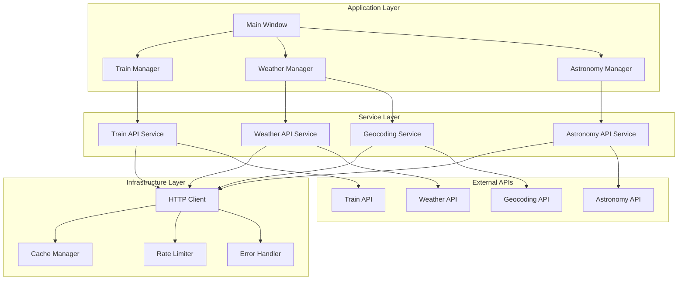
```mermaid
graph TB
    subgraph "Application Layer"
        MW[Main Window]
        TM[Train Manager]
        WM[Weather Manager]
        AM[Astronomy Manager]
    end
    
    subgraph "Service Layer"
        TAS[Train API Service]
        WAS[Weather API Service]
        AAS[Astronomy API Service]
        GS[Geocoding Service]
    end
    
    subgraph "Infrastructure Layer"
        HTTP[HTTP Client]
        Cache[Cache Manager]
        RL[Rate Limiter]
        EH[Error Handler]
    end
    
    subgraph "External APIs"
        TAPI[Train API]
        WAPI[Weather API]
        AAPI[Astronomy API]
        GAPI[Geocoding API]
    end
    
    MW --> TM
    MW --> WM
    MW --> AM
    
    TM --> TAS
    WM --> WAS
    AM --> AAS
    WM --> GS
    
    TAS --> HTTP
    WAS --> HTTP
    AAS --> HTTP
    GS --> HTTP
    
    HTTP --> Cache
    HTTP --> RL
    HTTP --> EH
    
    TAS --> TAPI
    WAS --> WAPI
    AAS --> AAPI
    GS --> GAPI
```

## API Service Implementation

### Base API Service Pattern

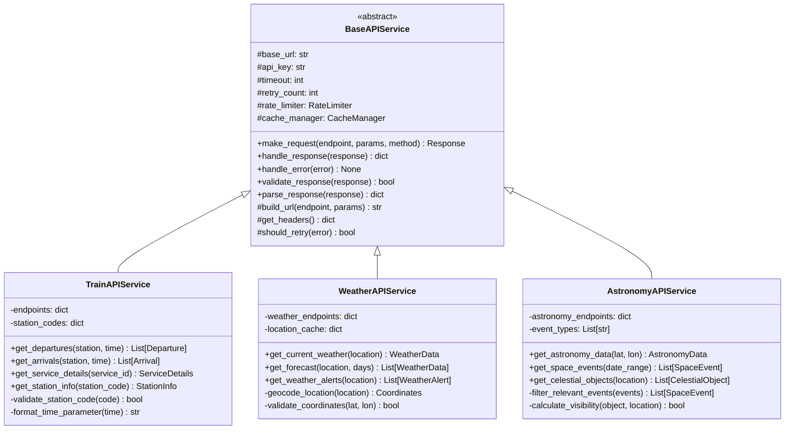
```mermaid
classDiagram
    class BaseAPIService {
        <<abstract>>
        #base_url: str
        #api_key: str
        #timeout: int
        #retry_count: int
        #rate_limiter: RateLimiter
        #cache_manager: CacheManager
        
        +make_request(endpoint, params, method) Response
        +handle_response(response) dict
        +handle_error(error) None
        +validate_response(response) bool
        +parse_response(response) dict
        #build_url(endpoint, params) str
        #get_headers() dict
        #should_retry(error) bool
    }
    
    class TrainAPIService {
        -endpoints: dict
        -station_codes: dict
        
        +get_departures(station, time) List[Departure]
        +get_arrivals(station, time) List[Arrival]
        +get_service_details(service_id) ServiceDetails
        +get_station_info(station_code) StationInfo
        -validate_station_code(code) bool
        -format_time_parameter(time) str
    }
    
    class WeatherAPIService {
        -weather_endpoints: dict
        -location_cache: dict
        
        +get_current_weather(location) WeatherData
        +get_forecast(location, days) List[WeatherData]
        +get_weather_alerts(location) List[WeatherAlert]
        -geocode_location(location) Coordinates
        -validate_coordinates(lat, lon) bool
    }
    
    class AstronomyAPIService {
        -astronomy_endpoints: dict
        -event_types: List[str]
        
        +get_astronomy_data(lat, lon) AstronomyData
        +get_space_events(date_range) List[SpaceEvent]
        +get_celestial_objects(location) List[CelestialObject]
        -filter_relevant_events(events) List[SpaceEvent]
        -calculate_visibility(object, location) bool
    }
    
    BaseAPIService <|-- TrainAPIService
    BaseAPIService <|-- WeatherAPIService
    BaseAPIService <|-- AstronomyAPIService
```

### HTTP Client Implementation

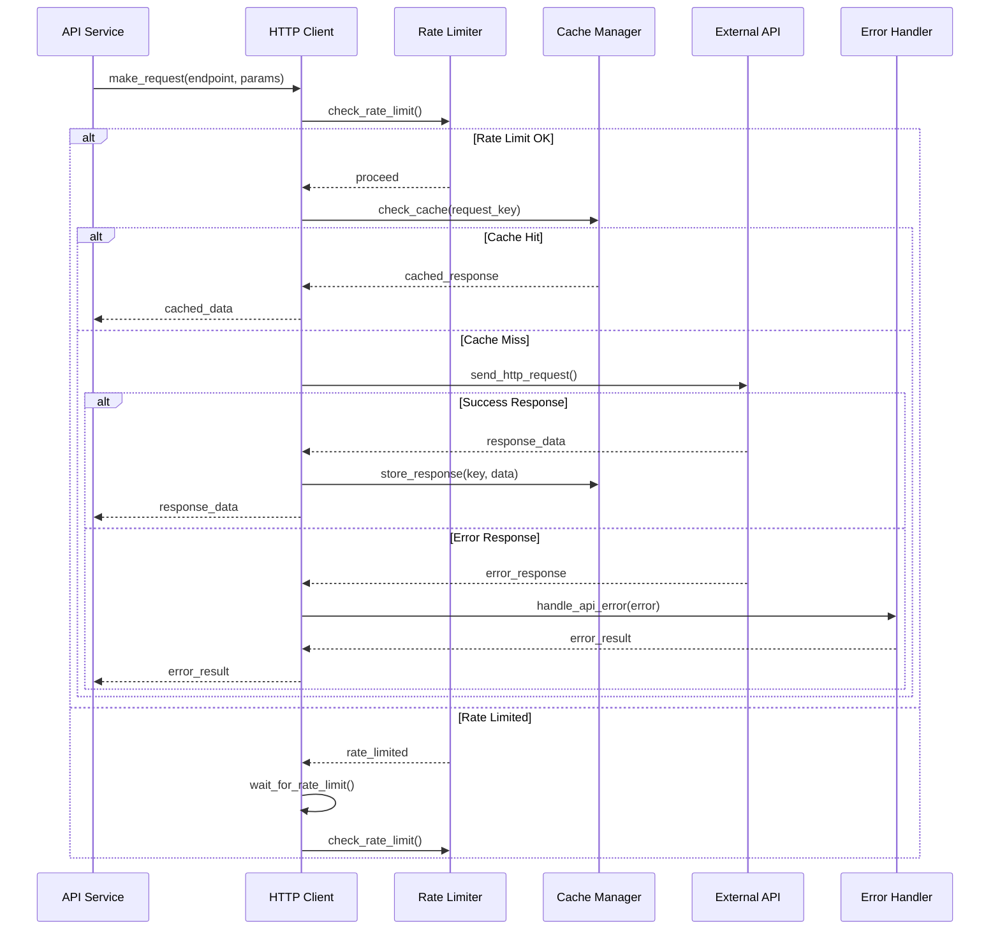
```mermaid
sequenceDiagram
    participant Service as API Service
    participant HTTP as HTTP Client
    participant RL as Rate Limiter
    participant Cache as Cache Manager
    participant API as External API
    participant EH as Error Handler
    
    Service->>HTTP: make_request(endpoint, params)
    HTTP->>RL: check_rate_limit()
    
    alt Rate Limit OK
        RL-->>HTTP: proceed
        HTTP->>Cache: check_cache(request_key)
        
        alt Cache Hit
            Cache-->>HTTP: cached_response
            HTTP-->>Service: cached_data
        else Cache Miss
            HTTP->>API: send_http_request()
            
            alt Success Response
                API-->>HTTP: response_data
                HTTP->>Cache: store_response(key, data)
                HTTP-->>Service: response_data
            else Error Response
                API-->>HTTP: error_response
                HTTP->>EH: handle_api_error(error)
                EH-->>HTTP: error_result
                HTTP-->>Service: error_result
            end
        end
    else Rate Limited
        RL-->>HTTP: rate_limited
        HTTP->>HTTP: wait_for_rate_limit()
        HTTP->>RL: check_rate_limit()
    end
```

## Train API Integration

### Train Data Flow

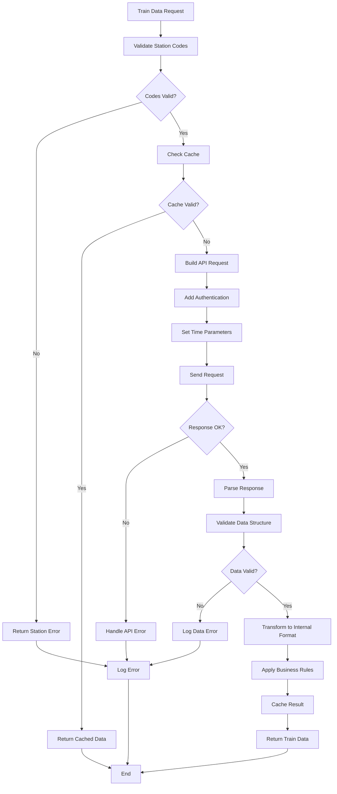
```mermaid
flowchart TD
    A[Train Data Request] --> B[Validate Station Codes]
    B --> C{Codes Valid?}
    C -->|No| D[Return Station Error]
    C -->|Yes| E[Check Cache]
    
    E --> F{Cache Valid?}
    F -->|Yes| G[Return Cached Data]
    F -->|No| H[Build API Request]
    
    H --> I[Add Authentication]
    I --> J[Set Time Parameters]
    J --> K[Send Request]
    
    K --> L{Response OK?}
    L -->|No| M[Handle API Error]
    L -->|Yes| N[Parse Response]
    
    N --> O[Validate Data Structure]
    O --> P{Data Valid?}
    P -->|No| Q[Log Data Error]
    P -->|Yes| R[Transform to Internal Format]
    
    R --> S[Apply Business Rules]
    S --> T[Cache Result]
    T --> U[Return Train Data]
    
    D --> V[Log Error]
    M --> V
    Q --> V
    G --> W[End]
    U --> W
    V --> W
```

### Train API Response Transformation

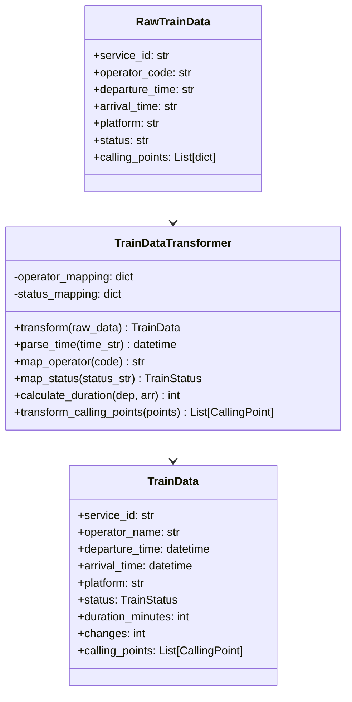
```mermaid
classDiagram
    class RawTrainData {
        +service_id: str
        +operator_code: str
        +departure_time: str
        +arrival_time: str
        +platform: str
        +status: str
        +calling_points: List[dict]
    }
    
    class TrainData {
        +service_id: str
        +operator_name: str
        +departure_time: datetime
        +arrival_time: datetime
        +platform: str
        +status: TrainStatus
        +duration_minutes: int
        +changes: int
        +calling_points: List[CallingPoint]
    }
    
    class TrainDataTransformer {
        -operator_mapping: dict
        -status_mapping: dict
        
        +transform(raw_data) TrainData
        +parse_time(time_str) datetime
        +map_operator(code) str
        +map_status(status_str) TrainStatus
        +calculate_duration(dep, arr) int
        +transform_calling_points(points) List[CallingPoint]
    }
    
    RawTrainData --> TrainDataTransformer
    TrainDataTransformer --> TrainData
```

## Weather API Integration

### Weather Data Processing Pipeline

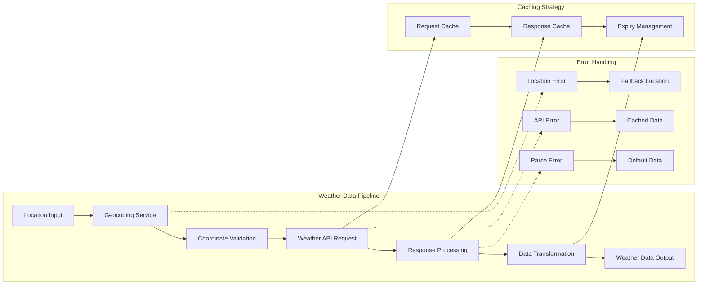
```mermaid
graph LR
    subgraph "Weather Data Pipeline"
        A[Location Input] --> B[Geocoding Service]
        B --> C[Coordinate Validation]
        C --> D[Weather API Request]
        D --> E[Response Processing]
        E --> F[Data Transformation]
        F --> G[Weather Data Output]
    end
    
    subgraph "Error Handling"
        H[Location Error] --> I[Fallback Location]
        J[API Error] --> K[Cached Data]
        L[Parse Error] --> M[Default Data]
    end
    
    subgraph "Caching Strategy"
        N[Request Cache] --> O[Response Cache]
        O --> P[Expiry Management]
    end
    
    B -.-> H
    D -.-> J
    E -.-> L
    
    D --> N
    E --> O
    F --> P
```

### Weather Data Model

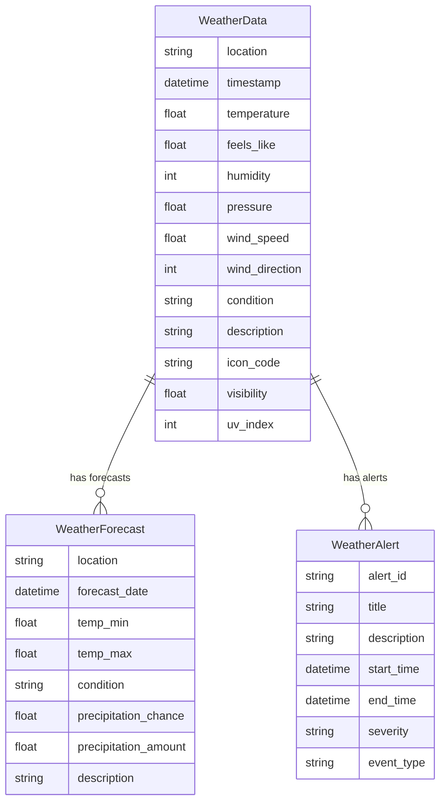
```mermaid
erDiagram
    WeatherData {
        string location
        datetime timestamp
        float temperature
        float feels_like
        int humidity
        float pressure
        float wind_speed
        int wind_direction
        string condition
        string description
        string icon_code
        float visibility
        int uv_index
    }
    
    WeatherForecast {
        string location
        datetime forecast_date
        float temp_min
        float temp_max
        string condition
        float precipitation_chance
        float precipitation_amount
        string description
    }
    
    WeatherAlert {
        string alert_id
        string title
        string description
        datetime start_time
        datetime end_time
        string severity
        string event_type
    }
    
    WeatherData ||--o{ WeatherForecast : "has forecasts"
    WeatherData ||--o{ WeatherAlert : "has alerts"
```

## Astronomy API Integration

### Hybrid Moon Phase Service

The application implements a sophisticated hybrid approach for moon phase calculations that combines API-based data with enhanced local calculations for maximum accuracy and reliability.

#### Architecture Overview

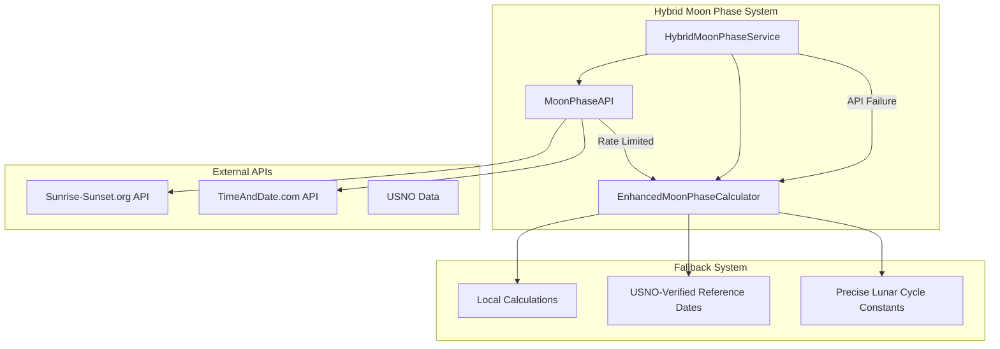
```mermaid
graph TB
    subgraph "Hybrid Moon Phase System"
        HMS[HybridMoonPhaseService]
        MPA[MoonPhaseAPI]
        EMC[EnhancedMoonPhaseCalculator]
    end
    
    subgraph "External APIs"
        SSA[Sunrise-Sunset.org API]
        TDA[TimeAndDate.com API]
        USNO[USNO Data]
    end
    
    subgraph "Fallback System"
        LC[Local Calculations]
        VRD[USNO-Verified Reference Dates]
        PLC[Precise Lunar Cycle Constants]
    end
    
    HMS --> MPA
    HMS --> EMC
    MPA --> SSA
    MPA --> TDA
    EMC --> LC
    EMC --> VRD
    EMC --> PLC
    
    HMS --> |"API Failure"| EMC
    MPA --> |"Rate Limited"| EMC
```

#### Moon Phase Service Implementation

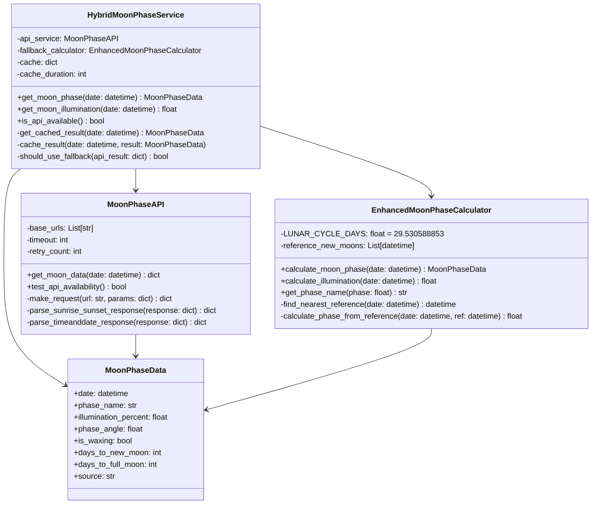
```mermaid
classDiagram
    class HybridMoonPhaseService {
        -api_service: MoonPhaseAPI
        -fallback_calculator: EnhancedMoonPhaseCalculator
        -cache: dict
        -cache_duration: int
        
        +get_moon_phase(date: datetime) MoonPhaseData
        +get_moon_illumination(date: datetime) float
        +is_api_available() bool
        -get_cached_result(date: datetime) MoonPhaseData
        -cache_result(date: datetime, result: MoonPhaseData)
        -should_use_fallback(api_result: dict) bool
    }
    
    class MoonPhaseAPI {
        -base_urls: List[str]
        -timeout: int
        -retry_count: int
        
        +get_moon_data(date: datetime) dict
        +test_api_availability() bool
        -make_request(url: str, params: dict) dict
        -parse_sunrise_sunset_response(response: dict) dict
        -parse_timeanddate_response(response: dict) dict
    }
    
    class EnhancedMoonPhaseCalculator {
        -LUNAR_CYCLE_DAYS: float = 29.530588853
        -reference_new_moons: List[datetime]
        
        +calculate_moon_phase(date: datetime) MoonPhaseData
        +calculate_illumination(date: datetime) float
        +get_phase_name(phase: float) str
        -find_nearest_reference(date: datetime) datetime
        -calculate_phase_from_reference(date: datetime, ref: datetime) float
    }
    
    class MoonPhaseData {
        +date: datetime
        +phase_name: str
        +illumination_percent: float
        +phase_angle: float
        +is_waxing: bool
        +days_to_new_moon: int
        +days_to_full_moon: int
        +source: str
    }
    
    HybridMoonPhaseService --> MoonPhaseAPI
    HybridMoonPhaseService --> EnhancedMoonPhaseCalculator
    HybridMoonPhaseService --> MoonPhaseData
    MoonPhaseAPI --> MoonPhaseData
    EnhancedMoonPhaseCalculator --> MoonPhaseData
```

#### API-First Data Flow

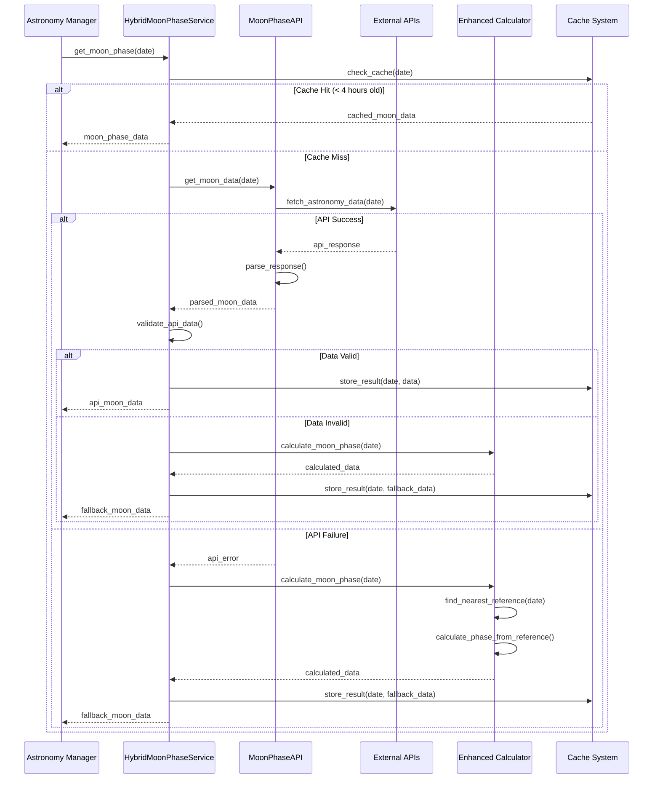
```mermaid
sequenceDiagram
    participant AM as Astronomy Manager
    participant HMS as HybridMoonPhaseService
    participant MPA as MoonPhaseAPI
    participant API as External APIs
    participant EMC as Enhanced Calculator
    participant Cache as Cache System
    
    AM->>HMS: get_moon_phase(date)
    HMS->>Cache: check_cache(date)
    
    alt Cache Hit (< 4 hours old)
        Cache-->>HMS: cached_moon_data
        HMS-->>AM: moon_phase_data
    else Cache Miss
        HMS->>MPA: get_moon_data(date)
        MPA->>API: fetch_astronomy_data(date)
        
        alt API Success
            API-->>MPA: api_response
            MPA->>MPA: parse_response()
            MPA-->>HMS: parsed_moon_data
            HMS->>HMS: validate_api_data()
            
            alt Data Valid
                HMS->>Cache: store_result(date, data)
                HMS-->>AM: api_moon_data
            else Data Invalid
                HMS->>EMC: calculate_moon_phase(date)
                EMC-->>HMS: calculated_data
                HMS->>Cache: store_result(date, fallback_data)
                HMS-->>AM: fallback_moon_data
            end
        else API Failure
            MPA-->>HMS: api_error
            HMS->>EMC: calculate_moon_phase(date)
            EMC->>EMC: find_nearest_reference(date)
            EMC->>EMC: calculate_phase_from_reference()
            EMC-->>HMS: calculated_data
            HMS->>Cache: store_result(date, fallback_data)
            HMS-->>AM: fallback_moon_data
        end
    end
```

#### Enhanced Local Calculations

The fallback system uses USNO-verified reference points for maximum accuracy:

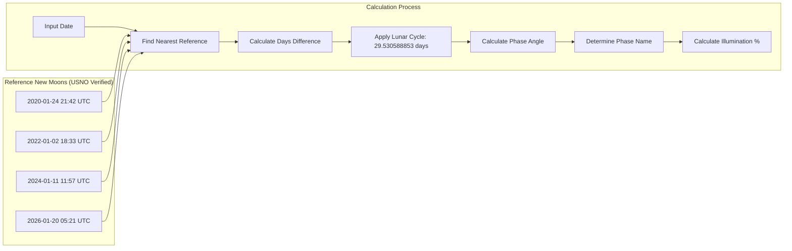
```mermaid
graph LR
    subgraph "Reference New Moons (USNO Verified)"
        R1[2020-01-24 21:42 UTC]
        R2[2022-01-02 18:33 UTC]
        R3[2024-01-11 11:57 UTC]
        R4[2026-01-20 05:21 UTC]
    end
    
    subgraph "Calculation Process"
        A[Input Date] --> B[Find Nearest Reference]
        B --> C[Calculate Days Difference]
        C --> D[Apply Lunar Cycle: 29.530588853 days]
        D --> E[Calculate Phase Angle]
        E --> F[Determine Phase Name]
        F --> G[Calculate Illumination %]
    end
    
    R1 --> B
    R2 --> B
    R3 --> B
    R4 --> B
```

#### API Endpoints and Integration

##### Primary API: Sunrise-Sunset.org
- **Endpoint**: `https://api.sunrise-sunset.org/json`
- **Parameters**: `lat`, `lng`, `date`, `formatted=0`
- **Rate Limit**: No authentication required, reasonable rate limiting
- **Data Quality**: Good for basic moon phase information
- **Fallback**: Automatic fallback to enhanced local calculation

##### Secondary API: TimeAndDate.com
- **Endpoint**: Various astronomy endpoints
- **Rate Limit**: More restrictive, used as secondary option
- **Data Quality**: High accuracy for astronomical events
- **Usage**: Backup when primary API unavailable

#### Error Handling Strategy

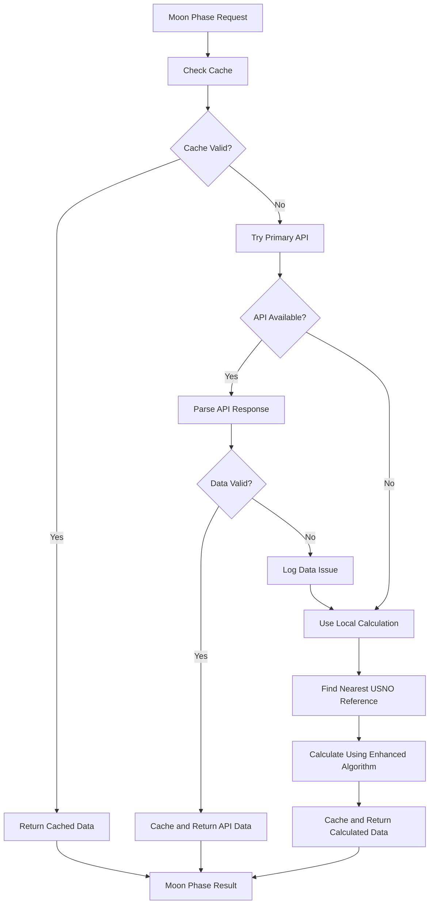
```mermaid
flowchart TD
    A[Moon Phase Request] --> B[Check Cache]
    B --> C{Cache Valid?}
    C -->|Yes| D[Return Cached Data]
    C -->|No| E[Try Primary API]
    
    E --> F{API Available?}
    F -->|Yes| G[Parse API Response]
    F -->|No| H[Use Local Calculation]
    
    G --> I{Data Valid?}
    I -->|Yes| J[Cache and Return API Data]
    I -->|No| K[Log Data Issue]
    
    K --> H
    H --> L[Find Nearest USNO Reference]
    L --> M[Calculate Using Enhanced Algorithm]
    M --> N[Cache and Return Calculated Data]
    
    D --> O[Moon Phase Result]
    J --> O
    N --> O
```

#### Accuracy Improvements

The hybrid system provides significant accuracy improvements:

| Aspect | Previous System | Hybrid System |
|--------|----------------|---------------|
| **Reference Date** | Jan 1, 2024 (incorrect) | Multiple USNO-verified dates |
| **Lunar Cycle** | 29.53 days (approximate) | 29.530588853 days (precise) |
| **Accuracy** | ±1-2 days potential error | ±2-4 hours for phase transitions |
| **Reliability** | Local calculation only | API-first with robust fallback |
| **Data Source** | Single calculation | Multiple verified sources |

#### Integration with Astronomy Manager

The hybrid service integrates seamlessly with the existing astronomy system:

```python
# astronomy_manager.py integration
from services.moon_phase_service import HybridMoonPhaseService

class AstronomyManager:
    def __init__(self):
        self.moon_phase_service = HybridMoonPhaseService()
    
    def get_current_moon_phase(self):
        """Get current moon phase using hybrid service."""
        return self.moon_phase_service.get_moon_phase(datetime.now())
```

### Astronomy Data Aggregation

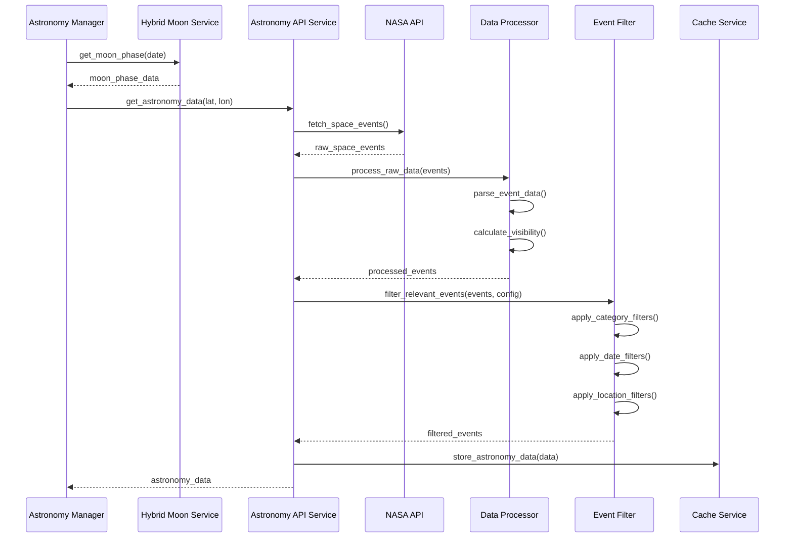
```mermaid
sequenceDiagram
    participant AM as Astronomy Manager
    participant HMS as Hybrid Moon Service
    participant AAS as Astronomy API Service
    participant NASA as NASA API
    participant Proc as Data Processor
    participant Filter as Event Filter
    participant Cache as Cache Service
    
    AM->>HMS: get_moon_phase(date)
    HMS-->>AM: moon_phase_data
    
    AM->>AAS: get_astronomy_data(lat, lon)
    AAS->>NASA: fetch_space_events()
    NASA-->>AAS: raw_space_events
    
    AAS->>Proc: process_raw_data(events)
    Proc->>Proc: parse_event_data()
    Proc->>Proc: calculate_visibility()
    Proc-->>AAS: processed_events
    
    AAS->>Filter: filter_relevant_events(events, config)
    Filter->>Filter: apply_category_filters()
    Filter->>Filter: apply_date_filters()
    Filter->>Filter: apply_location_filters()
    Filter-->>AAS: filtered_events
    
    AAS->>Cache: store_astronomy_data(data)
    AAS-->>AM: astronomy_data
```

### Astronomy Event Categories

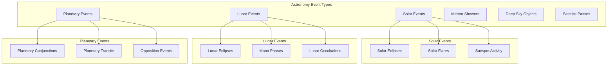
```mermaid
graph TD
    subgraph "Astronomy Event Types"
        A[Solar Events]
        B[Lunar Events]
        C[Planetary Events]
        D[Meteor Showers]
        E[Deep Sky Objects]
        F[Satellite Passes]
    end
    
    subgraph "Solar Events"
        A1[Solar Eclipses]
        A2[Solar Flares]
        A3[Sunspot Activity]
    end
    
    subgraph "Lunar Events"
        B1[Lunar Eclipses]
        B2[Moon Phases]
        B3[Lunar Occultations]
    end
    
    subgraph "Planetary Events"
        C1[Planetary Conjunctions]
        C2[Planetary Transits]
        C3[Opposition Events]
    end
    
    A --> A1
    A --> A2
    A --> A3
    
    B --> B1
    B --> B2
    B --> B3
    
    C --> C1
    C --> C2
    C --> C3
```

## Error Handling Strategies

### API Error Classification

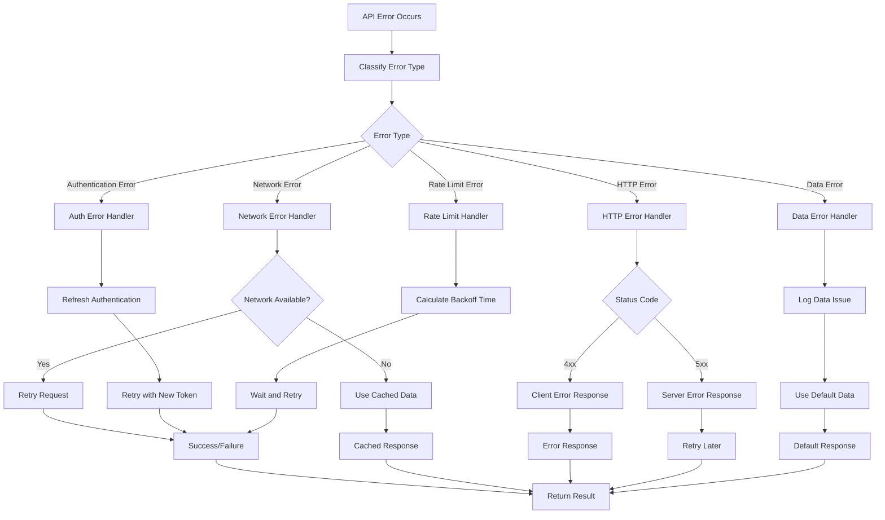
```mermaid
flowchart TD
    A[API Error Occurs] --> B[Classify Error Type]
    B --> C{Error Type}
    
    C -->|Network Error| D[Network Error Handler]
    C -->|HTTP Error| E[HTTP Error Handler]
    C -->|Authentication Error| F[Auth Error Handler]
    C -->|Rate Limit Error| G[Rate Limit Handler]
    C -->|Data Error| H[Data Error Handler]
    
    D --> I{Network Available?}
    I -->|Yes| J[Retry Request]
    I -->|No| K[Use Cached Data]
    
    E --> L{Status Code}
    L -->|4xx| M[Client Error Response]
    L -->|5xx| N[Server Error Response]
    
    F --> O[Refresh Authentication]
    O --> P[Retry with New Token]
    
    G --> Q[Calculate Backoff Time]
    Q --> R[Wait and Retry]
    
    H --> S[Log Data Issue]
    S --> T[Use Default Data]
    
    J --> U[Success/Failure]
    K --> V[Cached Response]
    M --> W[Error Response]
    N --> X[Retry Later]
    P --> U
    R --> U
    T --> Y[Default Response]
    
    U --> Z[Return Result]
    V --> Z
    W --> Z
    X --> Z
    Y --> Z
```

### Retry Logic Implementation

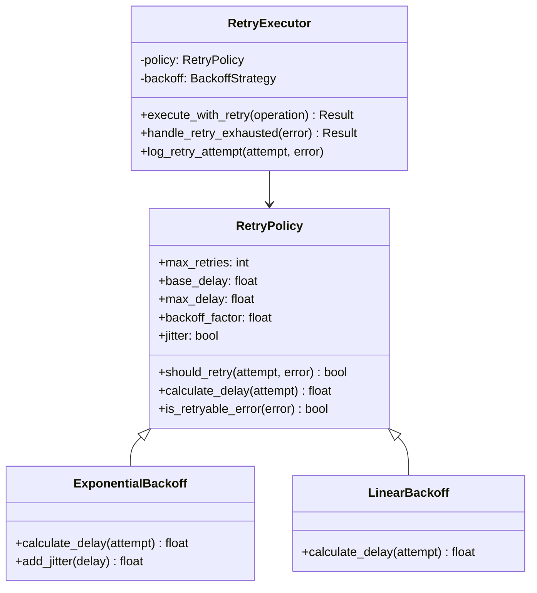
```mermaid
classDiagram
    class RetryPolicy {
        +max_retries: int
        +base_delay: float
        +max_delay: float
        +backoff_factor: float
        +jitter: bool
        
        +should_retry(attempt, error) bool
        +calculate_delay(attempt) float
        +is_retryable_error(error) bool
    }
    
    class ExponentialBackoff {
        +calculate_delay(attempt) float
        +add_jitter(delay) float
    }
    
    class LinearBackoff {
        +calculate_delay(attempt) float
    }
    
    class RetryExecutor {
        -policy: RetryPolicy
        -backoff: BackoffStrategy
        
        +execute_with_retry(operation) Result
        +handle_retry_exhausted(error) Result
        +log_retry_attempt(attempt, error)
    }
    
    RetryPolicy <|-- ExponentialBackoff
    RetryPolicy <|-- LinearBackoff
    RetryExecutor --> RetryPolicy
```

## Rate Limiting

### Rate Limiting Strategy

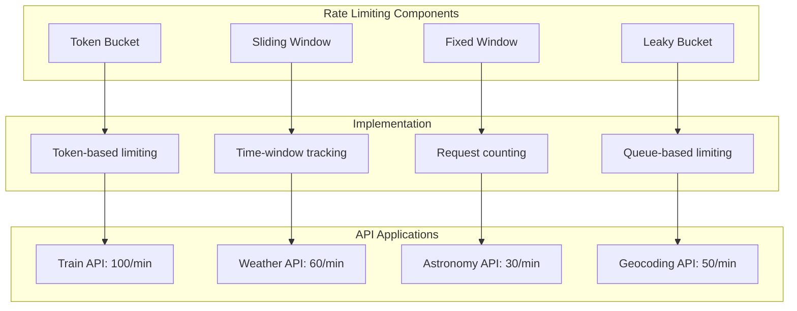
```mermaid
graph TB
    subgraph "Rate Limiting Components"
        A[Token Bucket]
        B[Sliding Window]
        C[Fixed Window]
        D[Leaky Bucket]
    end
    
    subgraph "Implementation"
        A1[Token-based limiting]
        B1[Time-window tracking]
        C1[Request counting]
        D1[Queue-based limiting]
    end
    
    subgraph "API Applications"
        AA[Train API: 100/min]
        BB[Weather API: 60/min]
        CC[Astronomy API: 30/min]
        DD[Geocoding API: 50/min]
    end
    
    A --> A1 --> AA
    B --> B1 --> BB
    C --> C1 --> CC
    D --> D1 --> DD
```

### Rate Limiter Implementation

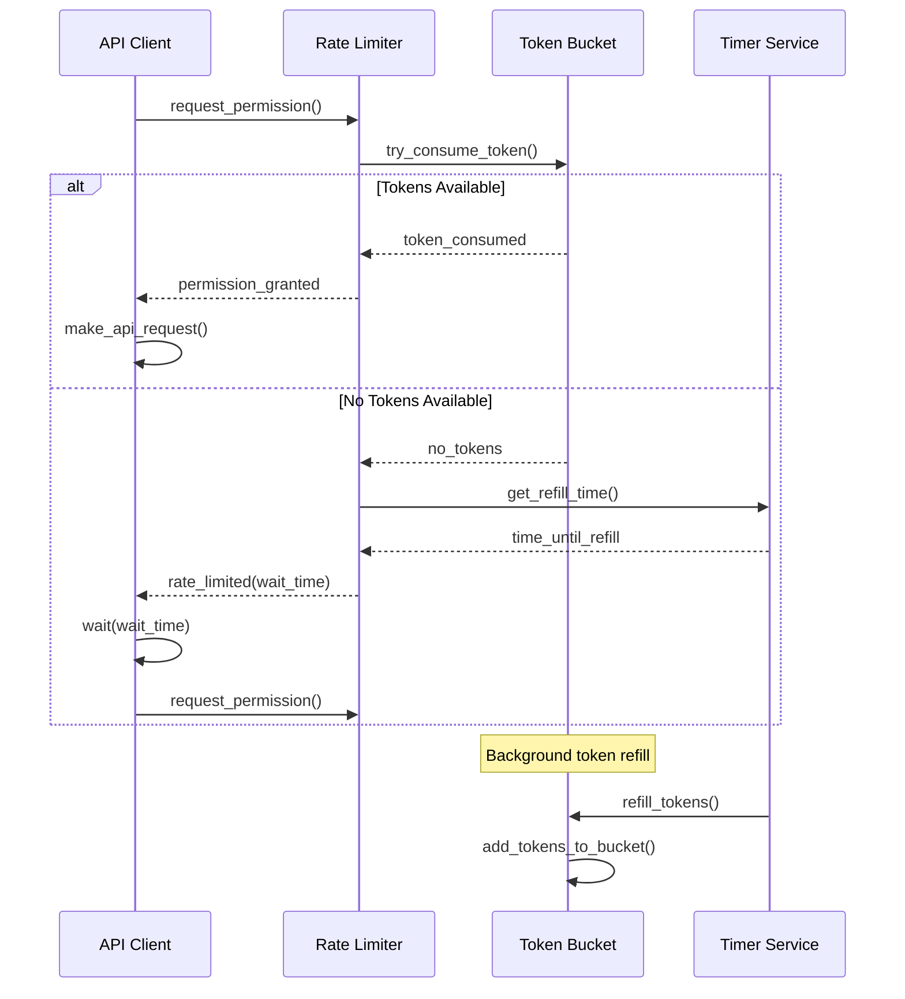
```mermaid
sequenceDiagram
    participant Client as API Client
    participant RL as Rate Limiter
    participant TB as Token Bucket
    participant Timer as Timer Service
    
    Client->>RL: request_permission()
    RL->>TB: try_consume_token()
    
    alt Tokens Available
        TB-->>RL: token_consumed
        RL-->>Client: permission_granted
        Client->>Client: make_api_request()
    else No Tokens Available
        TB-->>RL: no_tokens
        RL->>Timer: get_refill_time()
        Timer-->>RL: time_until_refill
        RL-->>Client: rate_limited(wait_time)
        Client->>Client: wait(wait_time)
        Client->>RL: request_permission()
    end
    
    Note over TB: Background token refill
    Timer->>TB: refill_tokens()
    TB->>TB: add_tokens_to_bucket()
```

## Caching Strategies

### Multi-Level API Caching

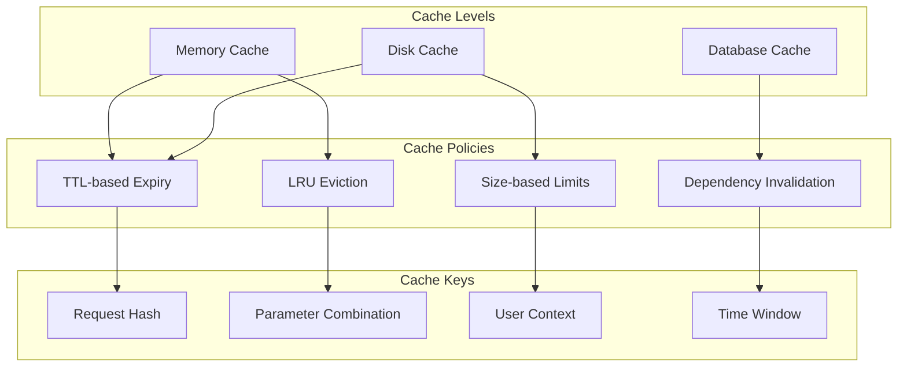
```mermaid
graph TB
    subgraph "Cache Levels"
        L1[Memory Cache]
        L2[Disk Cache]
        L3[Database Cache]
    end
    
    subgraph "Cache Policies"
        P1[TTL-based Expiry]
        P2[LRU Eviction]
        P3[Size-based Limits]
        P4[Dependency Invalidation]
    end
    
    subgraph "Cache Keys"
        K1[Request Hash]
        K2[Parameter Combination]
        K3[User Context]
        K4[Time Window]
    end
    
    L1 --> P1
    L1 --> P2
    L2 --> P1
    L2 --> P3
    L3 --> P4
    
    P1 --> K1
    P2 --> K2
    P3 --> K3
    P4 --> K4
```

### Cache Invalidation Flow

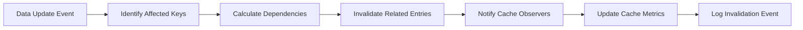
```mermaid
flowchart LR
    A[Data Update Event] --> B[Identify Affected Keys]
    B --> C[Calculate Dependencies]
    C --> D[Invalidate Related Entries]
    D --> E[Notify Cache Observers]
    E --> F[Update Cache Metrics]
    F --> G[Log Invalidation Event]
```

## API Monitoring and Metrics

### API Performance Monitoring

```mermaid
graph LR
    subgraph "Metrics Collection"
        A[Response Time]
        B[Success Rate]
        C[Error Rate]
        D[Cache Hit Rate]
        E[Rate Limit Usage]
    end
    
    subgraph "Monitoring Tools"
        F[Performance Logger]
        G[Error Tracker]
        H[Cache Monitor]
        I[Rate Limit Monitor]
    end
    
    subgraph "Alerting"
        J[High Error Rate Alert]
        K[Slow Response Alert]
        L[Rate Limit Alert]
        M[Cache Miss Alert]
    end
    
    A --> F --> J
    B --> G --> J
    C --> G --> K
    D --> H --> M
    E --> I --> L
```

### API Health Checks

```mermaid
sequenceDiagram
    participant Monitor as Health Monitor
    participant TAS as Train API Service
    participant WAS as Weather API Service
    participant AAS as Astronomy API Service
    participant Alert as Alert System
    
    loop Every 5 minutes
        Monitor->>TAS: health_check()
        TAS-->>Monitor: status_response
        
        Monitor->>WAS: health_check()
        WAS-->>Monitor: status_response
        
        Monitor->>AAS: health_check()
        AAS-->>Monitor: status_response
        
        Monitor->>Monitor: evaluate_health_status()
        
        alt Service Unhealthy
            Monitor->>Alert: send_alert(service, status)
            Alert->>Alert: notify_administrators()
        end
    end
```

## Security Considerations

### API Security Implementation

```mermaid
graph TD
    subgraph "Security Measures"
        A[API Key Management]
        B[Request Signing]
        C[SSL/TLS Encryption]
        D[Input Validation]
        E[Output Sanitization]
    end
    
    subgraph "Implementation"
        A1[Secure Key Storage]
        B1[HMAC Signatures]
        C1[Certificate Validation]
        D1[Parameter Validation]
        E1[Response Filtering]
    end
    
    subgraph "Protection Against"
        P1[Key Exposure]
        P2[Request Tampering]
        P3[Man-in-Middle]
        P4[Injection Attacks]
        P5[Data Leakage]
    end
    
    A --> A1 --> P1
    B --> B1 --> P2
    C --> C1 --> P3
    D --> D1 --> P4
    E --> E1 --> P5
```

## Future API Enhancements

### Planned API Improvements

1. **GraphQL Integration**: More efficient data fetching
2. **WebSocket Support**: Real-time data updates
3. **API Gateway**: Centralized API management
4. **Service Mesh**: Advanced service-to-service communication
5. **Event-Driven Architecture**: Asynchronous API interactions

### Extension Points

- **Custom API Adapters**: Support for new data sources
- **API Versioning**: Backward compatibility management
- **Advanced Caching**: Intelligent cache warming and invalidation
- **API Analytics**: Detailed usage and performance analytics
- **Multi-Region Support**: Geographic API distribution

---

*This API integration documentation is maintained alongside the API service codebase and updated with each API-related change.*