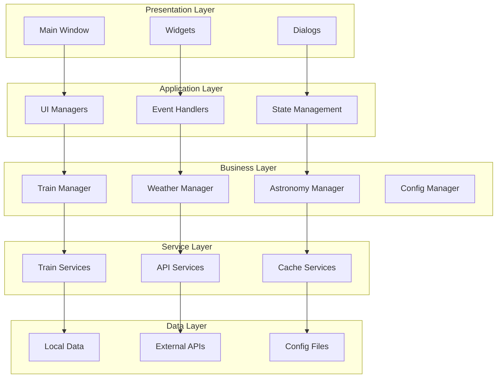
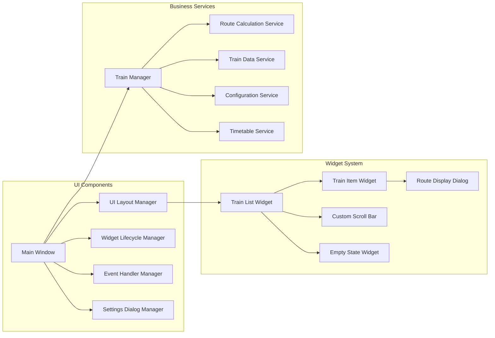
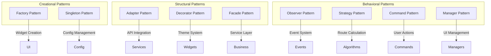
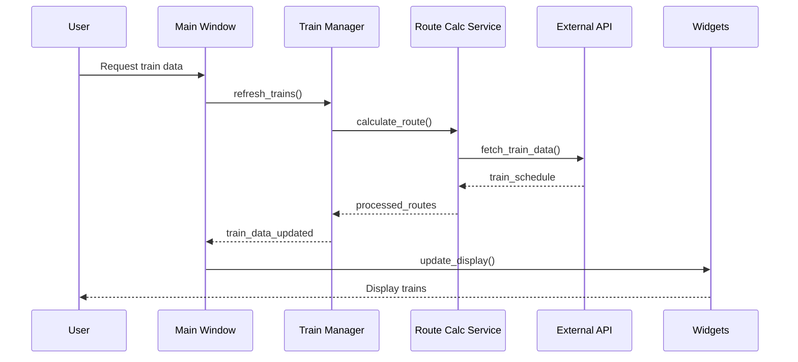
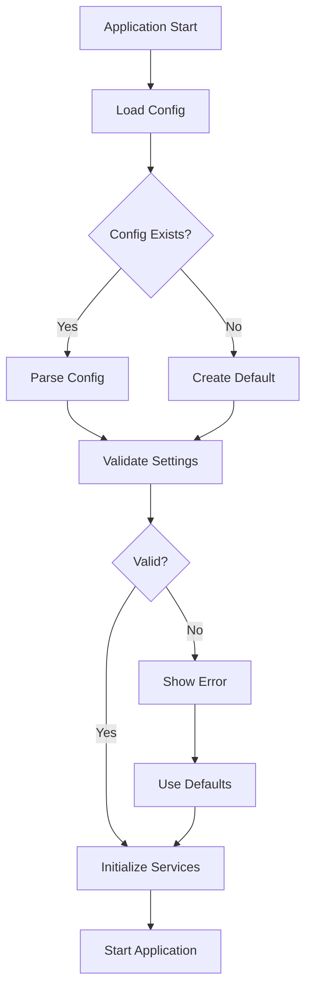
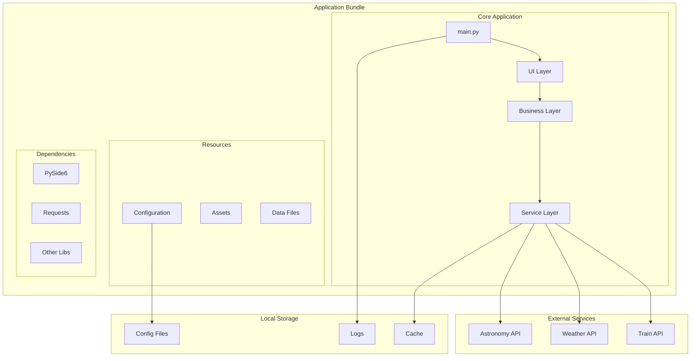
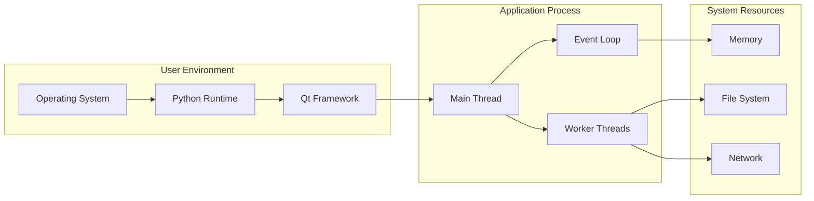

# Train Times Application - Architecture Overview

## Table of Contents

1. [System Overview](#system-overview)
2. [Architecture Principles](#architecture-principles)
3. [Component Architecture](#component-architecture)
4. [Detailed Documentation](#detailed-documentation)
5. [Design Patterns](#design-patterns)
6. [Data Flow](#data-flow)
7. [Deployment Architecture](#deployment-architecture)

## System Overview

The Train Times application is a desktop application built with PySide6 (Qt for Python) that provides real-time train schedule information with integrated weather and astronomy data. The application follows a modular, object-oriented architecture based on SOLID principles and established design patterns.

### High-Level Architecture

### Key Architectural Decisions

- **Layered Architecture**: Clear separation between presentation, application, business, service, and data layers
- **Service-Oriented Design**: Business logic encapsulated in focused service classes
- **Manager Pattern**: UI complexity managed through specialized manager classes
- **Observer Pattern**: Loose coupling through Qt's signal/slot mechanism
- **Dependency Injection**: Services receive dependencies through constructors

## Architecture Principles

### SOLID Principles Implementation

1. **Single Responsibility Principle (SRP)**
   - Each class has one reason to change
   - UI managers handle specific aspects of window functionality
   - Services focus on single business domains

2. **Open/Closed Principle (OCP)**
   - New features added through extension, not modification
   - Plugin-ready architecture for future enhancements

3. **Liskov Substitution Principle (LSP)**
   - Proper inheritance hierarchies
   - Interface-based design for interchangeable components

4. **Interface Segregation Principle (ISP)**
   - Focused interfaces for specific functionality
   - No forced dependencies on unused methods

5. **Dependency Inversion Principle (DIP)**
   - High-level modules depend on abstractions
   - Dependency injection throughout the application

### Design Quality Attributes

- **Maintainability**: Modular design with clear boundaries
- **Testability**: Isolated components with mockable dependencies
- **Scalability**: Service-oriented architecture supports growth
- **Reliability**: Error handling and graceful degradation
- **Performance**: Efficient resource management and caching

## Component Architecture

### Core Components Overview

## Detailed Documentation

### Component Documentation

- **[UI Architecture](ui-architecture.md)** - Detailed UI component structure and interactions
- **[Service Architecture](service-architecture.md)** - Business logic and service layer design
- **[Widget System](widget-system.md)** - Widget hierarchy and component relationships
- **[Data Flow](data-flow.md)** - Information flow through the application
- **[API Integration](api-integration.md)** - External service integration patterns

### Technical Documentation

- **[Design Patterns](design-patterns.md)** - Implemented patterns and their usage
- **[Configuration Management](configuration.md)** - Settings and configuration handling
- **[Error Handling](error-handling.md)** - Error management and recovery strategies
- **[Performance Optimization](performance.md)** - Performance considerations and optimizations
- **[Testing Strategy](testing-strategy.md)** - Testing approach and guidelines

## Design Patterns

### Primary Patterns Used

## Data Flow

### Application Data Flow

### Configuration Flow

## Deployment Architecture

### Application Structure

### Runtime Environment

## Architecture Benefits

### Achieved Goals

1. **Modularity**: Clear component boundaries and responsibilities
2. **Maintainability**: Easy to understand, modify, and extend
3. **Testability**: Isolated components with mockable dependencies
4. **Scalability**: Service-oriented design supports feature growth
5. **Reliability**: Robust error handling and graceful degradation
6. **Performance**: Efficient resource usage and responsive UI

### Quality Metrics

- **Code Coverage**: Comprehensive test coverage across all layers
- **Cyclomatic Complexity**: Low complexity through focused classes
- **Coupling**: Loose coupling through dependency injection
- **Cohesion**: High cohesion within individual components
- **Documentation**: Complete architectural and API documentation

## Future Enhancements

### Planned Improvements

1. **Plugin Architecture**: Support for third-party extensions
2. **Microservices**: Further service decomposition
3. **Event Sourcing**: Enhanced state management and debugging
4. **Containerization**: Docker-based deployment options
5. **Cloud Integration**: Cloud-based configuration and data sync

### Extension Points

- **New Data Sources**: Additional transport and weather providers
- **Custom Themes**: User-defined appearance customization
- **Advanced Analytics**: Journey planning and optimization
- **Mobile Companion**: Cross-platform synchronization
- **API Gateway**: Centralized external service management

---

*This architecture documentation is maintained alongside the codebase and updated with each significant architectural change.*