# Data Flow Documentation

## Overview

The Train Times application follows a unidirectional data flow pattern where data flows from external sources through services, managers, and finally to the UI components. This architecture ensures predictable data updates and makes debugging easier.

## Application Data Flow Architecture

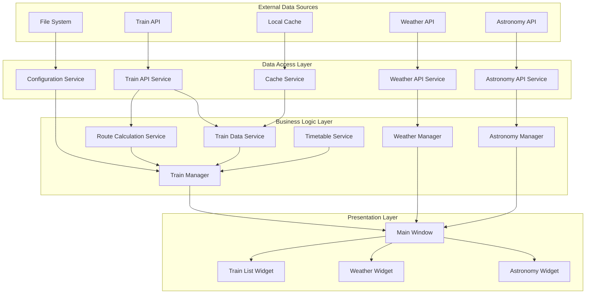

## Train Data Flow

### Complete Train Data Journey

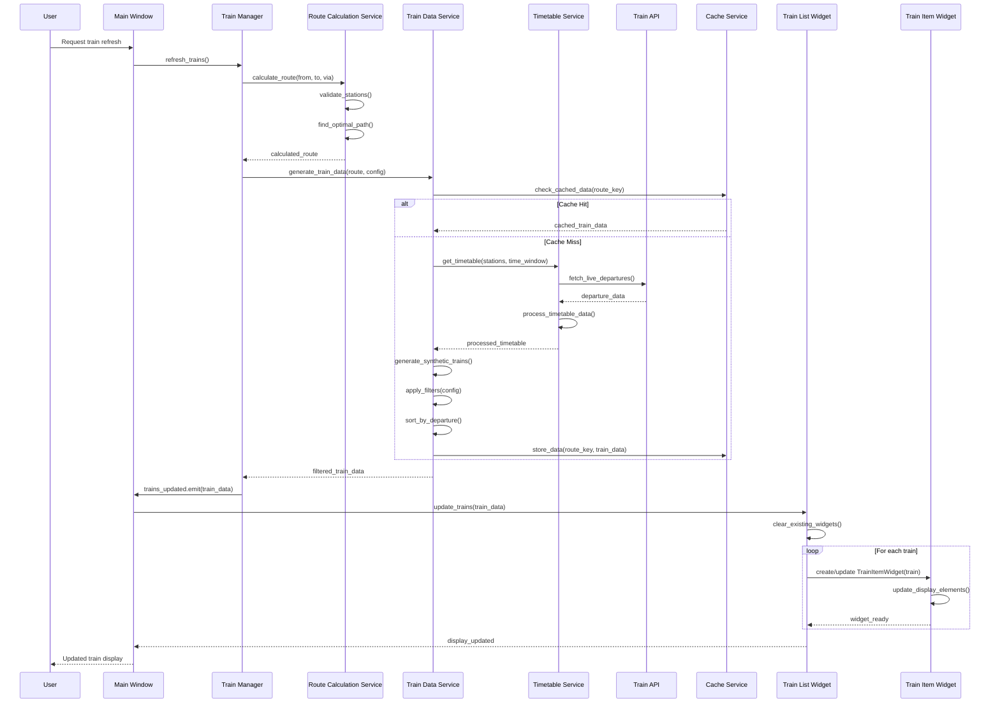

### Route Calculation Data Flow

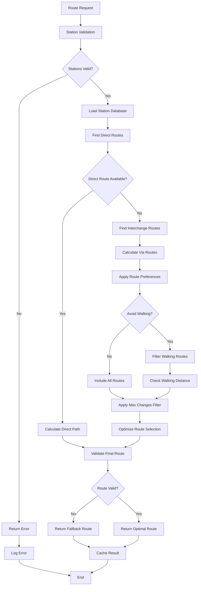

## Configuration Data Flow

### Configuration Loading and Updates

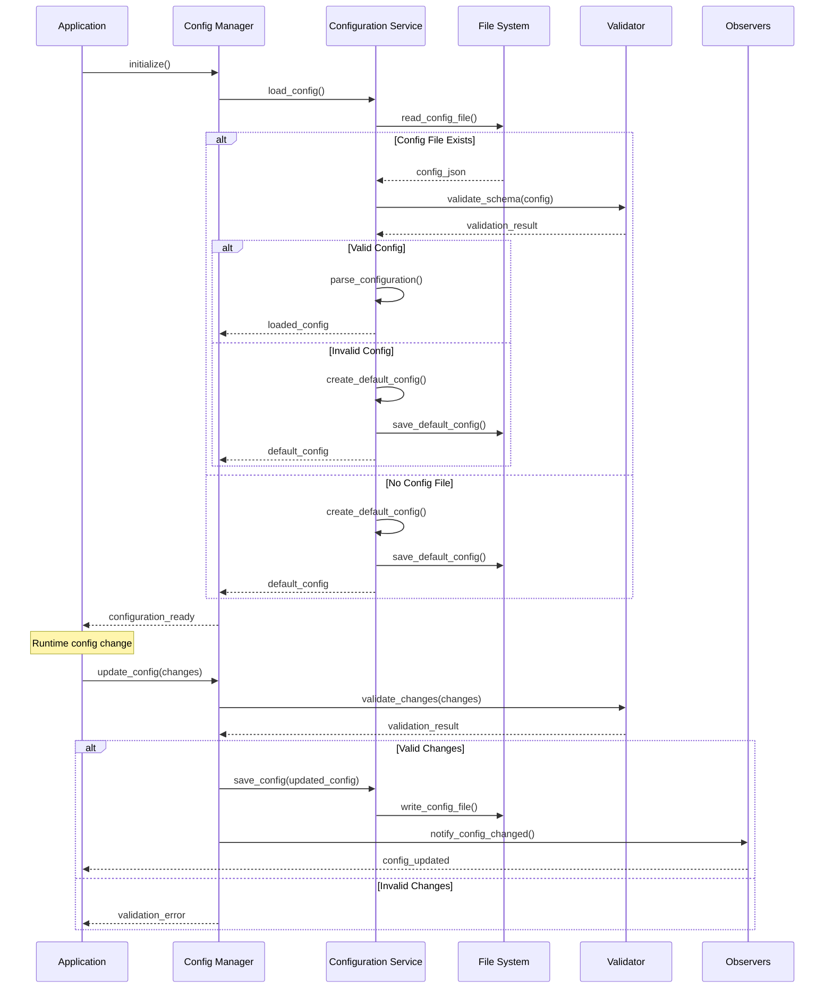

### Configuration Propagation

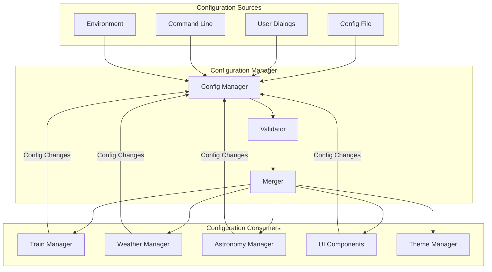

## Weather Data Flow

### Weather Information Pipeline

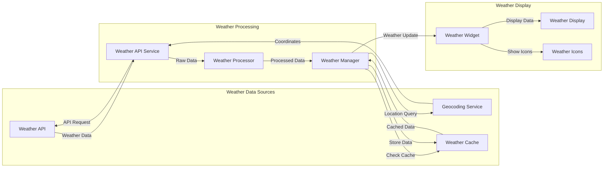

### Weather Update Cycle

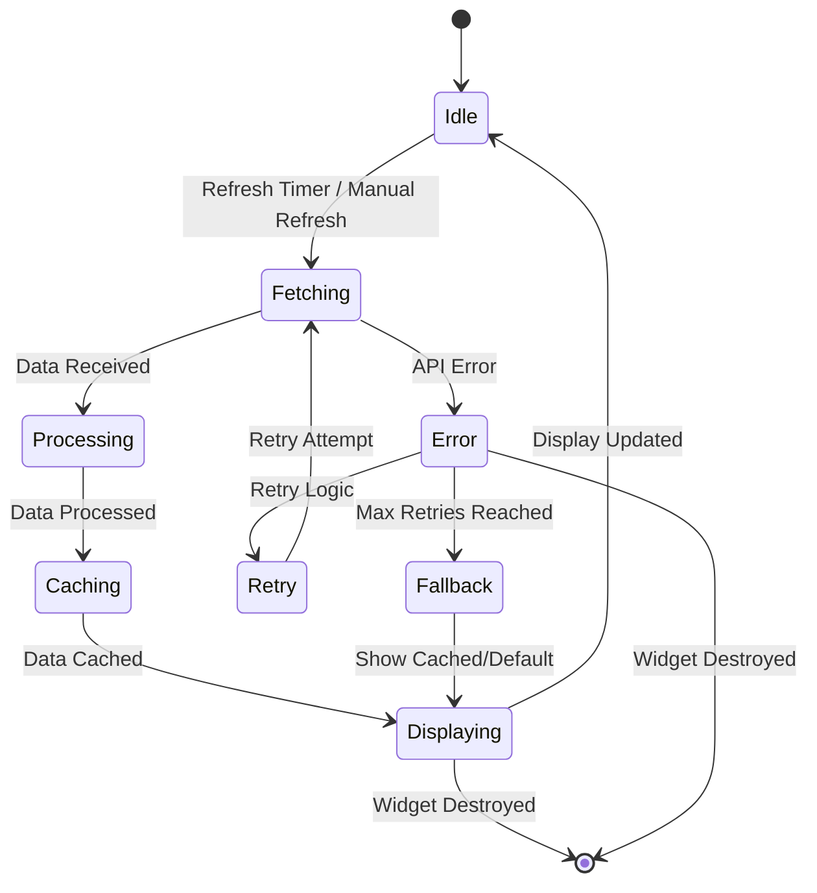

## Astronomy Data Flow

### Astronomy Information Pipeline

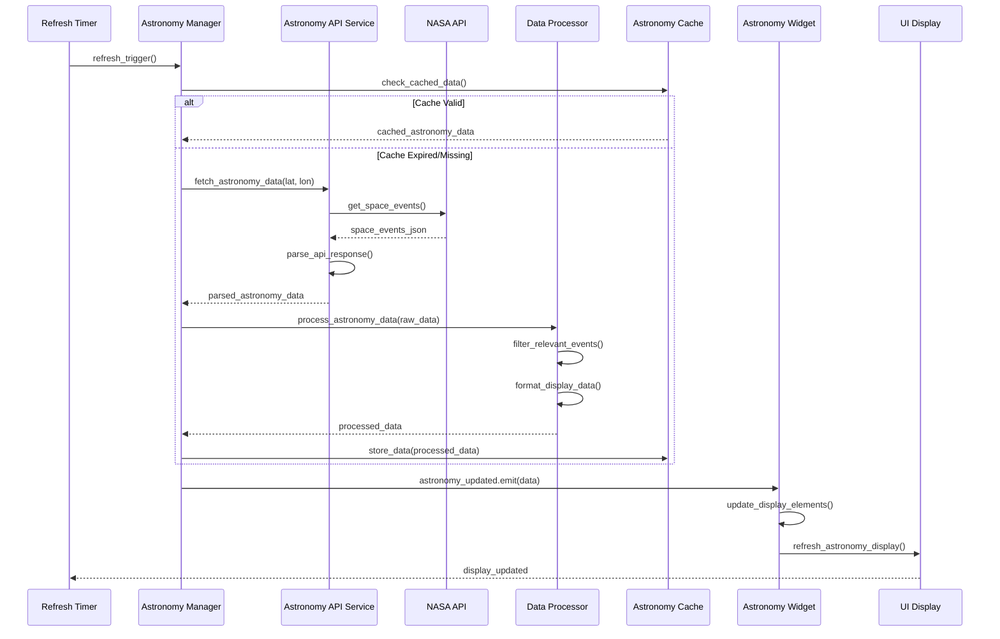

## Error Data Flow

### Error Handling and Recovery

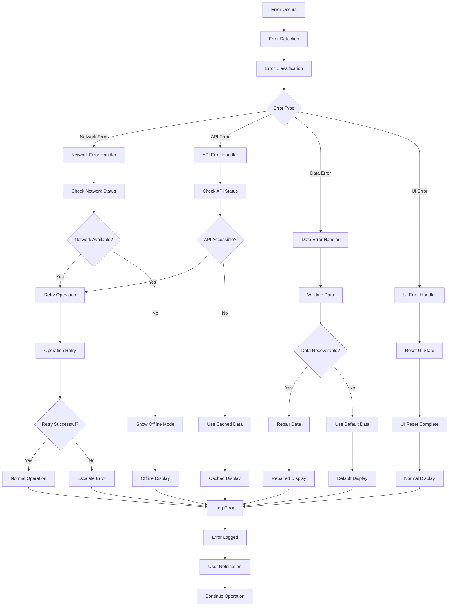

## Cache Data Flow

### Multi-Level Caching Strategy

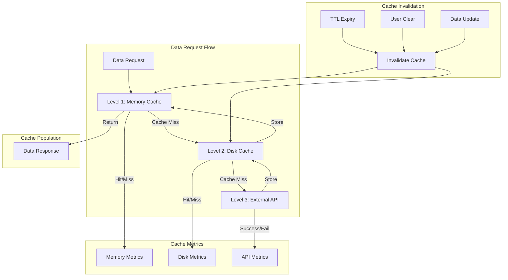

### Cache Lifecycle Management

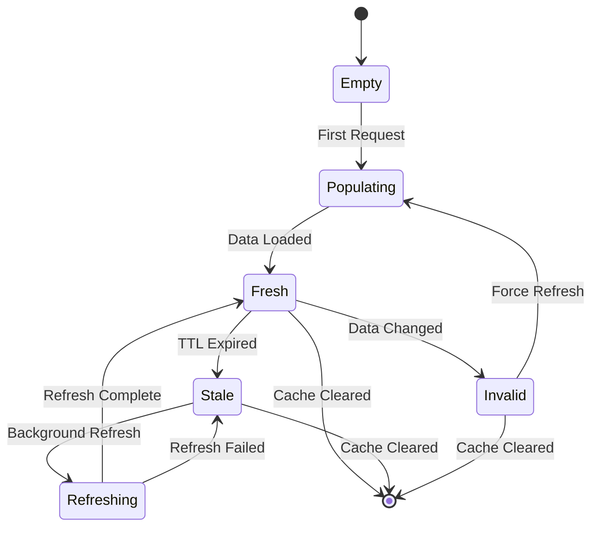

## Performance Data Flow

### Data Flow Optimization

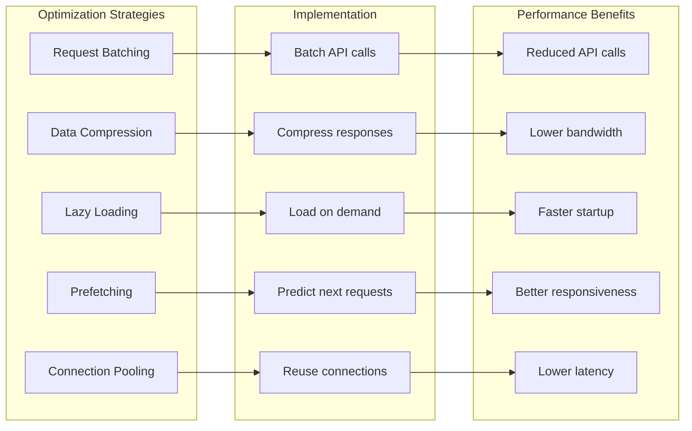

## Data Validation Flow

### Input Validation Pipeline

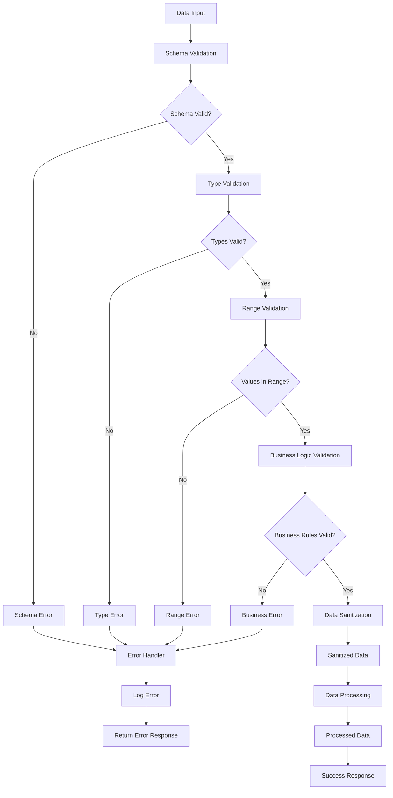

## Future Data Flow Enhancements

### Planned Improvements

1. **Event Sourcing**: Complete audit trail of data changes
2. **Real-time Updates**: WebSocket-based live data updates
3. **Data Streaming**: Continuous data flow for large datasets
4. **Distributed Caching**: Shared cache across multiple instances
5. **Data Analytics**: Usage patterns and performance metrics

### Extension Points

- **Custom Data Sources**: Plugin architecture for new data providers
- **Data Transformation**: Configurable data processing pipelines
- **Advanced Caching**: Intelligent cache warming and eviction
- **Data Synchronization**: Multi-device data consistency
- **Offline Support**: Comprehensive offline data management

---

*This data flow documentation is maintained alongside the application codebase and updated with each data-related change.*