# Design Patterns Documentation

## Overview

The Train Times application implements several well-established design patterns to achieve maintainable, extensible, and testable code. This document details the patterns used, their implementation, and the benefits they provide.

## Implemented Design Patterns

### Creational Patterns

#### 1. Factory Pattern

Used for creating widgets and service instances with consistent configuration.

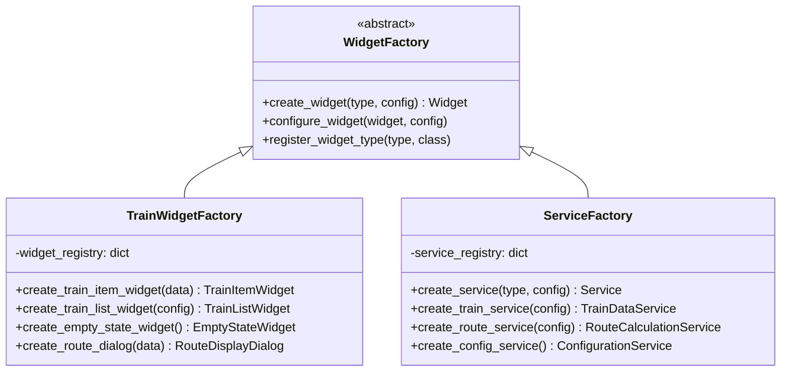

**Implementation Example:**
```python
class TrainWidgetFactory:
    @staticmethod
    def create_train_item_widget(train_data: TrainData, theme: str) -> TrainItemWidget:
        widget = TrainItemWidget(train_data)
        widget.apply_theme(theme)
        widget.setup_ui()
        return widget
    
    @staticmethod
    def create_train_list_widget(max_trains: int = 50) -> TrainListWidget:
        widget = TrainListWidget(max_trains)
        widget.setup_scroll_area()
        widget.setup_empty_state()
        return widget
```

#### 2. Singleton Pattern

Used for configuration management and theme management to ensure single instances.

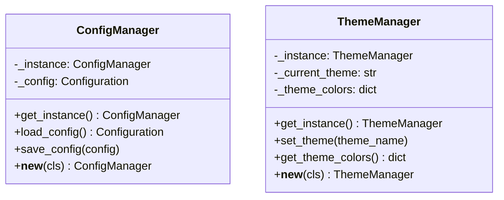

**Implementation Example:**
```python
class ConfigManager:
    _instance = None
    _config = None
    
    def __new__(cls):
        if cls._instance is None:
            cls._instance = super().__new__(cls)
        return cls._instance
    
    def load_config(self) -> Configuration:
        if self._config is None:
            self._config = self._load_from_file()
        return self._config
```

### Structural Patterns

#### 3. Adapter Pattern

Used to integrate external APIs with consistent internal interfaces.

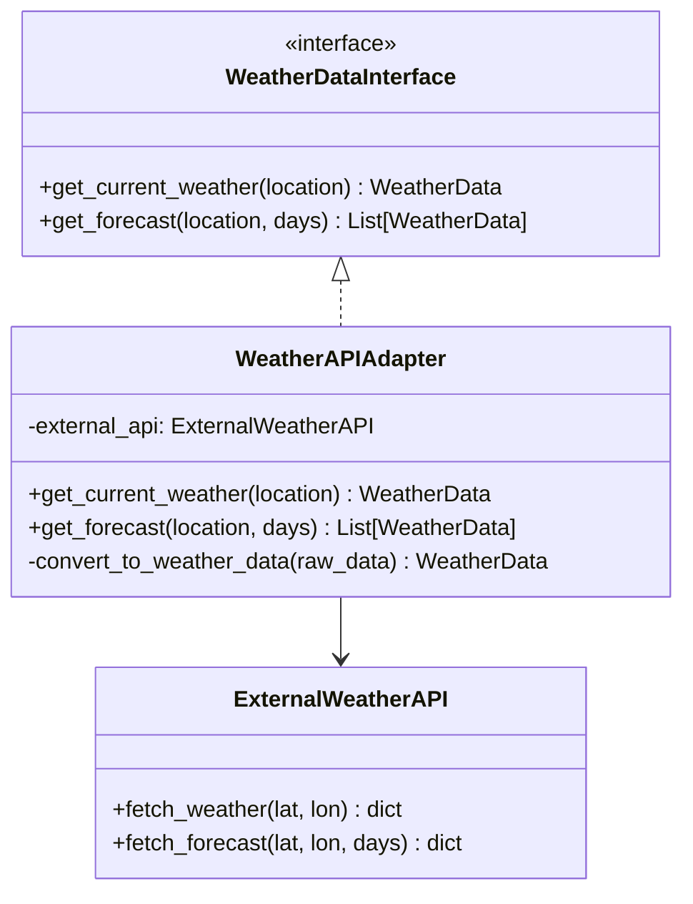

**Implementation Example:**
```python
class WeatherAPIAdapter(WeatherDataInterface):
    def __init__(self, external_api: ExternalWeatherAPI):
        self.external_api = external_api
    
    def get_current_weather(self, location: str) -> WeatherData:
        raw_data = self.external_api.fetch_weather(location)
        return self._convert_to_weather_data(raw_data)
    
    def _convert_to_weather_data(self, raw_data: dict) -> WeatherData:
        return WeatherData(
            temperature=raw_data['temp'],
            condition=raw_data['weather'][0]['main'],
            humidity=raw_data['humidity']
        )
```

#### 4. Facade Pattern

Used to provide simplified interfaces to complex subsystems.

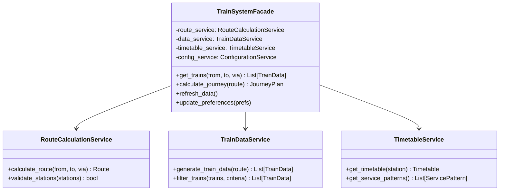

#### 5. Decorator Pattern

Used for theme application and widget enhancement.

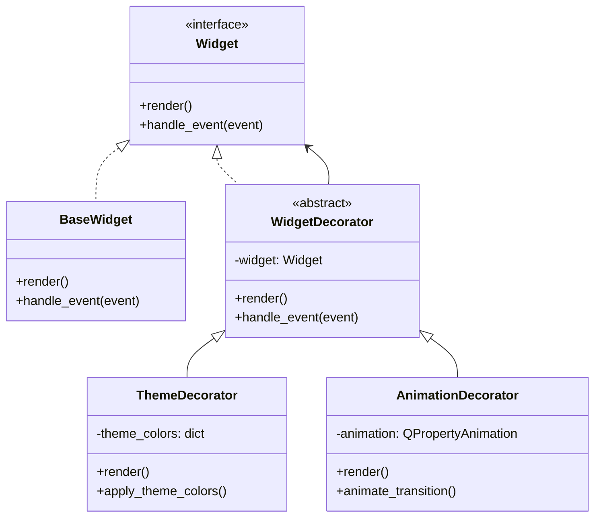

### Behavioral Patterns

#### 6. Observer Pattern

Implemented through Qt's signal-slot mechanism for loose coupling.

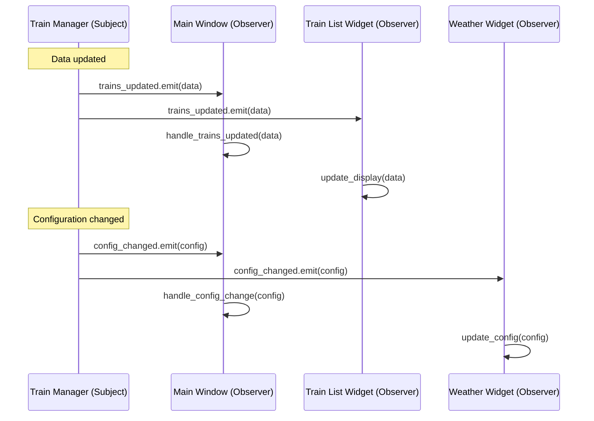

**Implementation Example:**
```python
class TrainManager(QObject):
    trains_updated = Signal(list)
    config_changed = Signal(object)
    error_occurred = Signal(str)
    
    def refresh_trains(self):
        try:
            trains = self._fetch_train_data()
            self.trains_updated.emit(trains)
        except Exception as e:
            self.error_occurred.emit(str(e))

class MainWindow(QMainWindow):
    def __init__(self):
        super().__init__()
        self.train_manager = TrainManager()
        self.train_manager.trains_updated.connect(self.update_train_display)
        self.train_manager.error_occurred.connect(self.show_error)
```

#### 7. Strategy Pattern

Used for different route calculation algorithms and theme strategies.

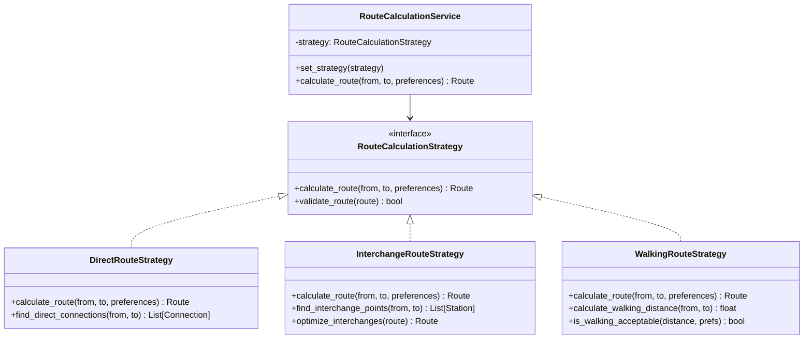

**Implementation Example:**
```python
class RouteCalculationService:
    def __init__(self):
        self.strategy = DirectRouteStrategy()
    
    def set_strategy(self, strategy: RouteCalculationStrategy):
        self.strategy = strategy
    
    def calculate_route(self, from_station: str, to_station: str, 
                       preferences: RoutePreferences) -> Route:
        return self.strategy.calculate_route(from_station, to_station, preferences)

# Usage
service = RouteCalculationService()
if preferences.avoid_walking:
    service.set_strategy(DirectRouteStrategy())
elif preferences.minimize_changes:
    service.set_strategy(InterchangeRouteStrategy())
else:
    service.set_strategy(WalkingRouteStrategy())
```

#### 8. Command Pattern

Used for user actions and undo/redo functionality.

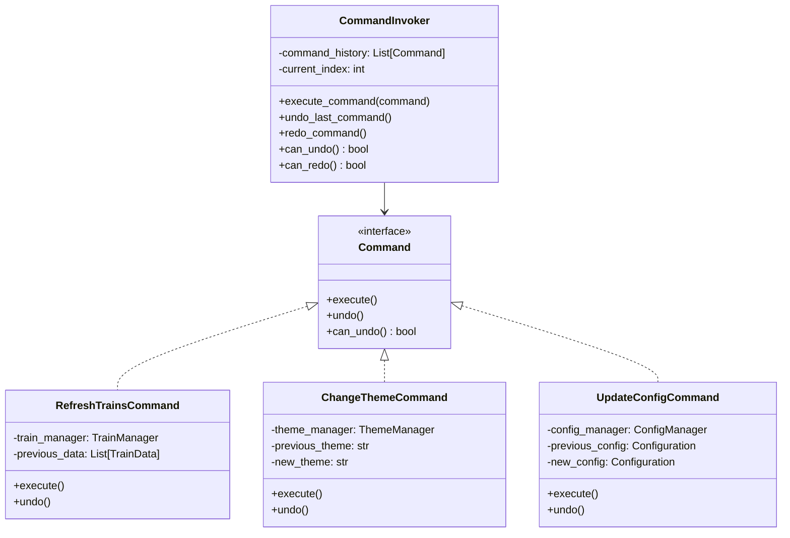

#### 9. State Pattern

Used for managing widget states and application lifecycle.

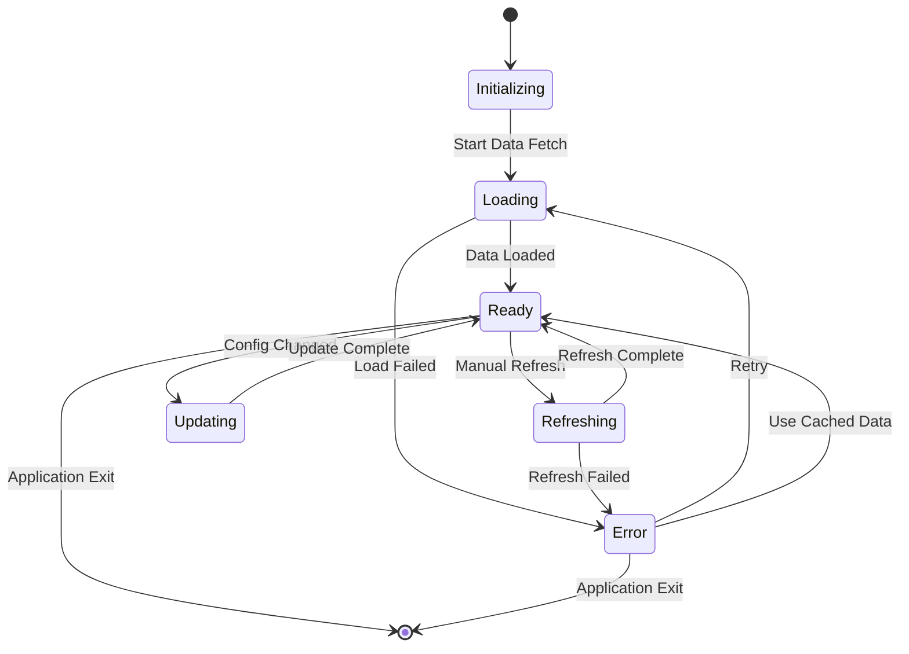

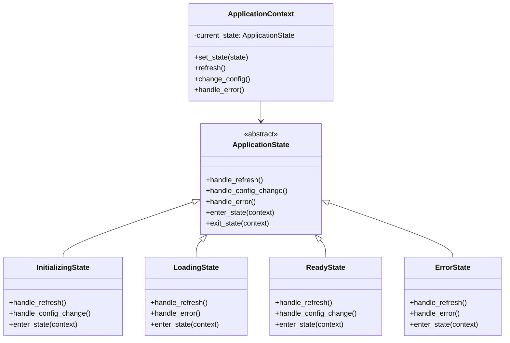

### Custom Patterns

#### 10. Manager Pattern

A custom pattern for organizing UI responsibilities.

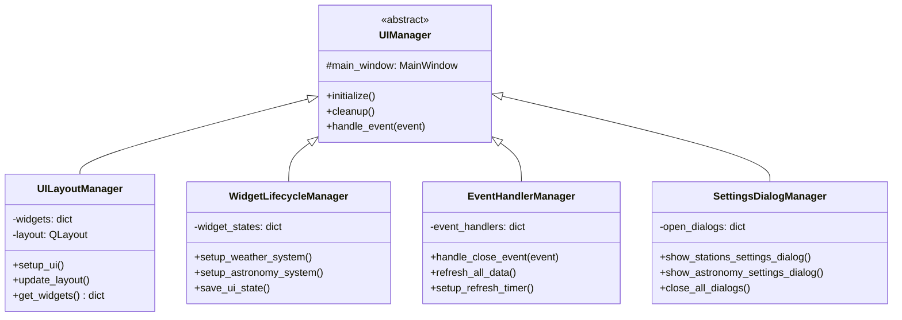

#### 11. Service Layer Pattern

Encapsulates business logic in focused service classes.

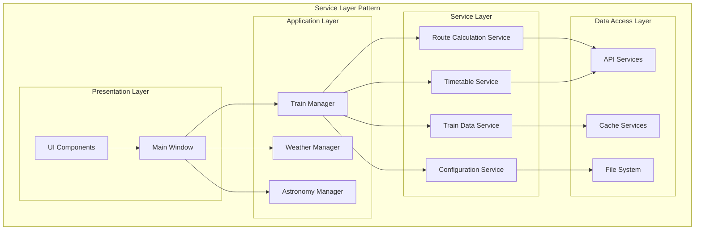

## Pattern Interactions

### Pattern Collaboration Diagram

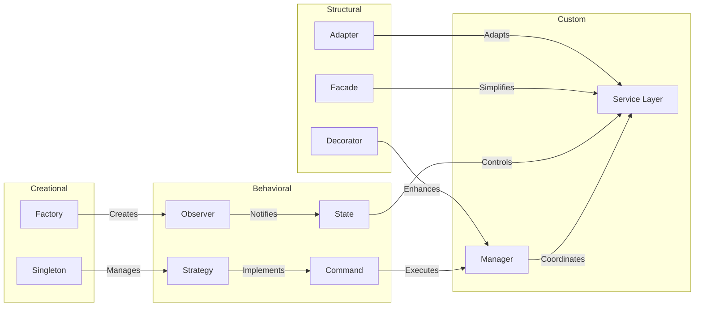

## Pattern Benefits

### Maintainability Benefits

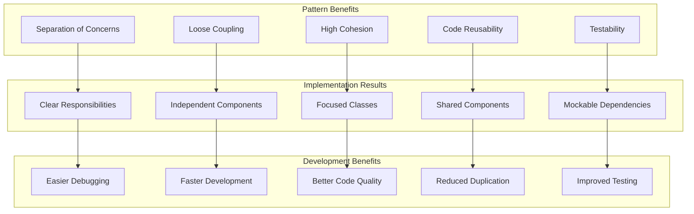

## Anti-Patterns Avoided

### Common Anti-Patterns and Solutions

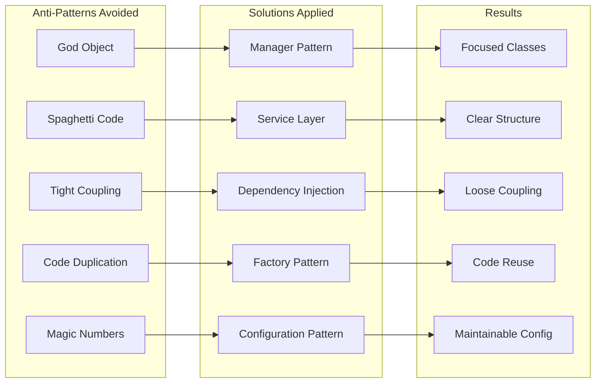

## Pattern Testing Strategies

### Testing Patterns Implementation

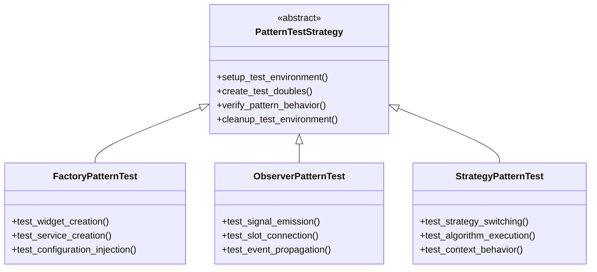

## Performance Considerations

### Pattern Performance Impact

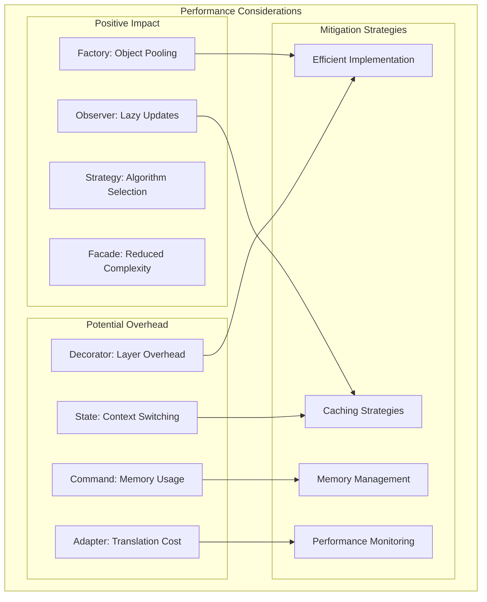

## Future Pattern Enhancements

### Planned Pattern Improvements

1. **Event Sourcing Pattern**: Complete audit trail of state changes
2. **CQRS Pattern**: Separate read and write operations
3. **Circuit Breaker Pattern**: Fault tolerance for external services
4. **Bulkhead Pattern**: Isolation of critical resources
5. **Saga Pattern**: Distributed transaction management

### Extension Opportunities

- **Plugin Pattern**: Dynamic loading of functionality
- **Visitor Pattern**: Operations on complex object structures
- **Memento Pattern**: State snapshots and restoration
- **Chain of Responsibility**: Flexible request handling
- **Template Method**: Standardized algorithm frameworks

---

*This design patterns documentation is maintained alongside the codebase and updated when new patterns are introduced or existing patterns are modified.*