# Service Architecture Documentation

## Overview

The Train Times application implements a service-oriented architecture where business logic is encapsulated in focused service classes. This design promotes separation of concerns, testability, and maintainability while providing a clear API for the presentation layer.

## Service Layer Architecture

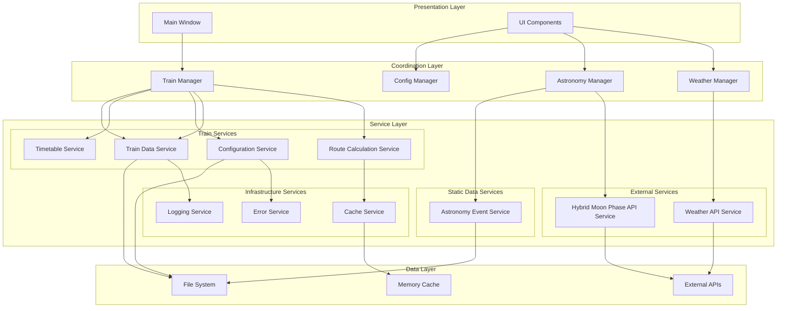

## Core Service Classes

### Train Manager (Coordinator)

The Train Manager acts as a coordinator service that orchestrates the various train-related services.

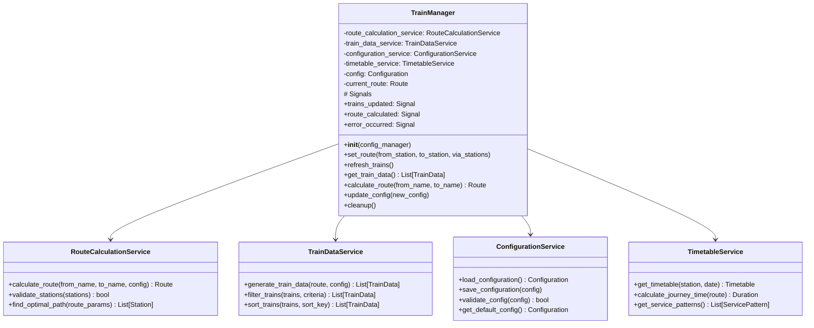

### Route Calculation Service

Handles all route finding and validation logic.

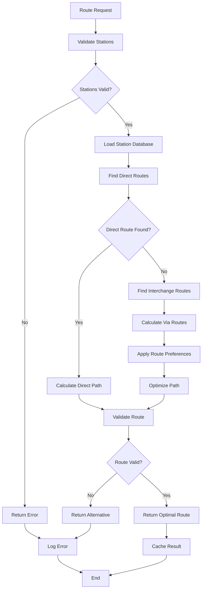

### Train Data Service

Manages train data generation, filtering, and processing.

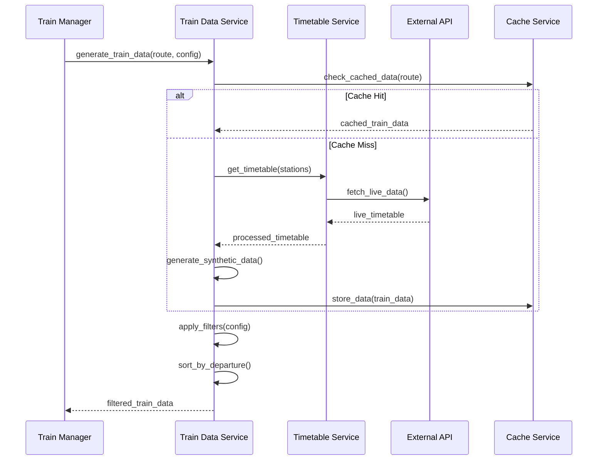

## Service Communication Patterns

### Service Dependencies

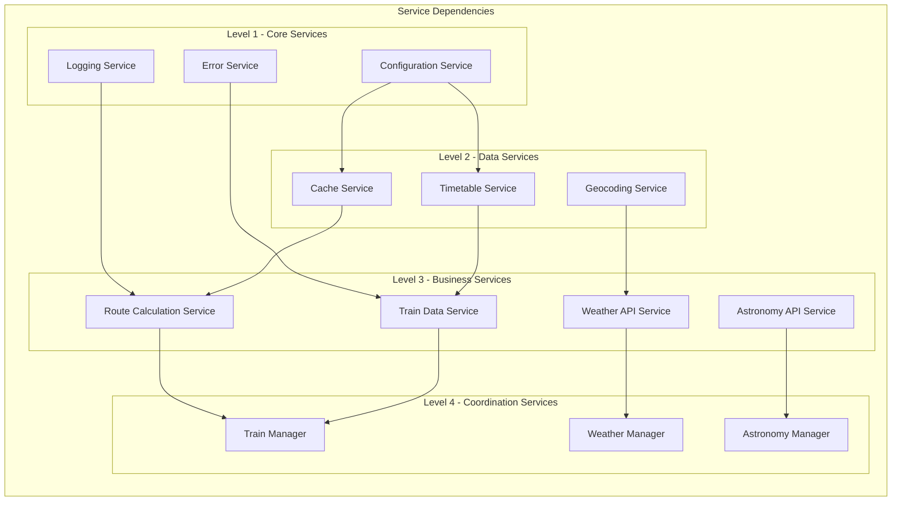

### Service Lifecycle Management

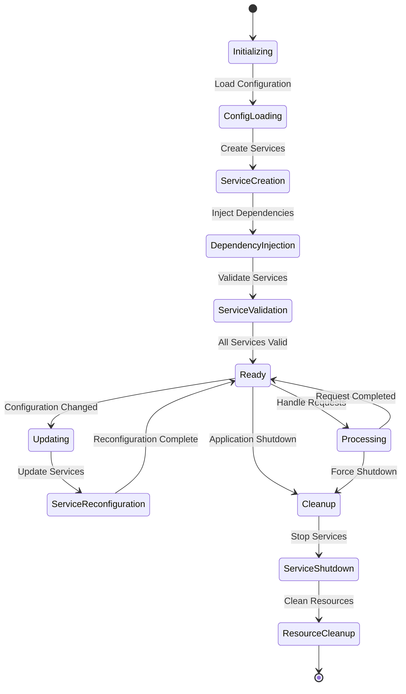

## Configuration Service Architecture

### Configuration Management Flow

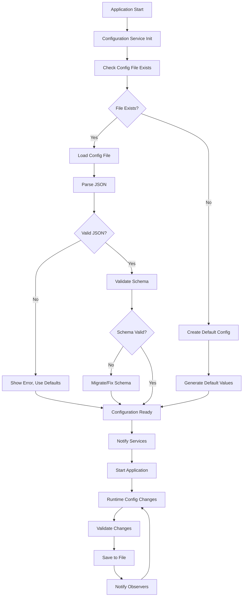

### Configuration Schema

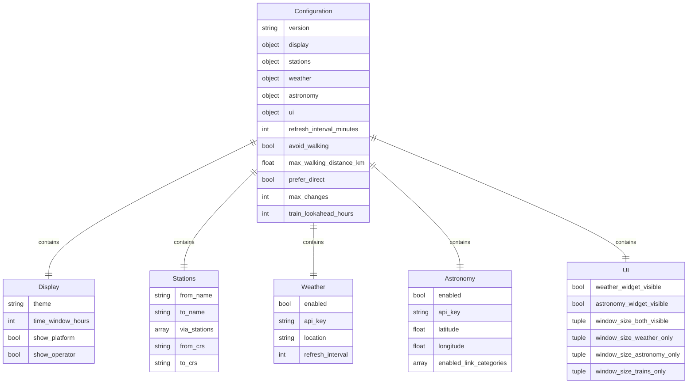

## External API Integration

### API Service Pattern

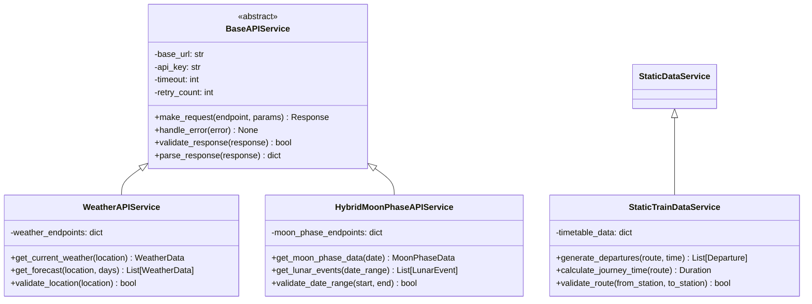

### API Error Handling

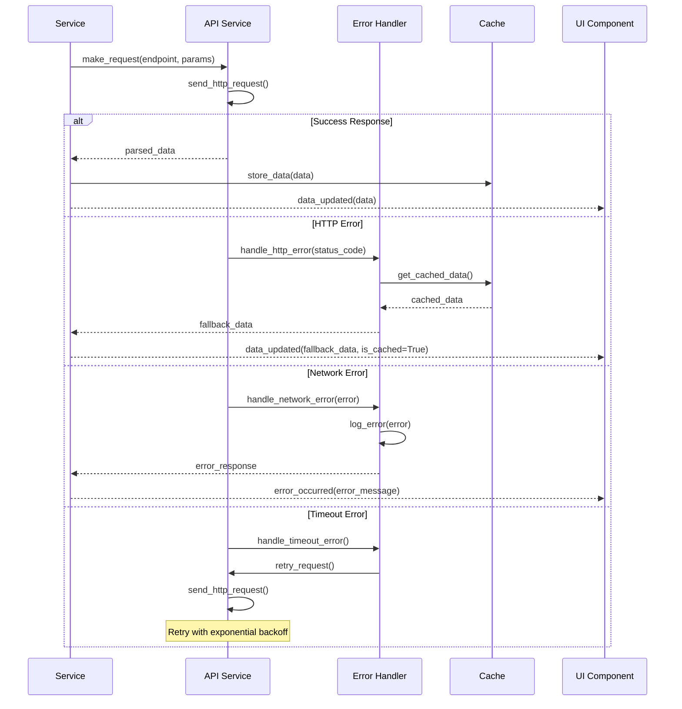

## Caching Strategy

### Multi-Level Caching

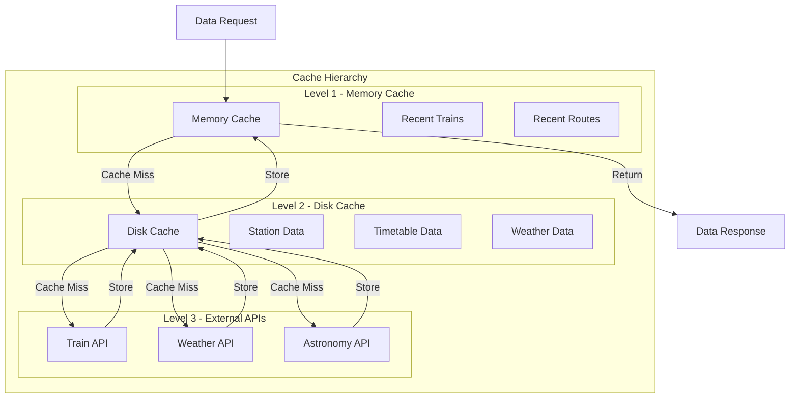

### Cache Invalidation Strategy

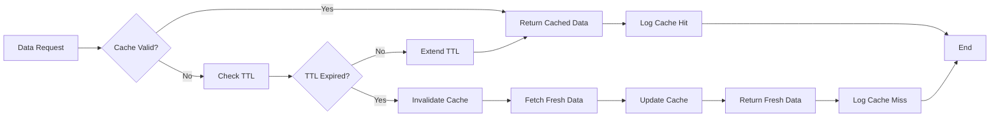

## Service Testing Strategy

### Service Test Architecture

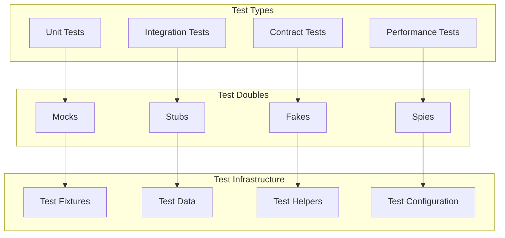

### Service Mock Strategy

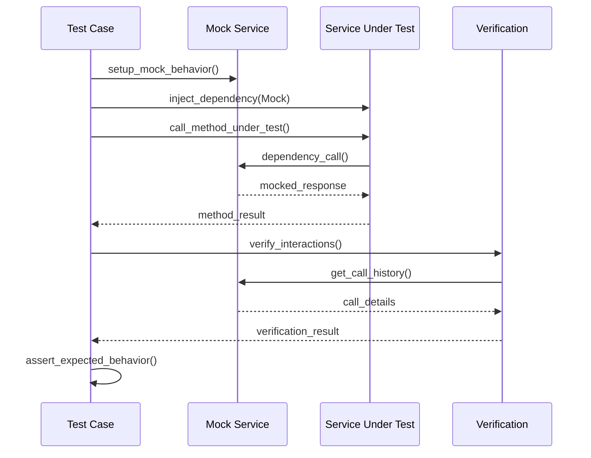

## Performance Optimization

### Service Performance Patterns

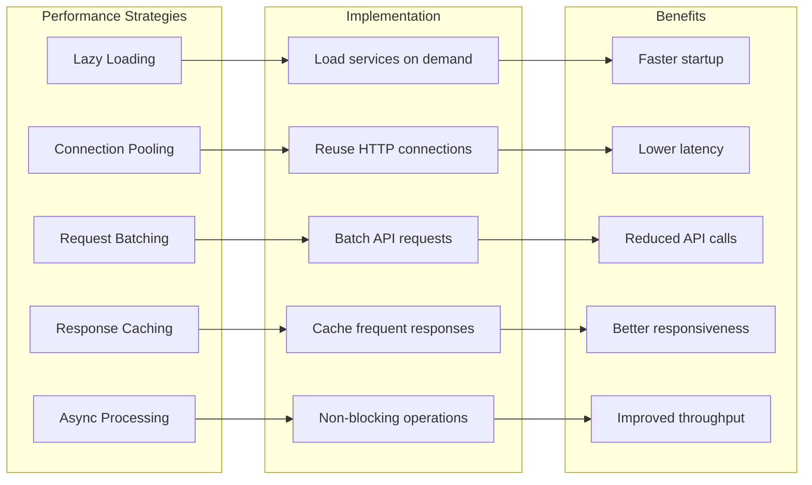

## Future Service Enhancements

### Planned Service Improvements

1. **Microservices Architecture**: Further decomposition into independent services
2. **Event-Driven Architecture**: Asynchronous event processing
3. **Service Mesh**: Advanced service-to-service communication
4. **Circuit Breaker Pattern**: Improved fault tolerance
5. **Distributed Caching**: Shared cache across service instances

### Extension Points

- **Plugin Services**: Framework for third-party service extensions
- **Service Registry**: Dynamic service discovery and registration
- **API Gateway**: Centralized API management and routing
- **Service Monitoring**: Health checks and performance metrics
- **Configuration Service**: Centralized configuration management

---

*This service architecture documentation is maintained alongside the service codebase and updated with each service-related change.*