# UI Architecture Documentation

## Overview

The Train Times application UI follows a manager-based architecture pattern where the main window delegates specific responsibilities to specialized manager classes. This approach ensures clean separation of concerns and improved maintainability.

## UI Component Hierarchy

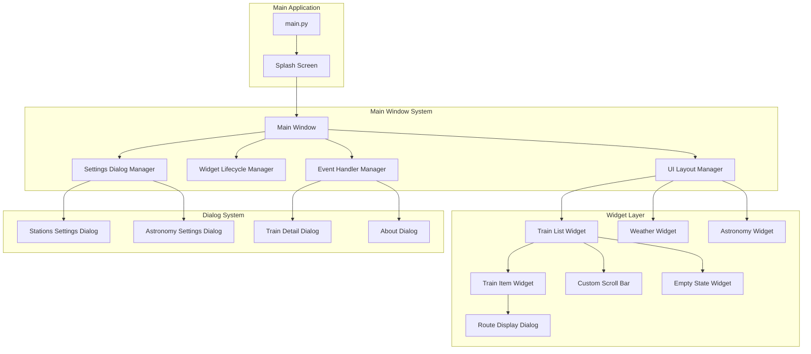

## Manager Architecture

### UI Layout Manager

The UI Layout Manager handles all aspects of window layout, widget positioning, and responsive design.

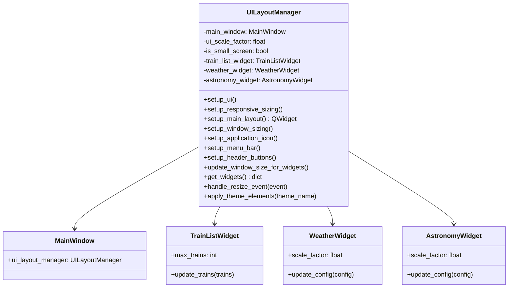

### Widget Lifecycle Manager

Manages widget visibility, initialization, and cleanup throughout the application lifecycle.

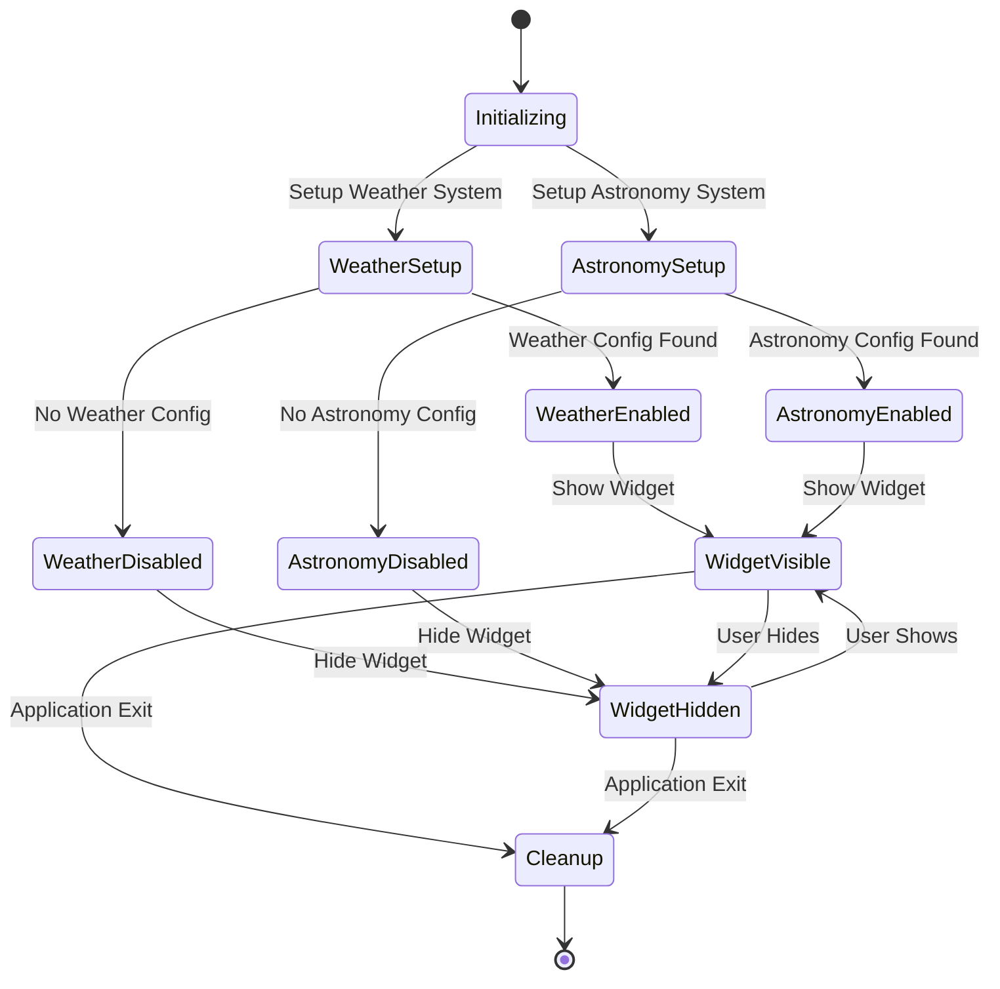

### Event Handler Manager

Coordinates all window events, user interactions, and system signals.

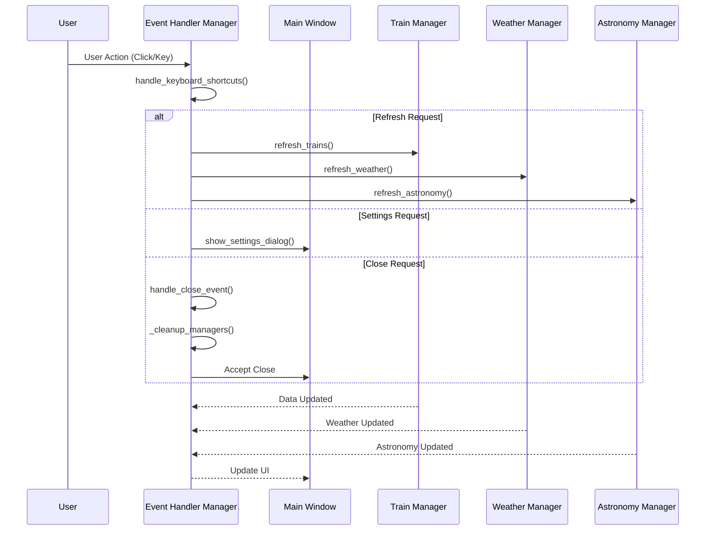

### Settings Dialog Manager

Handles all configuration dialogs and settings management.

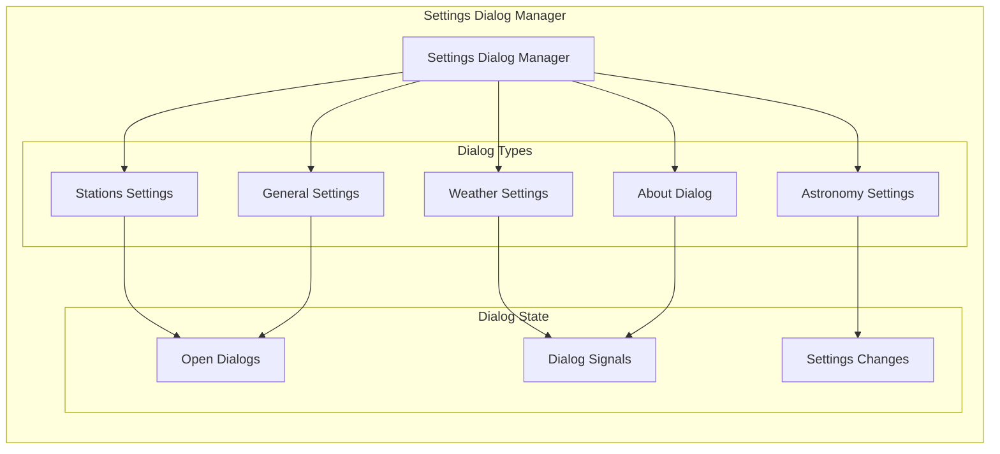

## Widget System Architecture

### Train Widget Hierarchy

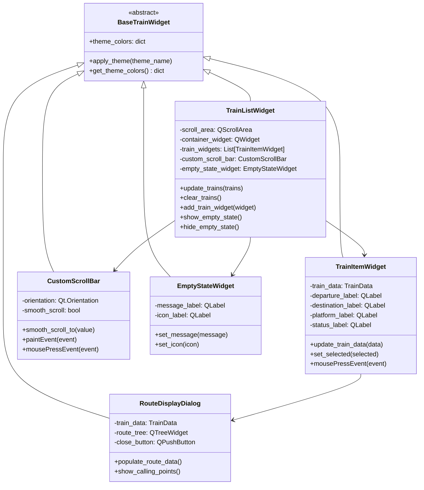

### Widget Communication Flow

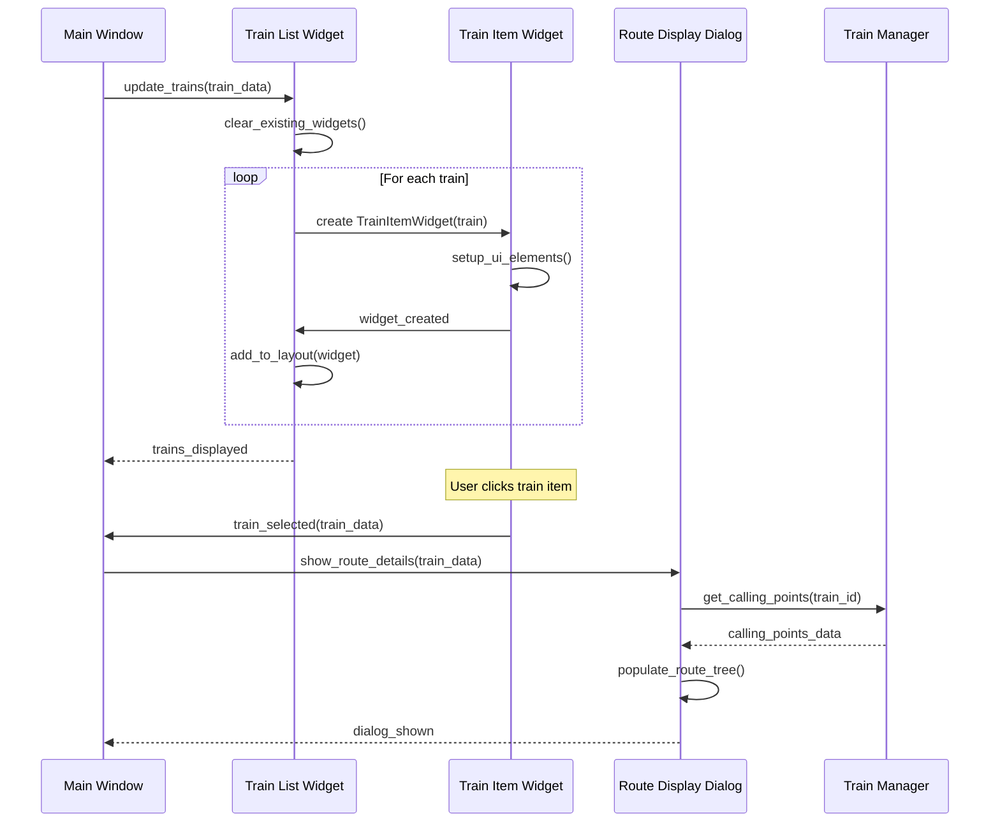

## Theme System Architecture

### Theme Management Flow

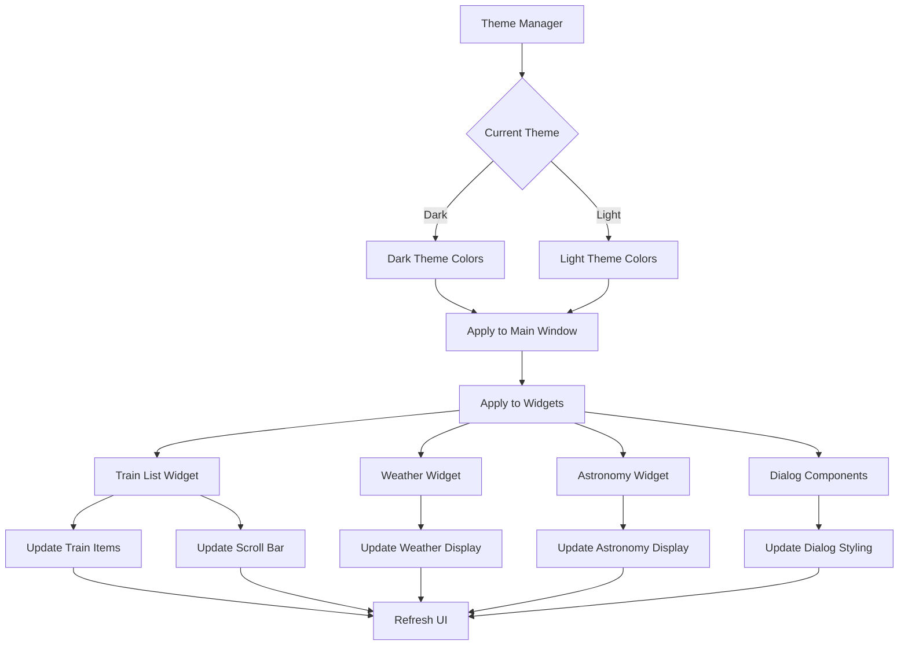

### Theme Color Mapping

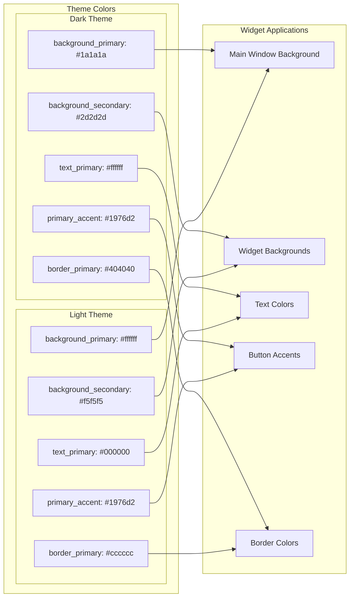

## Responsive Design System

### Screen Size Adaptation

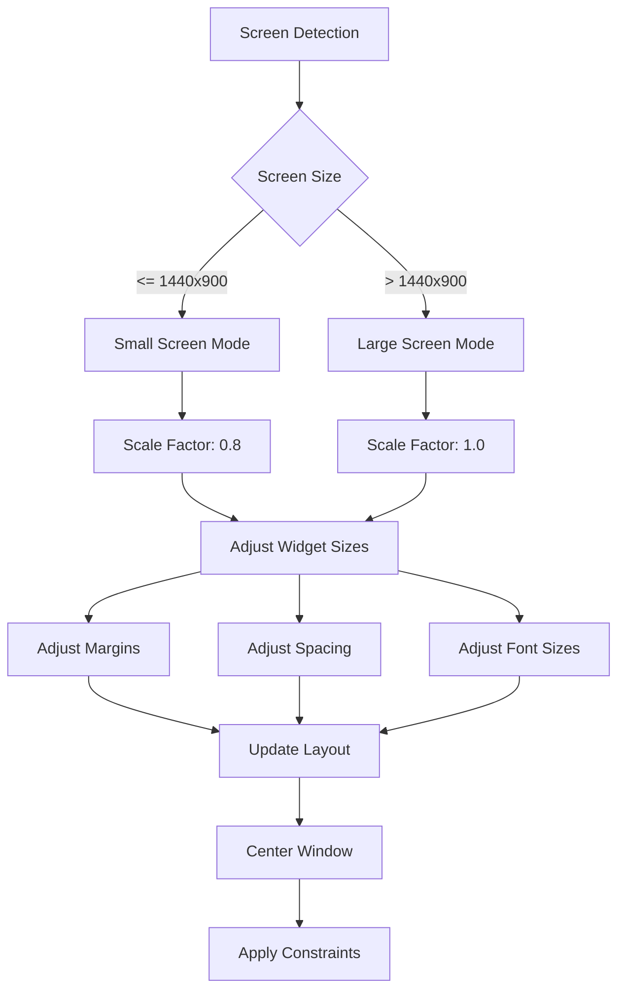

### Window Sizing Strategy

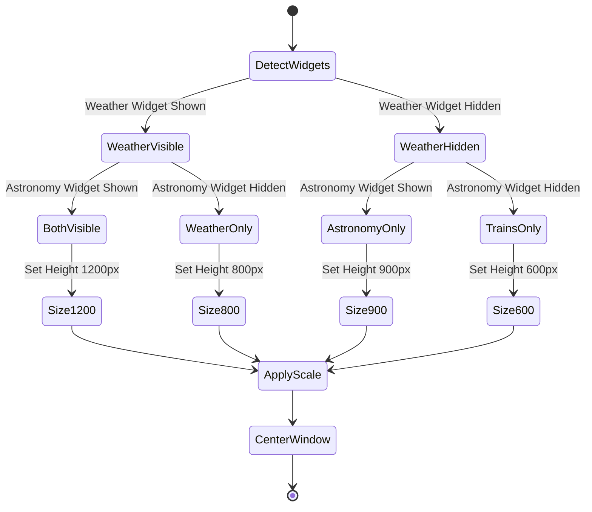

## Error Handling in UI

### UI Error Management Flow

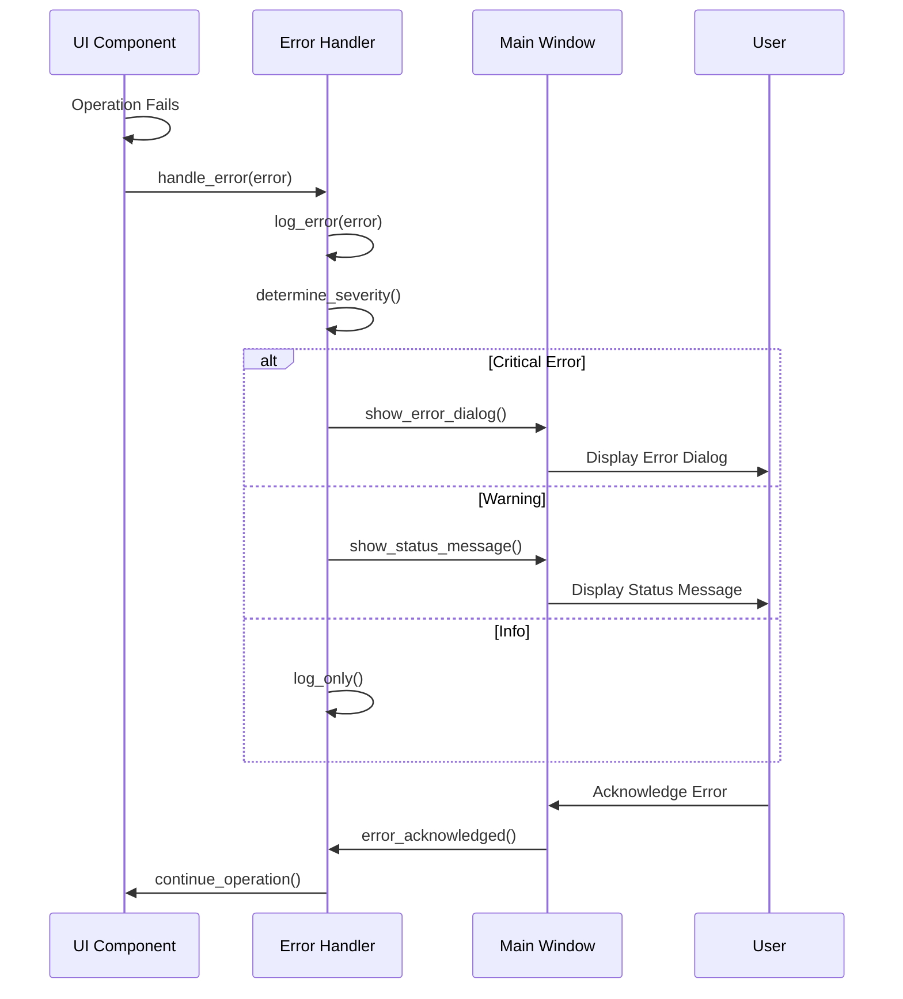

## Performance Considerations

### UI Performance Optimization

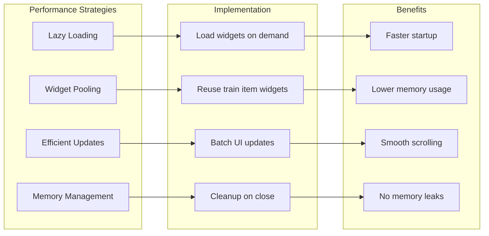

## Future UI Enhancements

### Planned UI Improvements

1. **Advanced Theming**: Custom user themes and color schemes
2. **Accessibility**: Screen reader support and keyboard navigation
3. **Animations**: Smooth transitions and micro-interactions
4. **Customizable Layout**: User-configurable widget arrangements
5. **Mobile-Responsive**: Adaptive UI for different screen sizes

### Extension Points

- **Plugin UI**: Framework for third-party UI extensions
- **Custom Widgets**: API for creating custom display components
- **Theme Engine**: Advanced theming with CSS-like styling
- **Layout Engine**: Flexible layout system for different use cases

---

*This UI architecture documentation is maintained alongside the UI codebase and updated with each UI-related change.*