# Widget System Documentation

## Overview

The Train Times application widget system is built on a modular, object-oriented architecture that promotes reusability, maintainability, and consistent theming. Each widget has a specific responsibility and can be used independently or as part of larger composite widgets.

## Widget Hierarchy

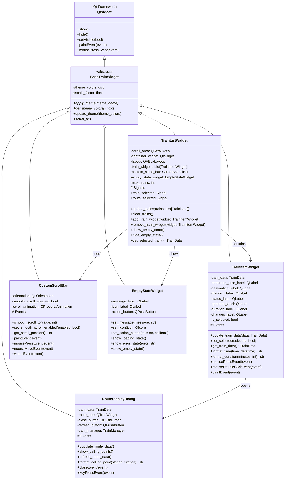

## Widget Composition Architecture

### Train List Widget Composition

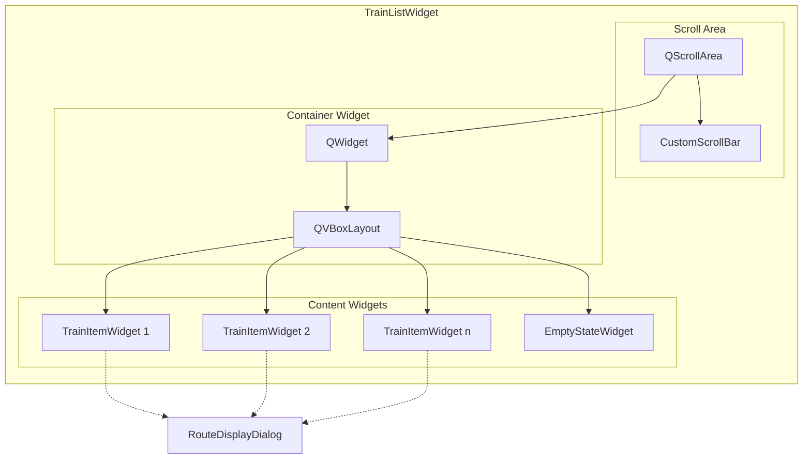

### Widget State Management

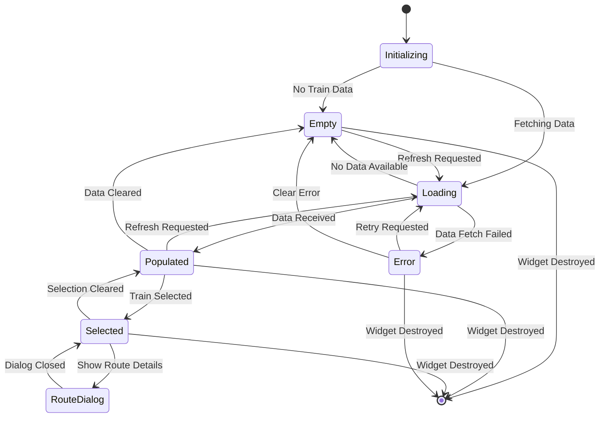

## Theme System Integration

### Theme Application Flow

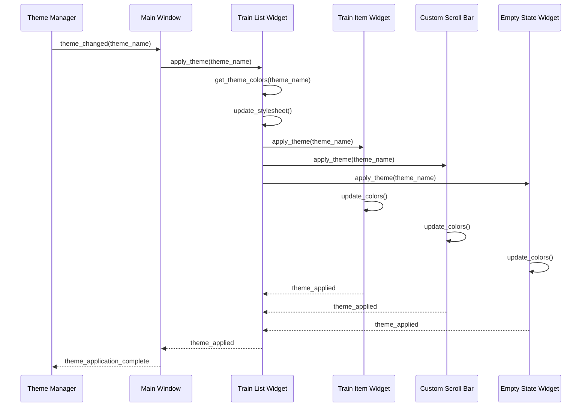

### Theme Color Mapping

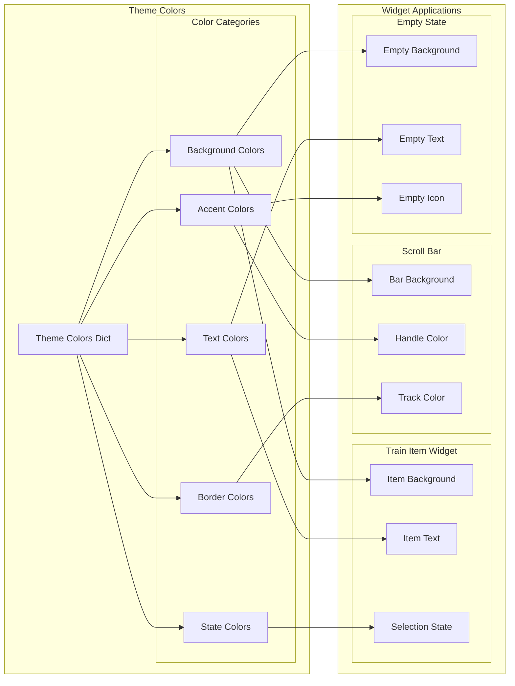

## Widget Communication Patterns

### Signal-Slot Communication

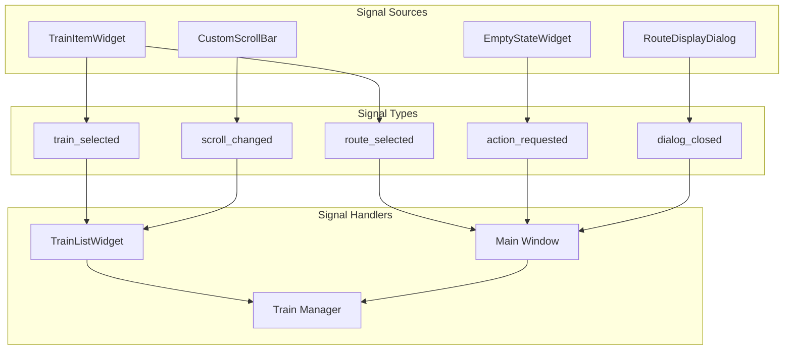

### Event Propagation

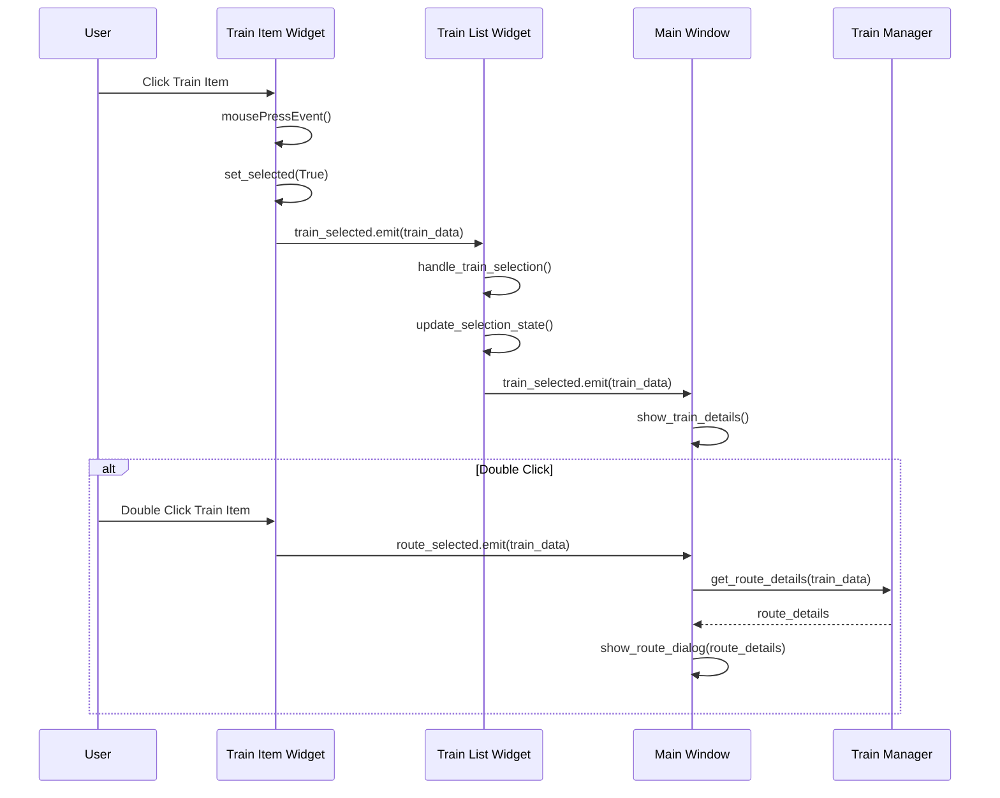

## Custom Widget Implementation

### Train Item Widget Details

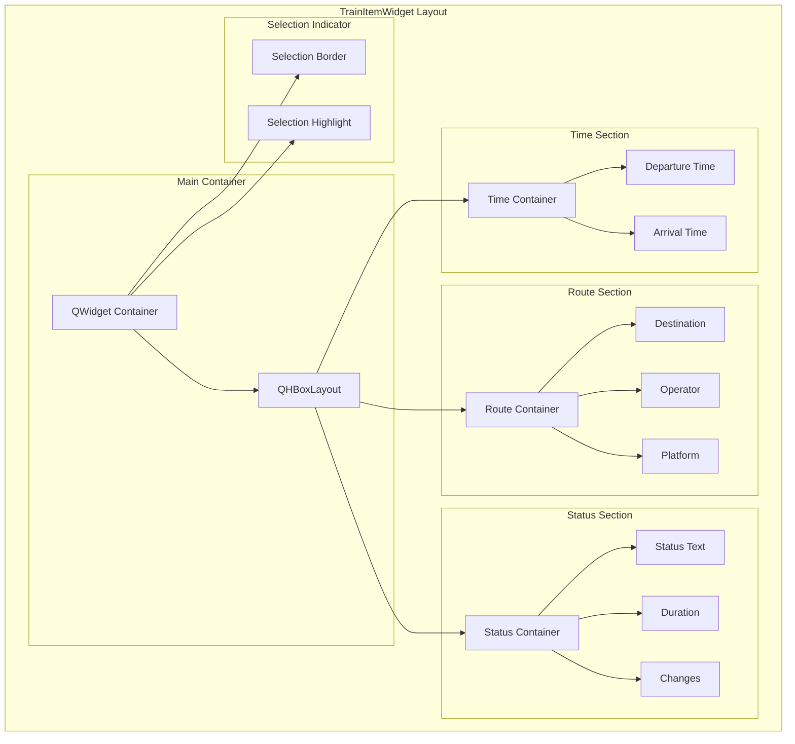

### Custom Scroll Bar Implementation

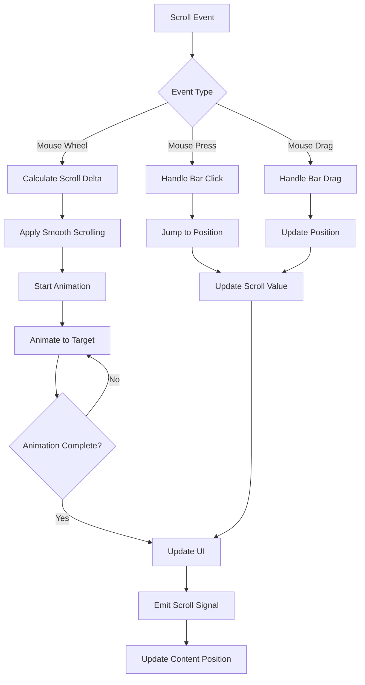

## Widget Performance Optimization

### Efficient Widget Updates

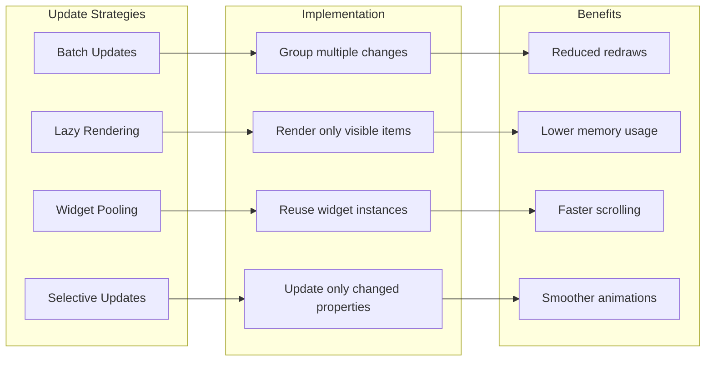

### Memory Management

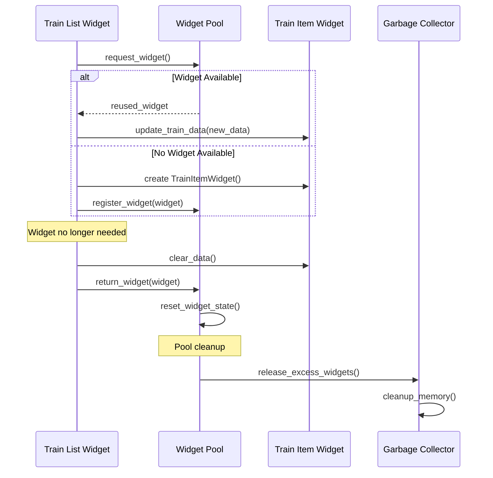

## Widget Testing Strategy

### Widget Test Architecture

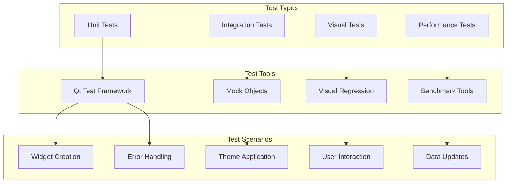

### Widget Test Examples

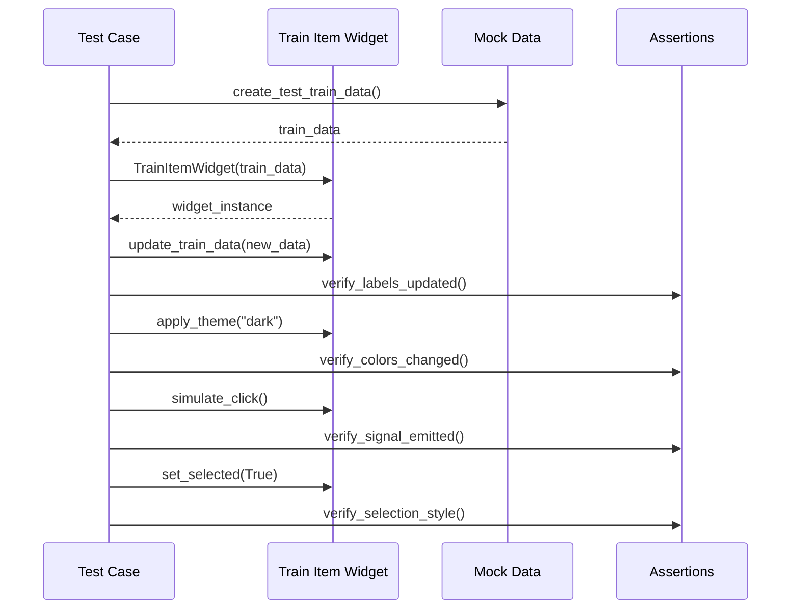

## Accessibility Features

### Accessibility Implementation

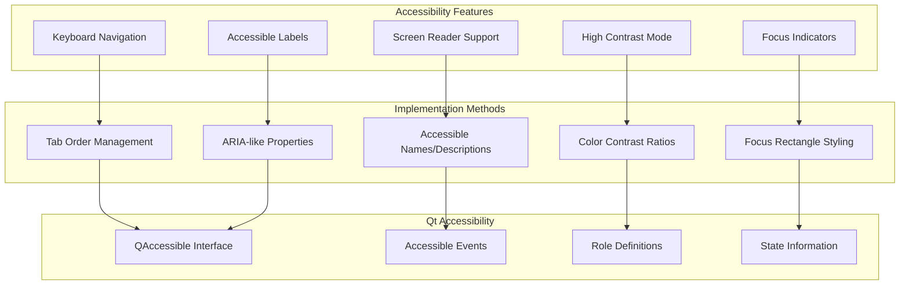

## Future Widget Enhancements

### Planned Widget Improvements

1. **Advanced Animations**: Smooth transitions and micro-interactions
2. **Touch Support**: Multi-touch gestures and touch-friendly sizing
3. **Virtualization**: Efficient handling of large datasets
4. **Custom Styling**: CSS-like styling system for widgets
5. **Responsive Design**: Adaptive layouts for different screen sizes

### Extension Points

- **Custom Widget Framework**: API for creating custom display components
- **Widget Marketplace**: Shareable widget components
- **Advanced Theming**: User-customizable widget appearances
- **Widget Analytics**: Usage tracking and performance metrics
- **Internationalization**: Multi-language widget support

## Widget Best Practices

### Design Guidelines

1. **Single Responsibility**: Each widget should have one clear purpose
2. **Consistent Theming**: All widgets should support the theme system
3. **Responsive Design**: Widgets should adapt to different screen sizes
4. **Performance Conscious**: Minimize redraws and memory usage
5. **Accessible**: Support keyboard navigation and screen readers

### Implementation Standards

1. **Signal-Slot Pattern**: Use Qt's signal-slot mechanism for communication
2. **Proper Cleanup**: Implement proper resource cleanup in destructors
3. **Error Handling**: Gracefully handle invalid data and edge cases
4. **Documentation**: Comprehensive docstrings and usage examples
5. **Testing**: Unit tests for all public methods and interactions

---

*This widget system documentation is maintained alongside the widget codebase and updated with each widget-related change.*